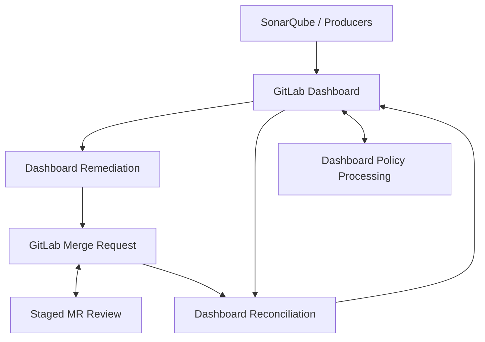

# ZeroOne Ops

[](https://github.com/JustinMelger/ZeroOne-ops/actions/workflows/quality.yml)


Structured AI workflows for software maintenance.

Structured AI workflows for code review, remediation, and operator-controlled
automation.

ZeroOne Ops coordinates bounded review and remediation workflows instead of
relying on one opaque agent. It helps teams review change requests, follow up
on static-analysis findings, and keep automation visible through explicit
workflow state, operator policy, and inspectable outputs.

## Why This Exists

ZeroOne Ops exists to explore how AI can assist developers in their existing
workflow by reducing review overhead and automating follow-up on
static-analysis findings. It also aims to provide a more inspectable and
operator-controlled alternative to fragmented SaaS coding assistants, so teams
can keep automation boundaries, governance, and model usage explicit inside
their own engineering workflow.

## Current Scope

Today the project includes:

- SonarQube issue intake and selection
- dashboard-backed remediation and reconciliation workflows
- GitLab and GitHub change-request review with staged candidate, precision,
  continuity, and bounded inline-comment support
- focused code-context gathering and LLM-backed analysis
- patch generation, bounded execution, and MR creation in CI mode
- operator-controlled policy handling through strict dashboard commands
- bounded local state and machine-safe review-note persistence for continuity
- a conservative single-file remediation boundary for safety

The project is now in iterative hardening and refinement, with a focus on
operator workflows, review quality, and clear automation boundaries.

## System Flow



## Quick Start

```bash
uv sync
uv run zeroone-ops dashboard sonar --dry-run
uv run zeroone-ops dashboard policy --dry-run
uv run zeroone-ops dashboard remediate --dry-run
uv run zeroone-ops review --dry-run
```

Useful quality commands:

```bash
uv run ruff check .
uv run mypy src
uv run pytest
just architecture
```

## Core Workflows

### Dashboard Remediation

- sync SonarQube findings into the dashboard
- select one supported item per run
- generate a bounded fix
- create or reuse a GitLab merge request in CI mode
- expose read-only operator policy state in the dashboard with strict
  `/zeroone policy ...` comment commands for policy actions

Severity control note:

- `remediation.bootstrap_severities` is the bootstrap seed for a new dashboard
  policy, not the day-to-day operator control surface after the dashboard
  policy exists
- once the dashboard has canonical policy state, remediation pickup follows the
  dashboard policy and operators should change severity policy through
  `/zeroone policy ...` comments
- if neither dashboard policy nor config severity is present, the bootstrap
  default is `low` and `medium` enabled with `high` disabled
- when an older dashboard body is recognized, ZeroOne Ops rewrites it into the
  current schema on read before continuing normal dashboard-backed workflows

### Dashboard Reconciliation

- inspect `mr_opened` dashboard items
- update lifecycle state after merge request outcomes change
- keep reconciliation separate from active remediation

### Dashboard Policy Processing

- inspect dashboard issue notes for strict `/zeroone policy ...` commands
- replay valid policy actions into canonical dashboard policy state
- publish bounded acknowledgement notes for accepted and rejected strict
  policy-command attempts
- keep policy processing separate from remediation pickup and lifecycle
  reconciliation
- use `zeroone-ops dashboard policy` as the explicit workflow entrypoint

### Merge Request Review

- review one merge request per run
- publish one deterministic summary note per reviewed revision
- deduplicate by merge request IID and head SHA
- keep the summary note authoritative even when bounded inline comments are enabled

## Dry-Run And Fixtures

Dry-run can use local fixtures before a repository is connected to real
services.

Included fixtures:

- [fixtures/sonar/issues.json](fixtures/sonar/issues.json)
- [fixtures/llm/analysis.json](fixtures/llm/analysis.json)
- [fixtures/llm/edit.json](fixtures/llm/edit.json)
- [samples/auto_fixable_example.py](samples/auto_fixable_example.py)

The repository's current default config file is
[.zeroone-ops.json](.zeroone-ops.json).
Copyable operator examples now live in [examples/](examples/), including:

- [examples/.zeroone-ops.json](examples/.zeroone-ops.json)
- [examples/.env.example](examples/.env.example)
- [examples/.gitlab-ci.example.yml](examples/.gitlab-ci.example.yml)
- [examples/github-review.yml](examples/github-review.yml)

Use the root [.zeroone-ops.json](.zeroone-ops.json) as the repository's live
runtime config, and use the files in [examples/](examples/) as copyable
templates when wiring the bot into another repository.

Config structure direction:

- top-level shared runtime settings stay at the root
- platform selection stays at the root
- review-specific behavior lives under `review`
- remediation-specific rollout policy now lives under `remediation`
- Sonar-specific local fixture behavior now lives under `sonarqube`

For example:

- `platform`
- `review.inline_comments_enabled`
- `remediation.bootstrap_severities`
- `remediation.max_retry_count`
- `remediation.analysis`
- `sonarqube.mock_issues_path`

`remediation.bootstrap_severities` is best treated as the initial rollout
baseline for seeding dashboard severity policy in a repository, not as the
primary steady-state operator control once dashboard policy exists.
When config leaves severity empty and no dashboard policy exists yet, the
default bootstrap baseline is `low` and `medium` enabled with `high` disabled.
Only the remaining nested migration aliases still load during migration. The
old flat top-level config keys no longer load, and new configs should use
`remediation.bootstrap_severities` and the nested structure.

To test the real OpenAI path instead of local fixtures:

```bash
export OPENAI_API_KEY=...
export OPENAI_MODEL=gpt-4.1-mini
```

Optional MLflow tracing is available for OpenAI-backed runs. It is off by
default and can be enabled with environment variables such as:

```bash
export ZEROONE_MLFLOW_ENABLED=true
export MLFLOW_TRACKING_URI=http://localhost:5000
export MLFLOW_EXPERIMENT_NAME=zeroone-ops-review
```

For CI use, prefer tighter MLflow request settings so an unreachable tracking
server does not slow a run down for too long:

```bash
export MLFLOW_HTTP_REQUEST_TIMEOUT=5
export MLFLOW_HTTP_REQUEST_MAX_RETRIES=1
```

For v1 safety, remediation only accepts structured edits that touch exactly one
file.

## Credentials And Secrets

For local testing, the most common environment variables are:

- `OPENAI_API_KEY`
- `OPENAI_MODEL`
- `GITHUB_TOKEN`
- `GITHUB_REPOSITORY`
- `GITLAB_URL`
- `GITLAB_TOKEN`
- `SONARQUBE_URL`
- `SONARQUBE_TOKEN`
- `SONARQUBE_PROJECT_KEY`

Store CI secrets as masked and protected variables, and avoid shell tracing
around authenticated git remote rewrites. Use the runbook for workflow-by-
workflow token requirements and permission guidance.

## Container And Releases

Build the local image:

```bash
docker build -t zeroone-ops:latest .
```

Run it against a checked-out repository:

```bash
docker run --rm \
  -v "$(pwd):/workspace" \
  --env-file .env \
  zeroone-ops:latest
```

The image keeps the installed bot in `/opt/zeroone-ops` and uses `/workspace`
as the repository root, so mounting another repository does not hide the bot's
virtual environment. The published runtime image uses a multi-stage build and
runs as a non-root user.

GitHub release automation uses `release-please` plus the publish workflow.
Stable release tags now follow the `zeroone-ops-vX.Y.Z` pattern.
Prerelease tags can use `zeroone-ops-vX.Y.Z-rc.N`; those publish explicit
prerelease image tags without updating `latest`, while the workflow still
accepts older tag prefixes during transition.

Pull a published image with:

```bash
docker pull ghcr.io/<owner>/zeroone-ops:0.2.0
```

A GitLab CI example is provided in
[examples/.gitlab-ci.example.yml](examples/.gitlab-ci.example.yml). It uses the
published `zeroone-ops` image while keeping the current runtime command names.
For GitHub review smoke tests, use
[examples/github-review.yml](examples/github-review.yml) as the starting
workflow file.

## Execution Modes

Local mode:

- creates a branch
- applies the patch
- can request interactive approval before commit
- does not create a merge request unless you switch to CI mode

CI mode:

- creates a branch
- applies the patch
- pushes the branch
- creates or reuses a GitLab merge request
- never blocks for terminal approval

## Docs

Use these docs for the deeper operational details:

- [docs/README.md](docs/README.md) for the documentation map
- [docs/runbook.md](docs/runbook.md) for CI setup, credentials, rollout order,
  and smoke-test recipes
- [docs/roadmap.md](docs/roadmap.md) for current build, hardening, and rebrand
  sequencing
- [docs/design/functional/functional-design.md](docs/design/functional/functional-design.md)
  and [docs/design/technical/technical-design.md](docs/design/technical/technical-design.md)
  for the broader functional and technical design surfaces across review,
  remediation, dashboard, and operator workflows
