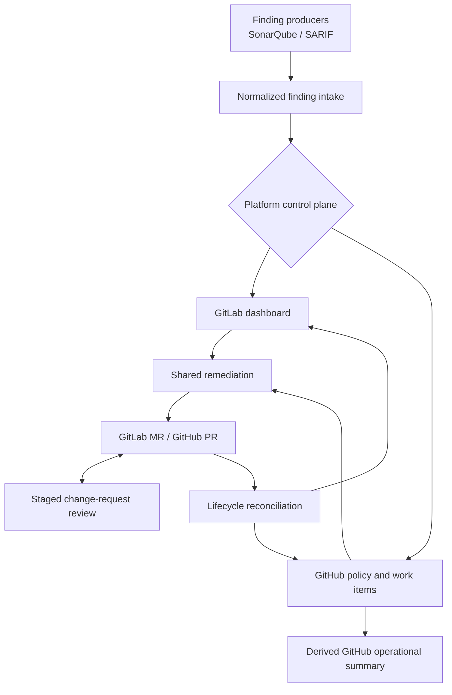

# ZeroOne Ops

[](https://github.com/JustinMelger/ZeroOne-ops/actions/workflows/quality.yml)


Structured AI workflows for code review, remediation, and operator-controlled
automation.

ZeroOne Ops coordinates bounded review and remediation workflows instead of
relying on one opaque agent. It helps teams review change requests, follow up
on static-analysis findings, and keep automation visible through explicit
workflow state, operator policy, and inspectable outputs.

## Why This Exists

ZeroOne Ops exists to explore how AI can assist developers in their existing
workflow by reducing review overhead and automating follow-up on
static-analysis findings. It also aims to provide a more inspectable and
operator-controlled alternative to fragmented SaaS coding assistants, so teams
can keep automation boundaries, governance, and model usage explicit inside
their own engineering workflow.

## Current Scope

Today the project includes:

- staged GitLab and GitHub change-request review with candidate, precision,
  continuity, and bounded inline-comment support
- normalized finding intake from SonarQube and SARIF artifacts, including Ruff
- GitLab dashboard-backed policy, remediation, and lifecycle workflows
- GitHub policy, authoritative work-item issues, lifecycle reconciliation, and
  a read-only operational summary
- bounded remediation execution, validation, and provider-local merge-request
  or pull-request publication
- inspectable local state and machine-readable provider records for continuity

The current focus is rollout hardening and an explicit, provider-neutral design
for recovering blocked remediation work. See the [roadmap](docs/roadmap.md).

## System Flow



## Quick Start

```bash
uv sync --all-groups
uv run zeroone-ops findings sync --dry-run
uv run zeroone-ops dashboard policy --dry-run
uv run zeroone-ops remediation run --dry-run
uv run zeroone-ops work-items sync-status --dry-run
uv run zeroone-ops review --dry-run
```

`dashboard sonar`, `dashboard remediate`, and `dashboard reconcile` remain
available as legacy GitLab aliases. Prefer `findings sync`, `remediation run`,
and `work-items sync-status` for new automation.

Useful quality commands:

```bash
uv run ruff check .
uv run mypy src
uv run pytest
just architecture
```

Optional local pre-commit hook setup for Ruff:

```bash
uv sync
uv run pre-commit install
uv run pre-commit run --all-files
```

## Core Workflows

### Finding Sync

- normalize SonarQube and configured SARIF findings into the shared finding
  contract
- project findings into the GitLab dashboard or GitHub work-item issues
- keep backlog-only findings visible in the GitHub operational summary without
  turning every finding into an issue

Severity control note:

- `remediation.bootstrap_severities` seeds a repository's initial policy; it is
  not the ongoing operator control surface
- policy decisions determine which normalized findings are promoted into
  durable remediation work
- if no policy or bootstrap severity is configured, the initial baseline is
  `low` and `medium` enabled with `high` disabled

### Control Plane And Policy

- GitLab stores policy and workflow state in its dashboard issue; only
  Maintainers and Owners can issue policy commands
- GitHub stores policy in a dedicated policy issue; only repository admins can
  issue policy commands
- GitHub work-item issues remain authoritative, while the operational summary
  is a read-only derived overview
- use `zeroone-ops dashboard policy` to process policy commands

### Remediation And Lifecycle

- select one eligible remediation item per run and produce a bounded patch
- run explicitly configured environment setup and validation commands before
  publication
- create or reuse a GitLab merge request or GitHub pull request in CI mode
- use `zeroone-ops work-items sync-status` to converge merged and closed
  change-request state
- preserve closed-unmerged change requests as blocked records; a future
  explicit recovery action will decide whether to dismiss, retry, or start
  fresh

### Change-Request Review

- review one merge request or pull request per run
- publish one deterministic summary note per reviewed revision
- deduplicate by change-request identity and head SHA
- keep the summary note authoritative even when bounded inline comments are enabled

## Dry-Run And Fixtures

Dry-run can use local fixtures before a repository is connected to real
services.

Included fixtures:

- [fixtures/sonar/issues.json](fixtures/sonar/issues.json)
- [fixtures/llm/analysis.json](fixtures/llm/analysis.json)
- [fixtures/llm/edit.json](fixtures/llm/edit.json)
- [samples/auto_fixable_example.py](samples/auto_fixable_example.py)

The repository's current default config file is
[.zeroone-ops.json](.zeroone-ops.json).
Copyable operator examples now live in [examples/](examples/), including:

- [examples/.zeroone-ops.json](examples/.zeroone-ops.json) for GitLab
- [examples/.zeroone-ops.github.json](examples/.zeroone-ops.github.json) for GitHub
- [examples/.zeroone-ops.minimal.json](examples/.zeroone-ops.minimal.json) for
  a minimal GitLab setup
- [examples/.env.example](examples/.env.example)
- [examples/.gitlab-ci.example.yml](examples/.gitlab-ci.example.yml)
- [examples/github-review.yml](examples/github-review.yml)
- [examples/github-operations.yml](examples/github-operations.yml) for GitHub
  finding sync, remediation, lifecycle, and policy processing

Use the root [.zeroone-ops.json](.zeroone-ops.json) as the repository's live
runtime config, and use the files in [examples/](examples/) as copyable
templates when wiring the bot into another repository.

Config structure direction:

- top-level shared runtime settings stay at the root
- platform selection stays at the root
- review-specific behavior lives under `review`
- remediation target, promotion seed, and analysis behavior live under
  `remediation`
- source-specific ingestion lives under `sonarqube` or `sarif`
- the active provider uses exactly one provider block: `gitlab` or `github`

For example:

- `platform`
- `review.inline_comments_enabled`
- `remediation.bootstrap_severities`
- `remediation.target_branch`
- `remediation.analysis`
- `sonarqube.mock_issues_path`
- `sarif.artifacts`

New configuration should use these nested blocks. GitLab examples can combine
SonarQube and SARIF intake; GitHub examples show SARIF/Ruff as a lightweight
starting point.

To test the real OpenAI path instead of local fixtures:

```bash
export OPENAI_API_KEY=...
export OPENAI_MODEL=gpt-4.1-mini
```

Optional MLflow tracing is available for OpenAI-backed runs. It is off by
default and can be enabled with environment variables such as:

```bash
export ZEROONE_MLFLOW_ENABLED=true
export MLFLOW_TRACKING_URI=http://localhost:5000
export MLFLOW_EXPERIMENT_NAME=zeroone-ops-review
```

For CI use, prefer tighter MLflow request settings so an unreachable tracking
server does not slow a run down for too long:

```bash
export MLFLOW_HTTP_REQUEST_TIMEOUT=5
export MLFLOW_HTTP_REQUEST_MAX_RETRIES=1
```

For v1 safety, remediation only accepts structured edits that touch exactly one
file.

## Credentials And Secrets

For local testing, the most common environment variables are:

- `OPENAI_API_KEY`
- `OPENAI_MODEL`
- `GITHUB_TOKEN`
- `GITHUB_REPOSITORY`
- `GITLAB_URL`
- `GITLAB_TOKEN`
- `SONARQUBE_URL`
- `SONARQUBE_TOKEN`
- `SONARQUBE_PROJECT_KEY`

Store CI secrets as masked and protected variables, and avoid shell tracing
around authenticated git remote rewrites. GitHub remediation jobs need
`contents: write`, `issues: write`, and `pull-requests: write`; review jobs
need `issues: write` and `pull-requests: write`. Use the runbook for
workflow-by-workflow token requirements and permission guidance.

The GitHub operations example reads `OPENAI_API_KEY` from repository secrets
and uses the `OPENAI_MODEL` repository variable when present; otherwise it
uses its documented default model.

## Container And Releases

Build the local image:

```bash
docker build -t zeroone-ops:latest .
```

Run it against a checked-out repository:

```bash
docker run --rm \
  -v "$(pwd):/workspace" \
  --env-file .env \
  zeroone-ops:latest
```

The image keeps the installed bot in `/opt/zeroone-ops` and uses `/workspace`
as the repository root, so mounting another repository does not hide the bot's
virtual environment. The published runtime image uses a multi-stage build and
runs as a non-root user.

GitHub release automation uses `release-please` plus the publish workflow.
Stable release tags now follow the `zeroone-ops-vX.Y.Z` pattern.
Prerelease tags can use `zeroone-ops-vX.Y.Z-rc.N`; those publish explicit
prerelease image tags without updating `latest`, while the workflow still
accepts older tag prefixes during transition.

Pull a published image with:

```bash
docker pull ghcr.io/<owner>/zeroone-ops:0.2.0
```

A GitLab CI example is provided in
[examples/.gitlab-ci.example.yml](examples/.gitlab-ci.example.yml). It uses the
published `zeroone-ops` image and the canonical neutral commands. For GitHub
review smoke tests, use [examples/github-review.yml](examples/github-review.yml)
as the starting workflow file. For the GitHub control plane, copy
[examples/github-operations.yml](examples/github-operations.yml) and the
GitHub JSON config template together.

## Execution Modes

Local mode:

- creates a branch
- applies the patch
- can request interactive approval before commit
- does not create a merge request unless you switch to CI mode

CI mode:

- creates a branch
- applies the patch
- pushes the branch
- creates or reuses a provider-specific merge request or pull request
- never blocks for terminal approval

## Docs

Use these docs for the deeper operational details:

- [docs/README.md](docs/README.md) for the documentation map
- [docs/runbook.md](docs/runbook.md) for CI setup, credentials, rollout order,
  and smoke-test recipes
- [docs/roadmap.md](docs/roadmap.md) for what is shipped, current, and parked
- [docs/design/functional/functional-design.md](docs/design/functional/functional-design.md)
  and [docs/design/technical/technical-design.md](docs/design/technical/technical-design.md)
  for the broader functional and technical design surfaces across review,
  remediation, dashboard, and operator workflows
