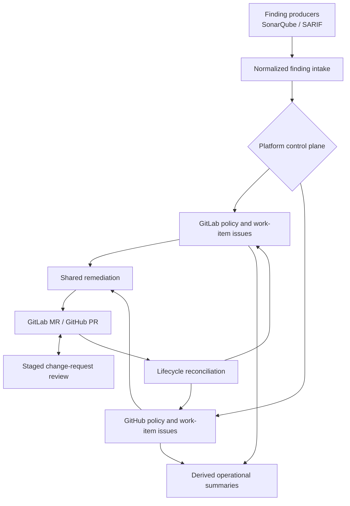

# ZeroOne Ops

[](https://github.com/JustinMelger/ZeroOne-ops/actions/workflows/quality.yml)


**The home for software agents that run in your pipeline.**

ZeroOne Ops provides governed OpenAI-assisted review and remediation for
GitLab and GitHub, with explicit policy, lifecycle state, and provider-native
change requests.

## What It Does

ZeroOne Ops helps teams:

- review GitLab merge requests and GitHub pull requests with staged,
  continuity-aware analysis
- normalize SonarQube and SARIF/Ruff findings into governed remediation work
- generate bounded fixes, validate them, and publish provider-native change
  requests
- control policy, inspect automation state, and reconcile completed or blocked
  remediation work

The current focus is cross-provider rollout hardening and a simpler
control-plane installation experience. See the [roadmap](docs/roadmap.md).

## System Flow



## Quick Start

Then choose one provider setup:

- **GitLab:** copy [examples/.zeroone-ops.json](examples/.zeroone-ops.json)
  to `.zeroone-ops.json`, include
  [examples/.gitlab-ci.example.yml](examples/.gitlab-ci.example.yml), and
  declare its `zeroone-ops-fix` and `zeroone-ops-review` stages in the root
  project pipeline.
- **GitHub:** copy
  [examples/.zeroone-ops.github.json](examples/.zeroone-ops.github.json) to
  `.zeroone-ops.json`, then add
  [examples/github-review.yml](examples/github-review.yml) and
  [examples/github-operations.yml](examples/github-operations.yml) under
  `.github/workflows/`.

Both CI examples use the published ZeroOne Ops container, so the target
repository does not need to install the `zeroone-ops` CLI. The GitHub
operations template uses Ruff as an example SARIF producer and installs `uv`
for that example's validation setup. Replace the SARIF generation and
toolchain-specific steps with the tools used by your repository.

Configure the matching provider credentials and `OPENAI_API_KEY` as described
in the [runbook](docs/runbook.md), then run the relevant workflow manually for
the first smoke test. From a ZeroOne Ops development checkout, the core
commands are:

```bash
uv run zeroone-ops findings sync --dry-run
uv run zeroone-ops dashboard policy --dry-run
uv run zeroone-ops remediation run --dry-run
uv run zeroone-ops work-items sync-status --dry-run
uv run zeroone-ops work-items recover --dry-run
uv run zeroone-ops review --dry-run
```

## Operating The Control Plane

CI owns the ZeroOne Ops commands. Operators use provider-native records and
the installed workflows or pipelines rather than running the CLI directly.

| Operator need | GitLab | GitHub |
|---|---|---|
| Change automation policy | Comment on the policy issue in issue mode; dashboard issue in legacy mode | Comment on the policy issue |
| Inspect a remediation item | Authoritative work-item issue in issue mode; dashboard workflow row in legacy mode | Authoritative work-item issue |
| Recover a blocked item | Comment on the work-item issue in issue mode, then run the control-plane job; dashboard issue in legacy mode | Comment on the work-item issue; the workflow runs on that comment |
| Inspect an active change request | Follow the work-item issue in issue mode; dashboard link in legacy mode | Follow the work-item or operational-summary link |

Each provider installation has the same conceptual jobs: finding sync,
remediation, lifecycle reconciliation, policy processing, and recovery
processing. Schedules own normal operation; manual runs are for rollout and
operator follow-up.

`dashboard sonar`, `dashboard remediate`, and `dashboard reconcile` remain
available as legacy GitLab aliases. Prefer `findings sync`, `remediation run`,
and `work-items sync-status` for new automation. Each legacy alias emits a
non-blocking CI warning with its replacement and no fixed removal version.

Useful quality commands:

```bash
uv run ruff check .
uv run mypy src
uv run pytest
just architecture
```

Optional local pre-commit hook setup for Ruff:

```bash
uv sync
uv run pre-commit install
uv run pre-commit run --all-files
```

## Core Workflows

### Finding Sync

- normalize SonarQube and configured SARIF findings into the shared finding
  contract
- project promoted findings into authoritative GitLab or GitHub work-item
  issues
- keep non-promoted findings visible only as aggregate backlog counts in the
  derived operational summary, without turning every finding into an issue

### Mypy JSON To SARIF

ZeroOne Ops consumes SARIF rather than requiring a Mypy-specific integration.
The [Mypy-to-SARIF example converter](examples/mypy_to_sarif.py) turns Mypy's
JSON output into a configured SARIF artifact:

```bash
mkdir -p artifacts
set +e
uv run mypy --output json src > artifacts/mypy.json
mypy_status=$?
set -e

python examples/mypy_to_sarif.py artifacts/mypy.json artifacts/mypy.sarif
test "$mypy_status" -le 1
```

Configure `artifacts/mypy.sarif` with a stable source ID such as
`mypy-sarif`. Mypy commonly reports typing and test-maintenance diagnostics as
SARIF errors, so an artifact-local mapping can give them medium workflow
priority while retaining the raw SARIF level as source evidence:

```json
{
  "path": "artifacts/mypy.sarif",
  "source_id": "mypy-sarif",
  "severity_mapping": {
    "error": "medium",
    "warning": "medium",
    "default": "medium"
  }
}
```

`source_id` is an operator-owned, stable source namespace. It is used for
finding identity and reconciliation even when a scanner reports a different
tool name. For example, a Semgrep report with driver name `Semgrep OSS` can use
the stable configured ID `semgrep-sarif`; the reported tool identity remains
available as source metadata. Changing an existing `source_id` creates a new
source namespace and does not migrate existing work items.

Exit code `1` means Mypy found type errors and still produces an authoritative
artifact; an exit code above `1` means the analysis did not complete and should
fail the pipeline. Artifact mappings support `error`, `warning`, `note`,
`none`, and `default`; unmapped levels use the existing SARIF mapping of
`error` to high, `warning` or an absent level to medium, and other levels to
low.

Severity control note:

- `remediation.bootstrap_severities` seeds a repository's initial policy; it is
  not the ongoing operator control surface
- policy decisions determine which normalized findings are promoted into
  durable remediation work
- if no policy or bootstrap severity is configured, the initial baseline is
  `low` and `medium` enabled with `high` disabled

### Control Plane And Policy

- GitLab issue mode stores policy in a dedicated policy issue and workflow
  state in authoritative work-item issues; only Maintainers and Owners can
  issue policy or recovery commands
- GitHub stores policy in a dedicated policy issue; only repository admins can
  issue policy commands
- GitHub work-item issues remain authoritative, while the operational summary
  is a read-only derived overview
- use `zeroone-ops dashboard policy` to process policy commands

### Remediation And Lifecycle

- select one eligible remediation item per run and produce a bounded patch
- run explicitly configured environment setup and validation commands before
  publication
- create or reuse a GitLab merge request or GitHub pull request in CI mode
- use `zeroone-ops work-items sync-status` to converge merged and closed
  change-request state
- preserve closed-unmerged change requests as blocked records until an
  authorized operator explicitly dismisses or retries them

### Change-Request Review

- review one merge request or pull request per run
- publish one deterministic summary note per reviewed revision
- deduplicate by change-request identity and head SHA
- keep the summary note authoritative even when bounded inline comments are enabled

## Dry-Run And Fixtures

Dry-run can use local fixtures before a repository is connected to real
services.

For issue control planes, finding-sync dry runs evaluate local findings and
policy only. They do not load existing open work items, so active capacity and
stale-item reconciliation are not included in the preview.

Included fixtures:

- [fixtures/sonar/issues.json](fixtures/sonar/issues.json)
- [fixtures/llm/analysis.json](fixtures/llm/analysis.json)
- [fixtures/llm/edit.json](fixtures/llm/edit.json)
- [samples/auto_fixable_example.py](samples/auto_fixable_example.py)

The repository's current default config file is
[.zeroone-ops.json](.zeroone-ops.json).
Copyable operator examples now live in [examples/](examples/), including:

- [examples/.zeroone-ops.json](examples/.zeroone-ops.json) for GitLab
- [examples/.zeroone-ops.github.json](examples/.zeroone-ops.github.json) for GitHub
- [examples/.zeroone-ops.minimal.json](examples/.zeroone-ops.minimal.json) for
  a minimal GitLab setup
- [examples/.env.example](examples/.env.example)
- [examples/.gitlab-ci.example.yml](examples/.gitlab-ci.example.yml)
- [examples/github-review.yml](examples/github-review.yml)
- [examples/github-operations.yml](examples/github-operations.yml) for GitHub
  finding sync, remediation, lifecycle, policy, and recovery processing

Use the root [.zeroone-ops.json](.zeroone-ops.json) as the repository's live
runtime config, and use the files in [examples/](examples/) as copyable
templates when wiring the bot into another repository.

Config structure direction:

- top-level shared runtime settings stay at the root
- platform selection stays at the root
- review-specific behavior lives under `review`
- remediation target, promotion seed, and analysis behavior live under
  `remediation`
- source-specific ingestion lives under `sonarqube` or `sarif`
- the active provider uses exactly one provider block: `gitlab` or `github`

For example:

- `platform`
- `review.inline_comments_enabled`
- `remediation.bootstrap_severities`
- `remediation.max_active_work_items`
- `remediation.source_priorities`
- `remediation.validation_feedback_enabled`
- `remediation.target_branch`
- `remediation.validation_setup_commands`
- `remediation.validation_commands`
- `remediation.analysis.max_file_bytes`
- `sonarqube.mock_issues_path`
- `sarif.artifacts`
- `sarif.artifacts[].severity_mapping`

New configuration should use these nested blocks. GitLab examples can combine
SonarQube and SARIF intake; GitHub examples use Ruff as one lightweight SARIF
producer example.

`remediation.max_active_work_items` bounds active remediation work across the
repository when using GitHub or GitLab issue control planes. It defaults to
`10`; only open approved and in-progress remediation work items consume the
limit. Deferred findings remain visible through aggregate backlog counts.

`remediation.source_priorities` optionally ranks policy-eligible work before
severity when capacity is limited. Lower non-negative values have higher
priority; sources not in the mapping use the neutral tier `100`, preserving
severity-first behavior when the mapping is omitted. For example:

```json
{
  "remediation": {
    "source_priorities": {
      "sonarqube": 10,
      "semgrep-sarif": 20,
      "ruff-sarif": 100,
      "mypy-sarif": 100
    }
  }
}
```

The supported compatibility fields `review.platform`, `gitlab.target_branch`,
`remediation.supported_severities`, `validation_setup_commands`, and
`validation_commands` emit non-blocking CI warnings with their replacement
fields. They have no fixed removal version and should not be used in new
configuration.

To test the real OpenAI path instead of local fixtures:

```bash
export OPENAI_API_KEY=...
export OPENAI_MODEL=gpt-4.1-mini
```

Optional MLflow tracing is available for OpenAI-backed runs. It is off by
default and can be enabled with environment variables such as:

```bash
export ZEROONE_MLFLOW_ENABLED=true
export MLFLOW_TRACKING_URI=http://localhost:5000
export MLFLOW_EXPERIMENT_NAME=zeroone-ops-review
```

For CI use, prefer tighter MLflow request settings so an unreachable tracking
server does not slow a run down for too long:

```bash
export MLFLOW_HTTP_REQUEST_TIMEOUT=5
export MLFLOW_HTTP_REQUEST_MAX_RETRIES=1
```

For v1 safety, remediation only accepts structured edits that touch exactly one
file.

`remediation.validation_feedback_enabled` is opt-in. It compares configured
validation commands before and after a remediation patch, preserving known
baseline failures and allowing one correction attempt only for a new diagnostic
in the same editable file.

## Execution Trust Model

Validation and setup commands are executable CI policy, not passive
configuration. Treat changes to them like workflow changes, and run privileged
remediation only from trusted default-branch configuration and triggers. See
the [execution trust model](docs/runbook.md#execution-trust-model) for the
complete operator guidance.

## Credentials And Secrets

For local testing, the most common environment variables are:

- `OPENAI_API_KEY`
- `OPENAI_MODEL`
- `GITHUB_TOKEN`
- `GITHUB_REPOSITORY`
- `GITLAB_URL`
- `GITLAB_TOKEN`
- `SONARQUBE_URL`
- `SONARQUBE_TOKEN`
- `SONARQUBE_PROJECT_KEY`

Store CI secrets as masked and protected variables, and avoid shell tracing
around authenticated git remote rewrites. GitHub remediation jobs need
`contents: write`, `issues: write`, and `pull-requests: write`; review jobs
need `issues: write` and `pull-requests: write`. Use the runbook for
workflow-by-workflow token requirements and permission guidance.

The GitHub operations example reads `OPENAI_API_KEY` from repository secrets
and uses the `OPENAI_MODEL` repository variable when present; otherwise it
uses its documented default model.

## Container And Releases

Build the local image:

```bash
docker build -t zeroone-ops:latest .
```

Run it against a checked-out repository:

```bash
docker run --rm \
  -v "$(pwd):/workspace" \
  --env-file .env \
  zeroone-ops:latest
```

The image keeps the installed bot in `/opt/zeroone-ops` and uses `/workspace`
as the repository root, so mounting another repository does not hide the bot's
virtual environment. The published runtime image uses a multi-stage build and
runs as a non-root user.

GitHub release automation uses `release-please` plus the publish workflow.
Stable release tags now follow the `zeroone-ops-vX.Y.Z` pattern.
Prerelease tags can use `zeroone-ops-vX.Y.Z-rc.N`; those publish explicit
prerelease image tags without updating `latest`, while the workflow still
accepts older tag prefixes during transition.

Pull a published image with:

```bash
docker pull ghcr.io/<owner>/zeroone-ops:0.2.0
```

Operational GitHub Actions and GitLab CI templates pin a released image tag.
Replace the version deliberately when upgrading. Repositories requiring a
stronger supply-chain boundary can pin the same release by immutable image
digest instead.

A supported GitLab CI installation template is provided in
[examples/.gitlab-ci.example.yml](examples/.gitlab-ci.example.yml). It uses the
published `zeroone-ops` image and the canonical neutral commands. Its default
`ZERO_ONE_OPS_VERSION` is the template compatibility version; upgrade
intentionally by changing that project or group variable to a later released
ZeroOne Ops version. GitHub templates use the matching repository variable for
their default image pin. For GitHub review smoke tests, use
[examples/github-review.yml](examples/github-review.yml) as the starting
workflow file. For the GitHub control plane, copy
[examples/github-operations.yml](examples/github-operations.yml) and the
GitHub JSON config template together.

## Execution Modes

Local mode:

- creates a branch
- applies the patch
- can request interactive approval before commit
- does not create a merge request unless you switch to CI mode

CI mode:

- creates a branch
- applies the patch
- pushes the branch
- creates or reuses a provider-specific merge request or pull request
- never blocks for terminal approval

## Docs

Use these docs for the deeper operational details:

- [docs/README.md](docs/README.md) for the documentation map
- [docs/runbook.md](docs/runbook.md) for CI setup, credentials, rollout order,
  and smoke-test recipes
- [docs/roadmap.md](docs/roadmap.md) for what is shipped, current, and parked
- [docs/design/functional/functional-design.md](docs/design/functional/functional-design.md)
  and [docs/design/technical/technical-design.md](docs/design/technical/technical-design.md)
  for the broader functional and technical design surfaces across review,
  remediation, dashboard, and operator workflows
