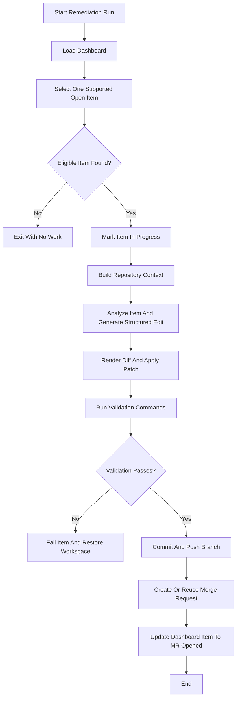

# AI Code Ops Dashboard Remediation Functional Design

## 1. Purpose

Build a dashboard-backed remediation workflow that:

1. reads one structured work item from the dashboard,
2. selects one remediation-ready item safely,
3. analyzes the local repository against that item,
4. proposes and validates a code change,
5. opens a merge request when the change is acceptable,
6. updates the dashboard item lifecycle as the work progresses.

This document defines the functional behavior for moving remediation from
source-specific intake toward a dashboard-first operating model.

## 2. Goals

- Make the dashboard the shared work queue for remediation-ready items.
- Decouple discovery from code-changing remediation.
- Allow multiple producers to feed one generic remediation workflow.
- Preserve the narrow, safe remediation scope already proven in the SonarQube
  v1 workflow.
- Keep the remediation bot deterministic, traceable, and easy to operate.

## 3. Non-Goals

- Auto-remediating every dashboard item type in the first version.
- Replacing GitLab merge requests as the review surface.
- Letting free-form dashboard text become remediation input.
- Supporting broad refactors or multi-file rewrites in the first dashboard
  remediation version.
- Solving long-term cross-repo queueing, locking, or analytics in the first
  implementation.

## 4. Primary User Story

As a maintainer, I want discovery bots to write structured dashboard items and
the remediation bot to pick up one supported item at a time, so the code-changing
workflow no longer depends directly on SonarQube or another single source.

## 5. Assumptions

- GitLab remains the primary platform in the first implementation.
- The dashboard is a persistent GitLab issue with a strict machine-readable
  format.
- Only some dashboard item types are remediation-ready at first.
- The local repository workspace and validation commands remain the primary
  safety gate before merge request creation.
- Merge requests remain the main human review surface.

## 6. External Systems

- GitLab dashboard issue
  - source of structured work items
  - updated with item lifecycle changes
- GitLab merge requests
  - output surface for code changes
  - durable operational state for opened remediation work
- local repository workspace
  - source analysis, edit rendering, validation, git operations
- LLM provider
  - item analysis and structured edit generation
- upstream discovery producers
  - SonarQube dashboard sync
  - later pipeline-failure discovery
  - later internal review discovery

## 7. High-Level Functional Flow

## 8. Proposed Logical Components

### 8.1 Dashboard Item Source

Responsible for:

- loading the dashboard issue,
- parsing structured items,
- selecting one eligible remediation item,
- returning a typed work item to the remediation workflow.

### 8.2 Dashboard Item Selector

Responsible for:

- filtering supported item types and statuses,
- skipping items already represented by an active merge request,
- enforcing ordering and fairness rules,
- returning stable skip reasons for observability.

### 8.3 Work Item Analyzer

Responsible for:

- mapping the selected dashboard item into a repository-context request,
- keeping scope bounded to the supported remediation model,
- rejecting items that exceed current remediation capability.

### 8.4 Generic Remediation Workflow

Responsible for:

- taking one structured work item,
- producing a structured edit,
- rendering a bot-owned diff,
- validating and publishing the result.

The shared remediation workflow should consume a remediation-native work-item
contract rather than requiring every producer to masquerade as a SonarQube
issue internally.

That means:

- SonarQube remains one supported producer profile,
- future producers should plug into the same workflow through the shared
  remediation contract,
- source-specific prompt shaping or policy can still exist where needed, but it
  should not redefine the base execution model for every producer.

### 8.5 Dashboard Lifecycle Updater

Responsible for:

- transitioning dashboard item statuses,
- recording merge request links,
- moving failed or rejected items out of active sections,
- keeping the dashboard in sync with remediation progress.

The first implementation should keep this responsibility narrow:

- the remediation workflow owns transitions it can observe directly during its
  active run,
- later reconciliation of merged, closed, or otherwise externally changed merge
  requests should remain a separate maintenance workflow.

## 9. Remediation-Ready Dashboard Item Contract

An item should only be selectable for remediation when it includes:

- `id`
- `source`
- `type`
- `status`
- `title`
- `summary`
- `priority`
- `source_reference`

And, when relevant for code remediation:

- `file`
- `line`
- `validation_commands`
- `expected_change`
- `constraints`
- `acceptance_criteria`

For the first dashboard-backed remediation version, only `constraints` should
be treated as a producer-neutral execution input. The other optional fields can
be preserved on the item as metadata, but they should not yet change runtime
behavior until their enforcement semantics are defined more clearly.

The remediation workflow should reject items that are:

- structurally incomplete,
- outside supported item types,
- already in progress elsewhere,
- too broad for the current remediation scope.

## 10. Initial Supported Item Types

The first dashboard-backed remediation version should stay narrow.

Recommended initial support:

- Sonar-derived single-file code smell items already compatible with the
  current structured-edit workflow

Deferred item classes:

- pipeline-failure-derived test fixes
- complex single-file refactors
- symbol-safe rename issues
- multi-file changes

## 11. Selection Rules

The remediation workflow should select:

- only items with status `open`
- only supported item types
- only items that still satisfy current remediation policy
- only one item per run

The workflow should skip items when:

- a matching merge request is already open,
- the item is not remediation-ready,
- the item exceeds supported scope,
- the item has been marked `ignored` or `rejected`,
- the item is already `in_progress` for another run.

## 12. Item Lifecycle

Recommended lifecycle transitions:

- `open`
  - initial state after discovery or after a previously resolved issue reopens
- `in_progress`
  - selected by remediation and currently being processed
- `mr_opened`
  - remediation succeeded and a merge request exists
- `done`
  - issue no longer active upstream or remediation no longer required
- `rejected`
  - human or policy rejected remediation for this item
- `ignored`
  - explicitly out of scope for current automation
- `failed`
  - remediation attempted but did not complete successfully

The workflow should preserve stable item IDs across transitions.

For the first implementation, the remediation bot should own only the
transitions it can observe directly while it is running:

- `open -> in_progress`
- `in_progress -> mr_opened`
- `in_progress -> failed`
- `in_progress -> rejected`

Later transitions driven by external events, such as a merge request being
merged or closed after the remediation run has ended, should be handled by a
separate reconciliation workflow rather than making the remediation bot a full
long-lived state controller.

## 12.1 Stale In-Progress Recovery

The first implementation should define what happens when a run marks an item
`in_progress` and then does not finish cleanly because the job is canceled, the
runner crashes, or the process loses network access mid-flight.

## 12.2 Merge Request Reconciliation

Before product demonstration, the dashboard workflow should also define how
items leave `mr_opened` after the merge request state changes outside the
active remediation run.

This should be a separate scheduled reconciliation workflow rather than an
extension of the remediation bot itself.

Recommended ownership split:

- the remediation workflow owns active-run transitions only,
- the reconciliation workflow owns later merge-request convergence,
- the stale `in_progress` recovery rule remains owned by remediation intake and
  should not be duplicated by reconciliation.

Recommended reconciliation behavior:

- when the linked merge request is merged, move `mr_opened -> done`
- when the linked merge request is closed without merge and the item still
  represents valid open work, move `mr_opened -> open`
- when the linked merge request is closed without merge and the remediation is
  no longer needed, move `mr_opened -> done`
- when merge-request metadata is missing, inaccessible, or no longer matches
  stored branch and commit traceability well enough to make a safe decision,
  move `mr_opened -> failed` with an explicit operator-facing reason

The reconciliation workflow should be conservative. It should prefer explicit
failure or reopen behavior over silently dropping item history.

The first version should operate on:

- items currently in `mr_opened`
- one dashboard issue at a time
- scheduled or manually triggered CI runs

The first version should not own:

- item selection for remediation
- patch generation or validation
- active-run `in_progress` recovery
- broad dashboard cleanup outside merge-request convergence

At minimum, operators should be able to tell:

- whether the item is still actively being processed,
- whether the item should be moved back to `open`,
- whether the item should be left `in_progress` for manual follow-up.

The workflow should prefer explicit recovery rules over leaving stale
`in_progress` items ambiguous forever.

## 13. Human Interaction Model

Humans should be able to:

- inspect all remediation-ready items on the dashboard,
- see which item is currently in progress,
- follow the merge request link for an opened remediation,
- mark items ignored or rejected later when command-style controls are added.

The first implementation should remain machine-managed by default, with human
inspection and merge-request review as the main oversight mechanism.

## 14. Migration Model

Dashboard-backed remediation should become the primary remediation workflow
before live rollout and now stands as the only active remediation path.

The first version should therefore keep ownership simple:

- the dashboard-backed remediation workflow owns active execution transitions,
- Sonar dashboard sync remains the discovery producer for Sonar-derived items,
- later convergence of dashboard state with merged or closed merge requests is a
  separate reconciliation concern,
- remediation no longer depends on a separate direct Sonar execution path.

## 15. Success Criteria

The dashboard-backed remediation workflow is successful when:

- one supported dashboard item can be selected deterministically,
- remediation no longer depends on direct SonarQube intake for that item class,
- merge requests still contain the same quality and traceability as the current
  Sonar remediation flow,
- dashboard status updates remain accurate and understandable,
- unsupported or unsafe items are skipped cleanly instead of being forced
  through remediation.

## 16. Dashboard Contract Growth

The first item contract is intentionally narrow, but the platform direction now
includes future producers beyond SonarQube.

To keep the dashboard viable as a shared work queue, the contract should remain
clear about:

- which fields are universally required for every remediation-ready item,
- which fields are source-specific extensions,
- how new producers can add structured metadata without weakening the strict
  machine-managed format.

This avoids turning one flat item model into an overloaded bucket of optional
fields as more workflow types are added.

## 17. Traceability Expectations

Operators should be able to correlate one remediation attempt across:

- dashboard item ID,
- run summary,
- branch name,
- commit SHA,
- merge request URL.

## 18. Advisory Remediation Confidence

The remediation workflow may later expose an advisory confidence signal to help
operators understand how likely the bot thinks it can produce a safe and
bounded fix for the selected item.

This signal should remain advisory in the first version:

- it should not auto-merge changes,
- it should not replace human review,
- it should not automatically close dashboard items on its own.

The score should be accompanied by a short machine-generated reason so
operators can understand why the score was low or high instead of seeing an
unexplained number.

Recommended initial behavior:

- use a simple normalized score range such as `0.0` to `1.0`,
- store the score and reason on the dashboard item or associated workflow
  artifacts,
- surface the score for prioritization and operator awareness before using it
  as any stronger policy input.

Review-specific confidence should be defined in the pull-request review bot
functional design rather than here.

Those traceability fields should remain stable across normal success, failure,
and retry paths so the dashboard can act as a real operational control plane
rather than only a backlog view.
