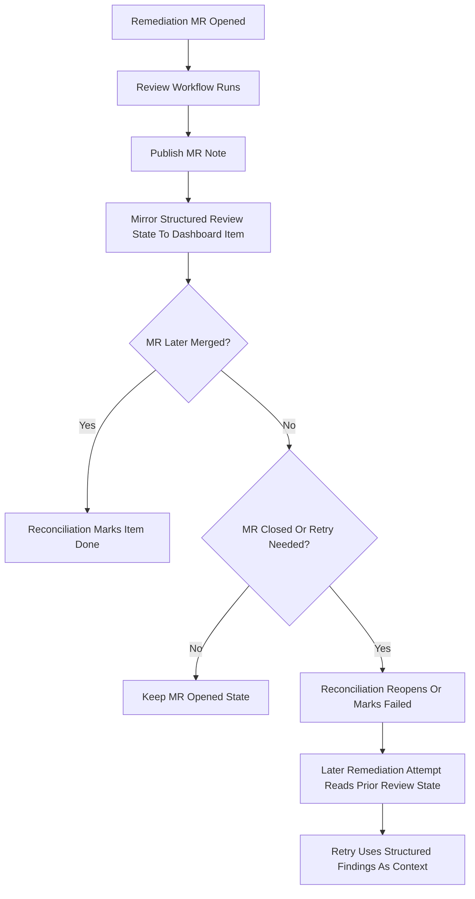

# ZeroOne Ops Dashboard Review Feedback Functional Design

## 1. Purpose

Define a follow-up phase where review results become structured dashboard state
for remediation items, so the bot can learn from prior review attempts without
turning merge request notes into machine state.

This design keeps two surfaces with different jobs:

1. dashboard state is for the bot,
2. merge request notes are for operators,
3. reconciliation and later retries use the dashboard as the control plane.

## 2. Goals

- Attach structured review outcomes to remediation-backed dashboard items.
- Keep merge request notes as the primary human-facing review surface.
- Let reconciliation and later remediation attempts use prior review findings.
- Make retry behavior more deliberate, bounded, and easier to explain.
- Improve operator visibility into whether an open or failed remediation MR was
  reviewed and what happened.

## 3. Non-Goals

- Replacing merge request notes with dashboard-only review output.
- Auto-retrying every failed or closed remediation item immediately.
- Letting raw free-form MR note text become the only retry input.
- Turning the review workflow into a code-changing workflow.
- Solving long-term analytics or multi-repo coordination in the first version.

## 4. Primary User Story

As an operator, I want remediation items to retain structured review state on
the dashboard, so I can see whether a remediation MR was reviewed, why it
failed, and whether a later retry should use those findings.

As the bot, I want retry-relevant review context stored on the remediation
item, so a reopened item does not start from zero after a failed first attempt.

## 5. Assumptions

- GitLab merge request notes remain the main human review surface.
- The dashboard remains the machine-readable control plane.
- Review and remediation stay separate workflows.
- Retry behavior must remain bounded and operator-auditable.
- Raw MR note prose may help operators, but retry logic should prefer
  structured review data.

## 6. Core Product Decision

The remediation dashboard item should become the canonical automation record.

That means:

- remediation lifecycle stays on the remediation item,
- review state is attached to that remediation item,
- merge request notes remain the readable explanation for humans,
- a separate standalone review-status item should not be the primary retry
  mechanism for remediation retries.

This keeps one shared record per remediation attempt lineage instead of making
operators and automation join multiple dashboard items by hand.

## 7. High-Level Functional Flow

## 8. Functional Model

### 8.1 Dashboard For The Bot

The dashboard should hold machine-readable state such as:

- remediation lifecycle status,
- merge request traceability,
- latest structured review outcome,
- retry count and retry eligibility,
- the most relevant prior review findings for the next attempt.

### 8.2 Merge Request Notes For Operators

Merge request notes should continue to provide:

- the readable review summary,
- the operator-facing explanation of findings,
- confidence and uncertainty framing,
- the discussion surface for human reviewers.

The dashboard may link back to the MR note, but it should not depend on humans
parsing the note body to understand retry state.

## 9. Review State To Store On The Dashboard

A remediation item should eventually carry structured review fields such as:

- `review_status`
  - `no_findings`
  - `findings_present`
  - `manual_review_only`
- `reviewed_head_sha`
- `review_note_url`
- `review_findings_count`
- `review_confidence`
- `review_confidence_reason`
- `review_feedback_summary`
- `review_feedback_updated_at`
- `review_retry_guidance`
  - for example `retryable`, `manual_only`, or `do_not_retry`

Later versions may also retain a bounded list of structured findings so the
next remediation attempt can reuse them directly.

## 10. Retry-Oriented Behavior

The first follow-up version should support a conservative retry loop.

Recommended rules:

- only remediation items with prior review state may use review feedback on
  retry,
- retries should be capped,
- the first version should default to one retry total per remediation item,
- the retry limit should be configurable in the JSON config,
- retries should not happen automatically without a clear lifecycle trigger,
- low-confidence or context-insufficient review outcomes should reduce retry
  confidence rather than silently blocking all retries,
- unsupported or ambiguous review feedback should fall back to operator review.

## 11. Reconciliation Responsibilities

Reconciliation should later do more than check merge request open/closed state.

It should also:

- notice when a remediation MR has a completed review outcome,
- keep the remediation item's review state current,
- reopen or fail items with enough structured context for the next attempt,
- preserve attempt history instead of treating each retry as a fresh item.

## 12. Operator Experience

Operators should be able to answer these questions directly from the dashboard:

- was this remediation MR reviewed,
- what was the review outcome,
- how many findings were raised,
- is the item retryable,
- why did it fail or reopen,
- which MR and SHA does this review state belong to.

The dashboard should support that without requiring the operator to open raw
JSON or read the whole MR note first.

## 13. Rollout Shape

Recommended rollout:

1. attach lightweight review metadata to remediation items,
2. show the linked review state clearly in dashboard rendering,
3. teach reconciliation to preserve and expose that review state,
4. let reconciliation derive retry eligibility from structured review outcome
   plus retry limits,
5. only then let remediation retries consume prior structured review findings.

This keeps visibility and traceability ahead of automation.

## 14. Done When

This follow-up phase is successful when:

- remediation items carry structured review state on the dashboard,
- MR notes remain the human review surface,
- reconciliation preserves review context for reopened or failed items,
- a later remediation attempt can use prior structured review feedback without
  relying on raw MR note text alone.
