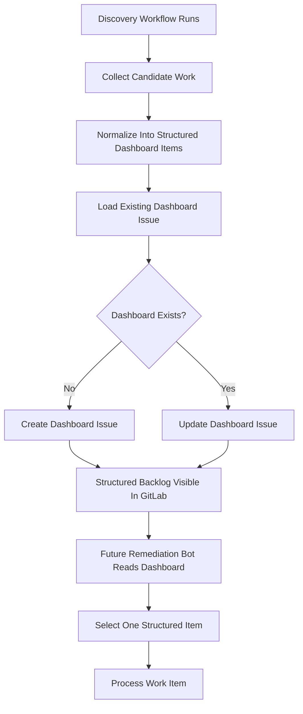

# AI Code Ops Dashboard Functional Design

## 1. Purpose

Build a GitLab-first dashboard that acts as the structured work queue for future
automation workflows.

The dashboard should:

1. provide one visible place where bot-discovered work items are tracked,
2. store work items in a strict, machine-readable format,
3. let future discovery workflows write items into that backlog,
4. let future remediation workflows pick up one structured item at a time,
5. keep discovery separate from code-changing remediation,
6. track future review workflow outcomes without replacing merge-request-native
   review notes.

This document defines the functional design for that dashboard before
implementation.

## 2. Goals

- Create a durable, human-visible control plane for AI Code Ops work.
- Normalize work from multiple sources into one consistent structured format.
- Decouple discovery from remediation.
- Make future pipeline-failure, internal-review, and Sonar-derived work visible
  and triageable.
- Provide a backlog that humans can inspect before automation acts.

## 3. Non-Goals

- Replacing GitLab issues or merge requests entirely.
- Building a full UI beyond GitLab-native surfaces in v1.
- Supporting arbitrary free-form dashboard text as automation input.
- Letting bots execute every dashboard item automatically in v1.
- Solving long-term shared-state scaling in the first dashboard version.

## 4. Primary User Story

As a maintainer, I want a single GitLab dashboard issue that:

- shows open AI-discovered work items,
- keeps those items in a structured format,
- records their current status,
- allows future bots to consume them safely,
- and makes it obvious what work is pending, in progress, rejected, or done.

## 5. Assumptions

- GitLab remains the primary platform in the first version.
- The dashboard is implemented as one persistent GitLab issue.
- Discovery workflows can update that issue through the GitLab API.
- Remediation workflows can read and parse that issue reliably.
- Humans may edit the issue, but the structured sections must remain stable for
  automation to work.

## 6. External Systems

- GitLab issues
  - used as the visible dashboard surface
  - stores the structured backlog content
- future discovery sources
  - SonarQube
  - pipeline failures
  - internal scheduled review
  - later Jira or ClickUp if normalized first
- future remediation workflow
  - consumes one structured dashboard item as a work item
- future review workflow
  - reviews merge requests on merge-request events
  - publishes detailed review output on the merge request itself
  - updates the dashboard with review status and traceability metadata

## 7. High-Level Functional Flow

## 8. Proposed Logical Components

### 8.1 Dashboard Service

Responsible for:

- finding or creating the dashboard issue,
- reading its current body,
- rendering deterministic dashboard content,
- publishing updates back to GitLab.

### 8.2 Work Item Normalizer

Responsible for:

- converting source-specific findings into one common dashboard item format,
- assigning stable IDs,
- preserving source traceability,
- rejecting items that do not meet the structured contract.

### 8.3 Discovery Producers

Responsible for:

- sourcing candidate work from systems like SonarQube or pipeline failures,
- deciding whether a candidate is worth writing into the dashboard,
- passing normalized items into the dashboard service.

### 8.4 Dashboard Consumer

Responsible for:

- reading the structured dashboard issue,
- selecting one eligible item,
- handing it to a remediation workflow later.

### 8.5 Review Status Updater

Responsible for:

- recording review workflow status on the dashboard,
- linking dashboard entries to merge requests and reviewed revisions,
- preserving the rule that detailed review findings stay on the merge request.

## 9. Dashboard Model

The dashboard should be one persistent GitLab issue, for example:

- `AI Code Ops Dashboard`

The body should contain stable sections such as:

- Open candidates
- In progress
- Merge requests opened
- Merge request reviews
- Rejected or ignored
- Recent failures

Each item must be machine-readable and human-readable.

## 10. Structured Dashboard Item Contract

Each dashboard item should include at least:

- `id`
- `source`
- `type`
- `status`
- `title`
- `summary`
- `file`
- `line`
- `priority`
- `validation_commands`
- `source_reference`

Source-specific optional fields may include:

- `rule`
- `severity`
- `pipeline_id`
- `job_id`
- `job_name`
- `commit_sha`
- `merge_request_iid`
- `merge_request_url`
- `reviewed_head_sha`
- `review_status`
- `log_excerpt`
- `expected_change`
- `constraints`
- `acceptance_criteria`

## 11. Item Lifecycle

Each dashboard item should move through clear statuses:

- `open`
- `in_progress`
- `mr_opened`
- `done`
- `rejected`
- `ignored`
- `failed`

The dashboard should show those statuses explicitly.

## 12. Source Examples

### 12.1 Sonar-Derived Item

- `source: sonarqube`
- `type: code_smell_fix`
- `rule: python:S1125`
- `file: src/service.py`
- `summary: Simplify boolean comparison`

### 12.2 Pipeline-Derived Item

- `source: pipeline_failure`
- `type: test_fix`
- `pipeline_id: 12345`
- `job_name: pytest`
- `commit_sha: abc123`
- `summary: Failing regression test in service module`

### 12.3 Internal Review Item

- `source: internal_review`
- `type: cleanup`
- `file: src/service.py`
- `summary: Repeated conditional branch could be simplified`

### 12.4 Merge Request Review Status Item

- `source: pull_request_review`
- `type: review_status`
- `merge_request_iid: 42`
- `reviewed_head_sha: abc123`
- `review_status: findings_present`
- `summary: Review completed with two findings`

## 13. Functional Requirements

### 13.1 Dashboard Discovery

The system must:

- find an existing dashboard issue if it already exists,
- create it if it does not,
- use a deterministic title and label set.

### 13.2 Deterministic Rendering

The dashboard body must:

- use a stable markdown structure,
- be machine-parseable,
- preserve item ordering rules,
- remain readable to humans.

### 13.3 Structured Work Item Safety

The remediation bot must only consume items that:

- match the required structured contract,
- are in a reviewable status,
- are not already in progress or completed,
- belong to a supported work type.

### 13.4 Discovery/Remediation Separation

The discovery workflow must not directly apply code changes in this design.

Instead:

- discovery writes normalized work to the dashboard,
- remediation reads one structured item from the dashboard and acts on it.

This separation is the key operating rule for the dashboard design.

### 13.5 Merge Request Review Interaction Model

The review workflow must:

- trigger from merge-request activity,
- publish the primary review result on the merge request itself,
- update the dashboard with review status, revision identity, and merge-request
  links,
- avoid treating the dashboard as the canonical review-comment surface.

For review workflows, the dashboard is a coordination and visibility surface,
not the primary output surface.

## 14. Deduplication Expectations

The dashboard must avoid duplicate items when possible.

Stable dedup keys should be source-specific, for example:

- SonarQube issue key
- pipeline job ID + commit SHA
- internal review finding ID

If the same source item already exists in the dashboard:

- update its status or metadata,
- do not create a second logically identical entry.

## 15. Human Interaction Model

Humans should be able to:

- read the backlog,
- understand why an item exists,
- see its current status,
- decide whether an item should remain in scope.

The first version may be status-only, but the design should allow later control
actions such as:

- retry
- ignore
- approve for automation

## 16. Success Criteria

The dashboard design is successful when:

- one GitLab issue can represent the current structured AI work backlog,
- multiple future discovery sources can write into it consistently,
- a remediation workflow can safely consume one structured item from it,
- humans can understand the backlog without reading logs or local state files.

## 17. Future Extensions

Post-v1 candidates include:

- issue checkboxes or commands as control inputs
- richer prioritization and grouping
- multiple dashboards by repository area or workflow type
- GitHub issue support with the same dashboard model
- dashboard items feeding both remediation and review workflows
