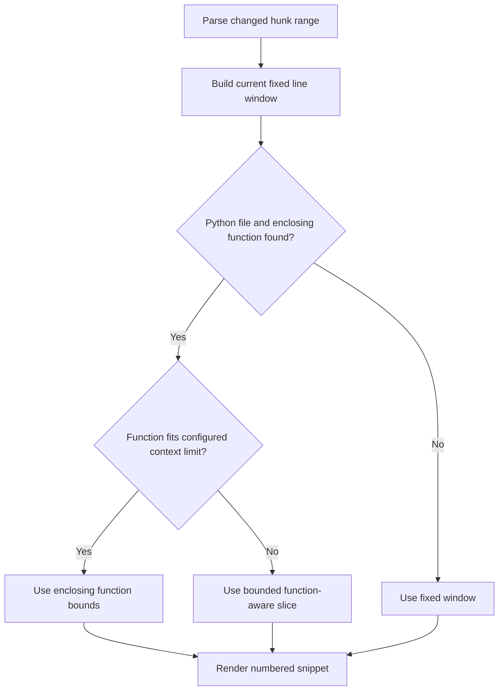

# Function-Aware Review Context Functional Design

## 1. Purpose

Define a review-bot follow-up improvement that expands changed-file context to
include an enclosing function when the reviewed hunk sits inside a long Python
function.

The goal is to improve review quality on legacy repositories where fixed
before/after line windows often miss important guards, fallback behavior,
shared local state, or return-shape construction that lives elsewhere in the
same function.

## 2. Goals

- Give the review bot more complete local reasoning context inside long
  functions.
- Reduce false positives caused by missing guards, setup, or fallback branches
  outside the current fixed line window.
- Keep context selection deterministic and bounded.
- Improve review quality on legacy codebases without globally bloating every
  prompt.

## 3. Non-Goals

- Full symbol-aware context expansion for every language in the first version.
- Unlimited whole-file expansion for large changed files.
- Replacing the current diff-centered review model with a code-indexing system.

## 4. Problem Statement

The current review workflow builds changed-file context using a fixed number of
lines before and after the changed hunk.

That works reasonably well for smaller or modern code, but on legacy
repositories it can miss key behavior when:

- a function is long,
- the relevant guard sits earlier in the same function,
- a fallback or return-shape decision happens later in the same function,
- or the changed hunk depends on shared local variables initialized outside the
  fixed review window.

This leads to misses and false positives that are not primarily prompt-quality
problems, but context-selection problems.

## 5. Primary User Story

As an operator testing the review bot on legacy repositories, I want the bot to
see enough of the enclosing function to judge the changed logic correctly,
without turning every review prompt into an oversized full-file dump.

## 6. Functional Direction

The review context builder should keep the current hunk-based window as the
baseline, but for supported Python files it should attempt to expand the
context to include the enclosing function when:

- the changed hunk is inside a Python function,
- the enclosing function stays within a configured maximum size,
- and expansion would materially increase local reasoning context.

When function-aware expansion is unavailable or too large, the builder should
fall back to the current fixed-window behavior.

For Python, the preferred first implementation should use AST-derived function
boundaries rather than only indentation heuristics, while still falling back to
the current window if parsing fails.

## 7. Functional Principles

### 7.1 Hunk Context Stays The Baseline

The current fixed before/after window remains the default behavior. Function
awareness should improve context selection, not replace the existing bounded
review model entirely.

### 7.2 Use Enclosing Function When It Helps

If the changed hunk is clearly inside a Python function, the review bot should
prefer seeing the whole enclosing function, or a bounded function-aware slice,
over an arbitrary line window.

### 7.3 Stay Bounded And Deterministic

Function-aware context should not become an excuse to include unbounded code.

It should remain:

- deterministic,
- capped by configuration,
- and easy to explain in tests and operator expectations.

## 8. Proposed Functional Flow

## 9. Functional Requirements

### 9.1 Supported Scope

The first version should support:

- Python files only

and should fall back to the current line-window behavior for:

- non-Python files,
- files where no enclosing function can be detected,
- or files where function-aware parsing is too ambiguous.

### 9.2 Function-Aware Expansion

When a Python change sits inside an enclosing function, the builder should try
to include:

- the function signature,
- local setup and guards,
- the changed hunk,
- and nearby return/fallback logic in that same function.

### 9.3 Configurable Limit

Function-aware expansion should be bounded by a new configuration limit, such
as a maximum number of lines that can be included from the enclosing function.

### 9.4 Safe Fallback

If the enclosing function is too large or cannot be identified reliably, the
builder should fall back to the current hunk-window behavior rather than
including the whole file.

## 10. Assumptions

- Most of the current review misses caused by missing local code context happen
  in long Python functions.
- The first version should preferably use Python AST node boundaries, with safe
  fallback to the existing line-window logic when parsing fails.
- Prompt cost and noise still matter, so whole-function expansion must stay
  bounded.

## 11. Risks

- Very large legacy functions could still create prompt bloat if not bounded.
- Function-boundary detection could over-include or under-include code in some
  edge cases.
- Broader context can improve correctness but also dilute focus if the slice is
  too large.

## 12. Done When

- the review bot can include enclosing Python function context where useful,
- the change reduces context-related misses on long-function code,
- and prompt size remains bounded and predictable rather than drifting toward
  full-file review.
