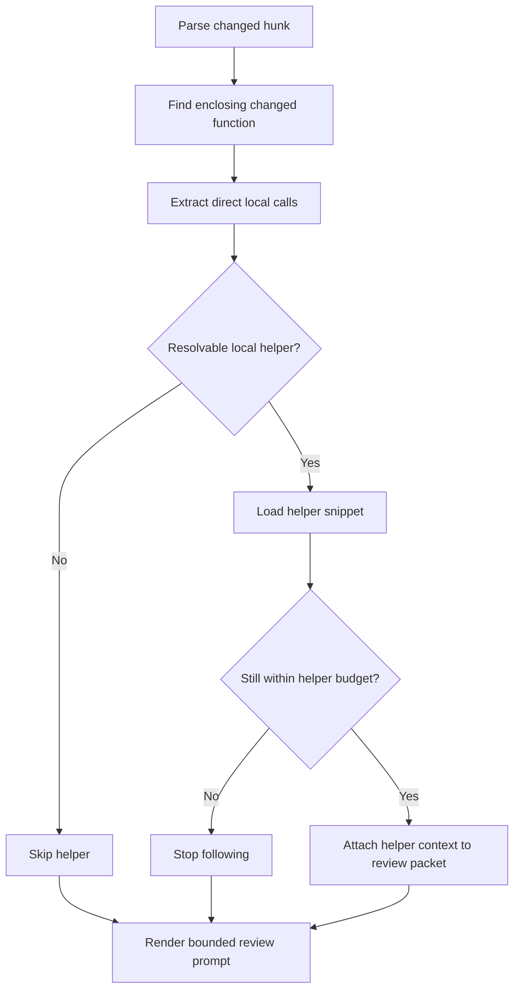

# Helper-Following Review Context Functional Design

## 1. Purpose

Define a review-bot follow-up improvement that augments changed-function
context with a bounded set of directly used helpers or called functions.

The goal is to improve review quality for changes whose correctness depends on
one or two nearby helper implementations, without turning the review workflow
into full repo-wide exploration.

## 2. Goals

- Reduce false positives caused by reviewing only the changed call site.
- Let the review bot inspect directly relevant local helpers when the changed
  function depends on them.
- Keep the review context bounded, deterministic, and explainable.
- Provide a practical middle step between static local windows and a fully
  agentic review workflow.

## 3. Non-Goals

- Full repo traversal during review.
- Arbitrary multi-hop dependency graph exploration in the first version.
- Cross-language symbol resolution in the first version.
- Replacing diff-centered review with general semantic code search.

## 4. Problem Statement

The current review bot can miss important context when the changed code calls a
local helper whose implementation is outside the selected local snippet.

That leads to repeated review-quality issues:

- a call-site diff is treated as suspicious even though the helper preserves
  behavior,
- a helper contract is guessed rather than inspected,
- or a real risk is missed because the changed function depends on a local
  callee not included in the prompt.

This is a context-selection limitation, not only a prompt-quality limitation.

## 5. Primary User Story

As an operator testing the review bot on real repositories, I want the bot to
inspect the directly relevant helpers used by a changed function so the review
feels more grounded, while still staying fast and bounded.

## 6. Functional Direction

The review context builder should:

1. identify the enclosing changed function,
2. detect a small set of directly called local helpers or functions,
3. resolve those helpers only when it can do so confidently,
4. include their code snippets in the review prompt as supplemental context,
5. stop after a strict depth and budget.

The first version should remain:

- Python only,
- one hop only,
- same repository only,
- bounded by max followed helpers and max added lines.

The first implementation should stay conservative about what counts as a
followable helper:

- prefer same-file direct functions first,
- consider project-local imports only after the basic same-file path proves
  useful,
- do not attempt broad method or object-attribute resolution in v1.
- do not follow generated-code helpers or test helpers in v1

## 7. Functional Principles

### 7.1 Changed Function First

The changed function remains the main review surface. Helper-following context
is supplemental, not a replacement for the changed diff and enclosing function.

### 7.2 Only Follow What We Can Resolve Confidently

The bot should follow only helpers or functions whose local definition can be
identified reliably. Ambiguous symbol resolution should fall back to the
existing context rather than guessing.

### 7.3 Stay Bounded

The first version should follow:

- one call hop,
- a small maximum number of helpers,
- a strict total line budget.

Recommended first budgets:

- depth: `1`
- max followed helpers: `3`
- max helper lines total: `120`
- max helper context added per merge request should also stay bounded

That keeps the review packet inspectable and cost-bounded.

## 8. Proposed Functional Flow

## 9. Functional Requirements

### 9.1 Supported Scope

The first version should support:

- Python files only
- local function or method calls only
- one hop from the changed function to directly used helpers

Helper-following should run only when the changed hunk sits inside an
identifiable changed function.

### 9.2 Helper Resolution

The builder should try to resolve:

- directly called local functions in the same file,
- local imports or project-local helper symbols when resolution is clear.

It should not guess across ambiguous imports or dynamic dispatch.

For the first version, "resolvable" should mean the call maps to one clear
local definition without ambiguity.

Helper-following should respect the existing review scope rules, including
supported and ignored paths.

### 9.3 Context Budget

The first implementation should use explicit bounds such as:

- max followed helpers per changed function,
- max total helper lines,
- max overall supplemental helper context budget.

Helper context should be rendered separately from the main changed-function
context so the prompt clearly distinguishes:

- primary changed code,
- supporting helper context.

Helper context ordering should stay deterministic, for example:

- same-file helpers first,
- imported helpers second,
- ties broken by first call occurrence in the changed function.

### 9.4 Diagnostics And Operator Support

Because helper-following can fail or skip work for several bounded reasons, the
feature should support lightweight diagnostics that operators can enable during
testing.

That diagnostic support should:

- be off by default,
- be controlled by config,
- explain which helper candidates were found, resolved, skipped, or clipped,
- and stay out of normal MR notes or operator-facing review summaries.

A small, explicit skip-reason taxonomy should be used so diagnostics stay
consistent and easy to reason about, for example:

- `ambiguous_symbol`
- `unsupported_call_shape`
- `budget_exceeded`
- `non_python`
- `parse_failed`

### 9.4 Safe Fallback

If helper-following fails, becomes ambiguous, or exceeds budget, the builder
should fall back to the current changed-function/local-context packet rather
than expanding unpredictably.

## 10. Assumptions

- Many current review misses involve one-hop local helper context rather than
  deep repo-wide dependency analysis.
- Python-only support is enough to validate the idea.
- The review bot benefits more from a few relevant helper snippets than from
  a much larger generic line window.
- repository operators may want a config flag to enable or disable helper
  following per repo while testing the feature.
- repository operators may also want a separate config flag for helper-following
  diagnostics so rollout can be debugged without making ordinary runs noisy.

## 11. Risks

- Weak symbol resolution could follow the wrong helper.
- Even bounded helper-following can add prompt noise if the helper selection is
  poor.
- The most relevant truth may still live two or more hops away, which the
  first version will intentionally not follow.

## 12. Done When

- changed functions can carry bounded directly relevant helper context,
- review quality improves on helper-dependent diffs,
- and the context remains narrow enough that the workflow still feels like
  structured review rather than open-ended repo exploration.
