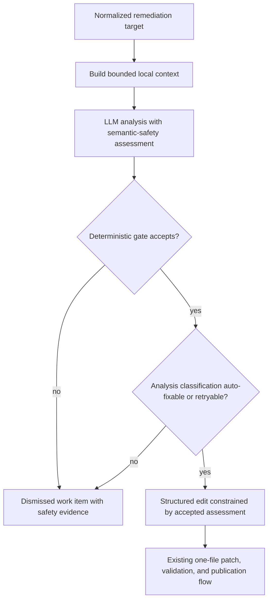

# Remediation Semantic Safety Functional Design

## Status

Implemented contract. The semantic-safety gate, provider projections, and
verified review-context handoff follow this design.

## Purpose

Rule-driven findings are evidence of a potential problem, not instructions to
change code. Before ZeroOne Ops creates a remediation patch, it must establish
a bounded local rationale for the proposed change. This protects repositories
from mechanically valid edits that alter behavior unexpectedly.

Semantic safety is mandatory for every remediation analysis. It applies to all
normalized sources and both GitHub and GitLab issue-mode workflows.

## Goals

- require a concrete local account of current and intended behavior before
  automated code generation;
- distinguish straightforward, behavior-preserving maintenance from changes
  that require human judgment;
- prevent a structured edit from proceeding after analysis rejects automation;
- retain compact operator evidence when automation stops;
- preserve the existing one-file patch, validation, and provider-native change
  request boundaries.

## Non-Goals

- formally proving program equivalence or correctness;
- replacing repository tests, review, or validation commands;
- adding a second model, semantic embedding search, or independent LLM judge;
- expanding a one-file remediation into test or multi-file repair;
- revising a published change request from review findings.

## Semantic-Safety Assessment

Every analysis result must contain a bounded semantic-safety assessment:

| Field | Required meaning |
|---|---|
| Current behavior | What the relevant local code does today. |
| Intended behavior | What the code should do after this remediation, including any intentionally corrected behavior. |
| Local preservation evidence | Why the proposed one-file change preserves behavior outside that intended correction. |

For lint, typing, test, refactor, and maintenance work, intended behavior will
normally state that runtime behavior is preserved. For a real behavioral fix,
it must state the narrow intended correction and what surrounding behavior
remains unchanged.

The assessment is a bounded model claim grounded in local context, not a formal
proof. The deterministic gate requires only non-empty, bounded fields and at
least one evidence entry. It does not determine whether that evidence is true,
specific, non-contradictory, or sufficient to preserve behavior.

## Decision Rules

1. Analysis classifies the item as `auto_fixable`, `retryable`, or `manual` and
   produces the required assessment.
2. An independent deterministic gate validates only assessment shape: required,
   bounded non-empty fields and at least one evidence entry.
3. `auto_fixable` and `retryable` proceed only when the gate accepts the
   assessment. The structured-edit request receives the accepted assessment as
   untrusted analysis evidence; trusted workflow policy retains the one-file
   and minimal-scope constraints.
4. `manual`, or an analysis that fails the gate, never invokes structured-edit
   generation, patch application, validation, branch creation, or publication.
5. A structured edit cannot change the analysis classification or broaden the
   stated intended behavior. Existing patch scope and safety checks remain the
   final enforcement layer.

The gate does not decide whether the semantic claim is true. It enforces only
that a complete, bounded claim is present before automation proceeds.

## Operator Experience

For a gate-approved patch, the generated pull or merge request includes a short
**Semantic Safety** section: current behavior, intended behavior, and bounded
local preservation evidence. It is supporting review evidence, not approval or
a claim that validation passed.

When the existing review workflow evaluates that pull or merge request, it
receives the same assessment as explicitly labeled, untrusted remediation
evidence. The review can compare the proposed diff with the stated current
behavior, intended behavior, and preservation claim without a second
remediation-stage model call. A finding that the claim is unsupported or
contradicted remains normal review feedback; it does not make the assessment a
formal proof.

When the analysis is `manual` or the gate rejects its evidence, the work item
uses the existing terminal `dismissed` outcome. Its provider issue closes and
renders:

- `Last Execution` with status `dismissed` and stage `semantic_safety`;
- a concise reason that automatic remediation stopped because behavior could
  not be established safely;
- the semantic-safety assessment when available.

Dismissal remains durable suppression for that exact v1 finding identity. There
is no new requeue command for semantic-safety dismissals. Operators may resolve
the issue manually.

## Trust And Ownership

- scanner diagnostics, repository code, guidance, prior review feedback, and
  validation output remain untrusted evidence;
- analysis and structured-edit workflow requirements are trusted policy;
- the remediation analysis service owns semantic-safety evaluation;
- shared execution owns the hard stop before branch and patch work;
- review receives semantic-safety evidence only through a verified work-item to
  change-request link, never by trusting description-provided identifiers;
- GitHub and GitLab work-item renderers project compact final evidence only;
- finding sync and lifecycle do not reinterpret semantic evidence or reopen a
  dismissed item.

## Flow

## Acceptance Criteria

- Every auto-generated patch has current behavior, intended behavior, and local
  preservation evidence.
- Missing or invalid assessment fields stop automation before branch or patch
  creation.
- A `manual` analysis cannot be overridden by structured-edit output.
- GitHub and GitLab render equivalent terminal semantic-safety evidence.
- Mechanical safe fixes remain eligible when their assessment states preserved
  runtime behavior.
- Behavior-sensitive or cross-file changes are dismissed for manual handling.
- Existing validation feedback, patch application, and recovery behavior remain
  unchanged after a gate-approved analysis.
