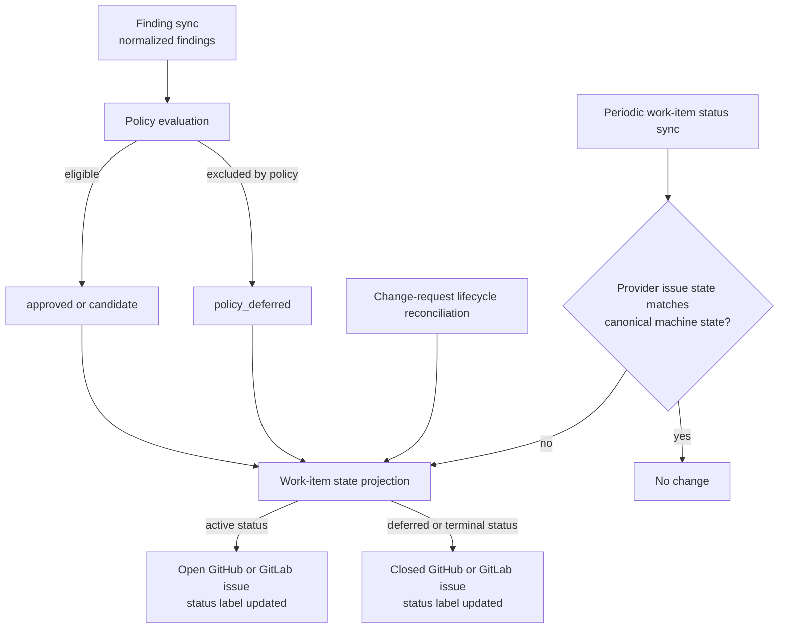

# ZeroOne Ops Work-Item State Projection Functional Design

## Scope

This design defines how canonical work-item status is projected onto GitHub and
GitLab issue state. It starts with policy reconciliation so policy-ineligible
work does not remain as cluttering open candidates.

It does not introduce new storage, a new operator command, or a generic
provider abstraction.

## Problem

Finding sync can determine that a known finding is no longer eligible under
the current operator policy. Today an unlinked approved work item is demoted
to `candidate` and remains open. This leaves operator-visible work that the
policy explicitly excludes.

The decision that a finding is policy-ineligible belongs to finding sync. The
provider-specific mechanics of rendering labels and opening or closing an
issue should not be decided independently by finding sync, recovery, and
lifecycle code.

## Authoritative Model

`WorkItemState` remains authoritative. Provider issue state and labels are
derived projections:

| Canonical status | Provider issue state |
|---|---|
| `candidate` | open |
| `approved` | open |
| `in_progress` | open |
| `blocked` | open |
| `completed` | closed |
| `dismissed` | closed |
| `policy_deferred` | closed |
| `capacity_deferred` (planned) | closed |

Labels remain discovery indexes and operator filters. They must never be used
as the authority for a status transition; parsed machine state remains the
authority.

## Policy-Deferred Work

`policy_deferred` means that a finding remains known but is intentionally not
actionable under current policy. It is a reversible deferred state, not a
claim that the finding was fixed.

It is projected as a closed provider issue, but it is not a terminal domain
outcome: a later finding sync may reopen it when the finding remains present
and policy makes it eligible again.

The rendered work item records the policy reason, deferred time, and finding
sync run ID. It links operators to the policy surface. It does not offer a
work-item recovery command, because policy changes are made through the policy
surface.

Finding sync may move an item to `policy_deferred` only when it is unlinked and
currently `candidate` or `approved`. It must preserve `in_progress`, `blocked`,
`dismissed`, and items linked to a change request. Those are lifecycle-owned
or operator-owned states.

Today, when policy makes the same finding eligible again, a later successful
finding sync reopens the same provider issue as `approved` when capacity
permits or as `candidate` when capacity defers it. The planned
`capacity_deferred` follow-up replaces that latter open-candidate projection
with a closed backlog state. The original identity and history remain intact.

When a complete managed source inventory no longer reports an exact finding
identity, finding sync moves safe unlinked `candidate` or `approved` work, and
already closed deferred work, to `completed` with resolution
`no_longer_detected` before evaluating policy. The provider issue remains
closed, but its rendered state and status label make clear that ZeroOne Ops did
not remediate the finding. It may have been fixed manually or disappeared
through another change.

An incomplete, unavailable, or non-authoritative source inventory must not
make this transition. In that case the deferred item remains unchanged.

CI finding artifacts are ephemeral evidence, not durable authority. A missing,
unreadable, or failed scanner artifact means that source inventory is
unavailable, not empty. Existing work for that source remains unchanged until
a later complete source run reports its inventory. A valid complete artifact
with zero findings is the only empty inventory that may reconcile prior work.

Finding identity is location-bound in v1. A diagnostic moved by an unrelated
change can therefore create a new occurrence while the prior occurrence closes
as `no_longer_detected`. Relocation-aware occurrence matching is deferred to
the later finding-grouping design.

### Policy-Deferred Transition Rules

This table applies only while the exact finding remains present in a complete
managed inventory. Absence follows the `no_longer_detected` precedence above.

| Current status | Finding is policy-ineligible | Finding is policy-eligible |
|---|---|---|
| `candidate` | move to `policy_deferred` | promote through the capacity plan or remain `candidate` |
| `approved` without a linked change request | move to `policy_deferred` | retain `approved` |
| `policy_deferred` | retain closed | today: reopen as `approved` or `candidate`; planned: retain closed as `capacity_deferred` when capacity is full |
| `in_progress` | retain | retain; lifecycle owns the active attempt |
| `blocked` | retain | retain; recovery owns the next action |
| `dismissed` | retain | retain; dismissal suppression remains authoritative |
| any item linked to a change request | retain | retain; lifecycle owns the linked attempt |

A policy command changes only policy state. It does not enumerate or close
work-item issues. The next successful finding sync performs the bounded policy
reconciliation using its current inventory.

## Capacity-Deferred Work (Locked Follow-Up)

The active provider-issue list is an operator work queue, not a complete
finding inventory. Existing durable policy-eligible work that cannot enter the
configured active remediation budget remains closed as `capacity_deferred`.
Newly observed capacity-exhausted findings remain aggregate backlog-only work
until capacity selects them; they do not create a provider issue.

Finding sync selects from one shared queue that includes newly observed
policy-eligible findings and matching closed `capacity_deferred` records. It:

1. preserves existing open `approved` and `in_progress` work without demoting
   it when capacity is lowered;
2. orders all remaining eligible work by `high`, `medium`, `low`, then stable
   finding identity;
3. opens only selected durable work as `approved`;
4. keeps unselected durable work closed as `capacity_deferred`; and
5. leaves unselected newly observed findings as non-durable backlog-only work.

Closed backlog history does not receive a priority bonus over a newly observed
finding at the same severity. Aging, source balancing, and operator-assigned
priority remain future policy work.

## Responsibilities

| Concern | Owner |
|---|---|
| Determine finding inventory and policy eligibility | Finding sync |
| Determine remediation, recovery, and change-request outcomes | Their existing domain services |
| Define canonical status-to-open/closed mapping | Shared work-item state policy |
| Render state, labels, and provider issue open/closed state | Provider-local work-item projection |
| Repair a prior failed provider projection | Lifecycle/status reconciliation |

Finding sync requests a next canonical state. It must not call provider
close/reopen APIs directly.

Finding sync must re-verify that an item remains unlinked `candidate` or
`approved` immediately before requesting a policy-deferred transition. Pipeline
schedules and resource groups are operational aids, not correctness
boundaries. If remediation, recovery, or lifecycle changed the item in the
meantime, finding sync retains it and reports the protected transition instead.

## Failure Behavior

Provider updates are not transactional across body, labels, and issue state.
If projection fails after the authoritative rendered state changes, the
operation logs bounded projection evidence and leaves repair to the regular
lifecycle/status reconciliation path. A projection failure must not claim that
the underlying finding was resolved.

Status reconciliation repairs projection mismatches by inspecting open
authoritative work items and the narrow closed `policy_deferred` inventory. It
does not need to scan all closed provider issues.

## Non-Goals

- closing protected active or linked work automatically;
- treating policy deferral as dismissal or completion;
- scanning all closed repository issues;
- adding per-work-item policy commands;
- changing capacity-deferred `candidate` behavior.

## Future Reuse: Review Feedback

This projection boundary is intentionally reusable for remediation review
feedback. A future review-feedback design may introduce a distinct open status
such as `review_feedback_required` when a linked remediation change request
receives actionable review findings.

That later state must retain the linked change request and projected review
evidence. It must not be treated as `blocked`, dismissed, or a fresh unlinked
remediation candidate. A dedicated revision workflow or explicit operator
action will own any later retry decision.
