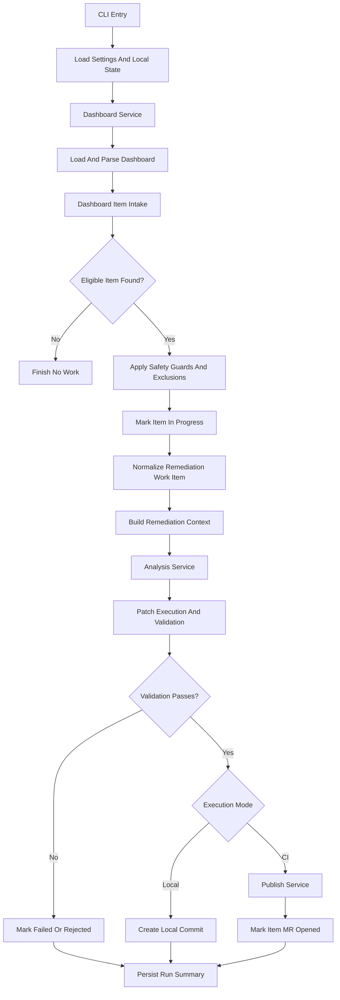

# ZeroOne Ops Dashboard Remediation Technical Design

> **Status: Historical.** GitLab dashboard mode is deprecated compatibility
> behavior. For current issue-mode contracts, see the [design index](../README.md).

## 1. Scope

This document defines the technical design for dashboard-backed remediation
described in
[functional-design-dashboard-remediation.md](../functional/functional-design-dashboard-remediation.md).

The goal is to let the remediation workflow consume one structured dashboard
item instead of reading directly from SonarQube.

Current constraints:

- GitLab only
- one dashboard item processed per run
- one shared container image and CLI
- dashboard issue remains the remote control plane and broader work inventory
- remediation stays limited to the current safe single-file structured-edit
  model

## 2. Technical Objectives

- Add a dashboard-backed intake path for remediation-ready items.
- Keep discovery and remediation separated by a strict dashboard item contract.
- Reuse the existing structured-edit, bot-rendered diff, validation, publish,
  and rollback path wherever possible.
- Add dashboard lifecycle updates for `in_progress`, `mr_opened`, `failed`,
  `rejected`, and `done`.
- Preserve deterministic dedup and traceability through stable dashboard item
  IDs.

## 3. Recommended Stack

- Python 3.13.x
- `uv` for dependency management and command execution
- `httpx` for GitLab API requests
- `pydantic` for dashboard and remediation models
- standard `logging`
- `json` for local repo-scoped execution state during the current phase
- `pathlib` for workspace access

No new runtime dependencies should be required for the first implementation.

## 4. Repository Layout

```text
zeroone-ops/
  docs/
    design/
      functional/
        functional-design-dashboard-remediation.md
      technical/
        technical-design-dashboard-remediation.md
  src/zeroone_ops/
    models/
      dashboard.py
      remediation.py
    services/
      dashboard/
        dashboard_item_intake.py
        dashboard_item_selector.py
        dashboard_item_normalizer.py
        dashboard_remediation_runner.py
        dashboard_remediation_updater.py
        dashboard_service.py
      remediation/
        remediation_context_builder.py
        execution_service.py
        publish_service.py
      shared/
        run_state_service.py
```

Dashboard-backed remediation should stay isolated from:

- source-specific discovery producers in `services/intake/`
- merge-request review workflow services in `services/review/`
- low-level GitLab issue transport in `providers/`

## 5. Runtime Architecture

### 5.1 Main Execution Path

Dashboard-backed remediation currently runs as a synchronous pipeline over the
shared GitLab dashboard inventory:

1. Load config and state.
2. Initialize GitLab dashboard client and dashboard service.
3. Load and parse the dashboard issue.
4. Select one remediation-ready item from the broader dashboard inventory.
5. Apply hard safety guards plus operator exclusions during remediation intake.
6. Mark the item `in_progress`.
7. Normalize the dashboard item into a provider-neutral remediation work item.
8. Build local repository context for that work item.
9. Run analysis, structured-edit generation, edit rendering, patch execution,
   validation, and publish through a remediation-native execution contract.
10. Update the dashboard item to:
   - `mr_opened` on success,
   - `rejected` when policy or local approval rejects it,
   - `failed` on execution failure.
11. Return a run summary.

This workflow intentionally does not own source sync or later merge-request
outcome handling:

- source-specific producers sync normalized items into the dashboard inventory
- remediation decides automated pickup eligibility from that inventory
- later merge-request outcomes are handled by dashboard reconciliation

### 5.1.1 Analysis And Structured-Edit Flow

Inside step 9, the remediation workflow currently uses the LLM in this order:

1. Build one bounded `IssueContext` for the selected remediation work item.
2. Call the analysis prompt.
3. Read the returned analysis classification:
   - `manual`
     - stop before patch generation
     - return a manual/rejected style outcome with no structured edit
   - `auto_fixable` or `retryable`
     - continue to structured edit generation
4. Call the structured-edit prompt using the same bounded issue context.
5. Render the returned structured edit into a bot-generated diff.
6. Apply the diff, validate it, and continue to publish only if validation
   succeeds.

Boundary notes:

- the analysis prompt decides whether automation should proceed at all
- the structured-edit prompt is only used after analysis allows automated
  continuation
- both prompts stay bounded to the selected remediation work item and must not
  expand the issue scope
- repository guidance, when present, may shape how the fix is implemented but
  must not create new remediation targets or new review judgments

### 5.2 Execution Diagram



### 5.3 Relationship To The Wider System

The remediation workflow now sits between dashboard sync and dashboard
reconciliation:

- source-specific intake writes normalized items into the dashboard
- remediation selects one eligible item and attempts execution
- review later evaluates the resulting merge request independently
- dashboard reconciliation observes merge-request and review outcomes, then
  preserves closed-unmerged work for explicit operator recovery

## 6. Python Module Responsibilities

### 6.1 `cli.py`

Responsibilities:

- expose a dashboard-backed remediation command
- keep existing review commands intact

Suggested commands:

- `zeroone-ops dashboard remediate`
- `zeroone-ops dashboard remediate --dry-run`

The first implementation should use `dashboard remediate` as the explicit
workflow entrypoint. Dashboard-backed remediation should stay a separate
workflow, not a hidden flag on the old Sonar path. Live remediation should stay
CI-only in the first implementation; local operator use is limited to
`dashboard remediate --dry-run` so the dashboard lifecycle does not need a
separate local-success state yet.

### 6.2 `runner.py`

Responsibilities:

- act as the composition root for dashboard-backed remediation
- wire together dashboard intake, lifecycle updates, and the existing
  remediation pipeline
- build the final run summary

The runner reuses the current single-file remediation engine, but the
execution contract should remain remediation-native:

- normalize source-specific inputs into a remediation-native execution model,
- avoid rebuilding fake `SonarIssue` values just to enter the execution path,
- keep SonarQube as one producer profile rather than the base execution type.

### 6.3 `models/remediation.py`

Responsibilities:

- define provider-neutral remediation work-item models
- decouple remediation execution from the raw dashboard item shape

Suggested models:

- `RemediationWorkItem`
- `RemediationSelectionResult`
- `RemediationLifecycleUpdate`

### 6.4 `services/dashboard_item_intake.py`

Responsibilities:

- load the parsed dashboard document
- select one supported remediation-ready item
- apply operator exclusions during remediation intake rather than during source sync
- return a typed no-work result when nothing is eligible

This service should not know how to fix code. It only selects one candidate.

### 6.5 `services/dashboard_item_selector.py`

Responsibilities:

- filter supported item types and statuses
- skip items already represented by active merge requests
- skip items outside current remediation policy
- return stable skip reasons for logs and summaries

### 6.6 `services/dashboard_item_normalizer.py`

Responsibilities:

- convert a `DashboardItem` into a provider-neutral `RemediationWorkItem`
- validate required fields before execution
- reject items that do not satisfy the remediation contract

This keeps the execution path from depending directly on dashboard-specific
field names.

### 6.7 `services/remediation_context_builder.py`

Responsibilities:

- build the existing code-context model from the selected work item
- reuse current issue-context concepts where possible
- support the initial single-file remediation scope only

The first implementation can likely reuse much of the current Sonar
`ContextBuilder` logic once the dashboard item is normalized to the required
shape.

Current repository-guidance boundary:

- dashboard-backed remediation does not yet attach repository guidance to the
  remediation prompt context
- the current remediation context remains limited to the selected work item,
  local code snippet context, constraints, and optional prior review feedback
- if repository guidance is added later, it should stay bounded and untrusted
  like review guidance, but with a narrower implementation-guidance role rather
  than becoming a second review-policy authority

### 6.8 `services/dashboard_remediation_updater.py`

Responsibilities:

- transition dashboard item statuses
- attach branch name, merge request URL, and commit SHA when available
- move items into the correct dashboard section through normal rendering rules

This service should own lifecycle updates rather than scattering them across
runner and publish logic.

### 6.9 Existing Reused Services

The dashboard-backed remediation flow should continue reusing:

- `AnalysisService`
- `PatchExecutionService`
- `PublishService`
- `WorkspaceSnapshotService`
- `Validator`

The new path should change intake and lifecycle management, not the proven
single-file remediation engine.

However, the transition should not stop at intake. To support future producers
cleanly, the execution core should gradually move from Sonar-native types
toward remediation-native inputs.

Recommended direction:

- keep analysis, prompting, and execution services on the remediation-native
  model,
- treat Sonar-specific prompt shaping as one producer strategy rather than the
  global workflow contract.

The first producer-neutral execution pass should stay conservative:

- honor `constraints` during prompt and edit generation,
- keep repository validation commands sourced from repository config rather
  than per-item metadata,
- leave `expected_change`, `acceptance_criteria`, and `source_payload` as
  descriptive metadata until their runtime semantics are designed explicitly.

## 7. Data Model

### 7.1 `DashboardItem`

Already exists and remains the storage model for the dashboard issue.

Dashboard-backed remediation should require these fields for a selected item:

- `id`
- `source`
- `type`
- `status`
- `title`
- `summary`
- `priority`
- `source_reference`
- `file`

Additional fields used when present:

- `line`
- `rule`
- `severity`
- `validation_commands`
- `expected_change`
- `constraints`
- `acceptance_criteria`

For v1 execution behavior, these fields should not all be treated equally:

- `constraints` should be honored as a real execution input because it provides
  a bounded producer-neutral way to shape prompt and edit policy.
- `validation_commands`, `expected_change`, and `acceptance_criteria` should
  remain pass-through metadata until a later producer-expansion phase defines
  how they are enforced consistently.

### 7.2 `RemediationWorkItem`

Suggested provider-neutral execution model:

- `dashboard_item_id`
- `source_type`
- `source_ref`
- `title`
- `status`
- `message`
- `file_path`
- `line`
- `rule_id`
- `severity`
- `source_payload`

Optional execution metadata can continue to carry:

- `validation_commands`
- `expected_change`
- `constraints`
- `acceptance_criteria`

The v1 runtime contract should use:

- `constraints` as an actual execution input
- `validation_commands`, `expected_change`, and `acceptance_criteria` as
  pass-through metadata only
- `source_payload` as an opaque extension field rather than a generic runtime
  policy input

This model allows remediation execution to stay independent from whether the
item came from Sonar, pipeline discovery, or another producer.

The implementation should avoid leaving this model as a thin wrapper around a
later fabricated `SonarIssue`. If that happens, the execution path remains
source-shaped even though intake looks generic.

## 8. Selection And Dedup Rules

### 8.1 Eligible Statuses

The selector should consider only:

- `open`

The first version should not automatically pick:

- `in_progress`
- `mr_opened`
- `done`
- `rejected`
- `ignored`
- `failed`

### 8.2 Eligible Types

The selector should initially allow only the dashboard item types already proven
safe for the current remediation engine, which likely means Sonar-derived
single-file code-smell items.

### 8.3 Dedup Rules

Before selecting an item, the workflow should check:

- whether an active merge request already represents the item
- whether local state already tracks the item as active
- whether the dashboard item is already marked `mr_opened` or `in_progress`

Stable dashboard item IDs should be the primary dedup key.

For v1, local state and run summaries should persist the dashboard item ID
directly rather than trying to derive a second dedup identity from source data.

## 9. Lifecycle Updates

### 9.1 Before Execution

When an item is selected:

- update status from `open` to `in_progress`

### 9.2 On Successful Publish

When branch push and merge request creation succeed:

- update status to `mr_opened`
- set `branch_name`
- set `merge_request_url`
- set `commit_sha`

### 9.3 On Failure

When execution fails before publish:

- update status to `failed`
- optionally set `log_excerpt` or failure summary later

### 9.4 On Rejection

When policy or local approval rejects remediation:

- update status to `rejected`

Status transitions should be explicit and deterministic. A later maintenance
service can prune or archive older resolved items.

### 9.4.1 Keep First-Version State Ownership Narrow

The first remediation workflow should own only these transitions:

- `open -> in_progress`
- `in_progress -> mr_opened`
- `in_progress -> failed`
- `in_progress -> rejected`

Transitions caused by later external events, such as merge request merge or
closure after the remediation run has finished, should be handled by a separate
scheduled reconciliation workflow rather than adding another always-on state
controller bot.

### 9.5 Stale In-Progress Handling

The implementation should define how stale `in_progress` items are detected and
recovered.

The first version does not need a distributed lease system. It should use one
clear time-based recovery rule:

- if an item is still `in_progress` and its recorded run metadata is older than
  24 hours, treat it as stale,
- move it back to `open`,
- record in the dashboard update and run summary that the item was reopened by
  stale-run recovery.

Here, `in_progress` means the remediation workflow selected the item and is
actively processing it. Review happens after the workflow succeeds and the item
moves to `mr_opened`.

The 24-hour window is therefore a conservative stale-run recovery
buffer for interrupted jobs and operator investigation, not a review window.

### 9.6 Scheduled Merge-Request Reconciliation

The dashboard lifecycle should be closed by a separate scheduled reconciliation
workflow before product demonstration.

This workflow should remain distinct from the active remediation runner:

- remediation owns `open -> in_progress -> mr_opened|failed|rejected`
- reconciliation owns later `mr_opened` convergence once merge-request state
  changes externally
- stale `in_progress` recovery remains owned by remediation intake and should
  not be duplicated here

Recommended entrypoint:

- `zeroone-ops dashboard reconcile`
- optionally `zeroone-ops dashboard reconcile --dry-run` for operator review

Recommended runtime shape:

1. Load dashboard state.
2. Select items currently in `mr_opened`.
3. For each item, inspect the linked merge request using stored URL, IID, or
   branch metadata.
4. Compare remote merge-request state with stored dashboard traceability.
5. Apply one deterministic lifecycle update.
6. Return a reconciliation summary.

Recommended transition rules:

- merge request merged:
  move `mr_opened -> done`
- merge request closed without merge and remediation is still required:
  move `mr_opened -> failed` and preserve the branch and merge-request link for
  explicit operator requeue
- merge request closed without merge and remediation is no longer required:
  move `mr_opened -> done`
- merge request metadata missing, inaccessible, or inconsistent with stored
  branch/commit traceability:
  move `mr_opened -> failed`

For the first version, “still required” should be evaluated conservatively using
current dashboard state and stored traceability:

- if the dashboard item still exists and still represents the same remediation
  candidate, mark it failed until an operator explicitly requeues it
- if upstream discovery or dashboard state already indicates the issue no longer
  requires remediation, mark it done
- if the workflow cannot determine ownership safely, mark it failed with an
  operator-visible reason instead of guessing

Traceability requirements for reconciliation:

- use the stored dashboard item ID as the primary identity
- use merge-request URL, branch name, and commit SHA as supporting
  traceability fields
- preserve existing remediation metadata while updating only lifecycle fields
  and reconciliation notes

Scheduling guidance:

### 9.7 Failure Classification And Recovery Transitions

The dashboard-remediation model should separate:

- failure classification
  - why automation could not continue
- operator-facing recovery transition
  - what state the item should move to after the failure is understood

The first technical model should keep using the existing lifecycle states, but
it should treat the following concepts as distinct:

- `failed`
  - remediation could not complete and the item needs diagnosis
- `retry_eligible`
  - a bounded machine-readable signal that automation may try again once the
    relevant blocker is resolved
- `retry_block_reason`
  - a bounded operator-facing explanation for why the item should not retry
- `rejected`
  - automation should not continue for this attempt or item under the current
    conditions

Recommended first recovery classes:

- operational execution failure
  - examples: invalid or expired token, GitLab API access failure, missing `uv`
    or other tool in CI
- validation failure
  - examples: `pytest`, `ruff`, or other configured repo commands fail after a
    patch is applied
- policy or review block
  - examples: retry limit reached, latest review requires manual review,
    remediation excluded by policy
- manual-follow-up classification
  - examples: analysis decides the issue is not suitable for bounded automatic
    remediation

The first implementation should keep transition ownership conservative:

- remediation runner:
  - may move `open -> in_progress`
  - may move `in_progress -> failed`
  - may move `in_progress -> rejected`
  - may attach failure details, retry eligibility, and retry block reason
- dashboard reconciliation:
  - may converge change-request state and record recovery context
  - must not reopen a closed-unmerged remediation automatically
- operator-facing rendering:
  - must not invent new machine states
  - may present clearer next-step labels derived from the stored fields

Recovery should not be encoded as free-form dashboard prose alone. The source
of truth should remain structured dashboard item fields plus typed failure
details already captured in local run state.

### 9.8 Operator Workflow Board Buckets

The dashboard renderer should evolve from one mixed `Needs Attention` table to
an explicit workflow-board projection over existing dashboard item states.

Recommended first operator buckets:

- `Queue Auto-fix`
- `Needs Review`
- `In Flight`
- `Completed`

Recommended first state-to-bucket mapping:

- `Queue Auto-fix`
  - `open`
- `Needs Review`
  - `failed`
- `In Flight`
  - `in_progress`
  - `mr_opened`
- `Completed`
  - `done`

Dismissed outcomes should not be mixed into active review work by default.

Recommended later treatment:

- `rejected`
  - treat as dismissed or out of scope for the current attempt
- `ignored`
  - treat as intentionally excluded work, typically driven by policy or
    explicit automation scope
- if operators still need visibility into those outcomes, render them in a
  later `Rejected / Ignored` or `Dismissed` bucket rather than in
  `Needs Review`

The first implementation should keep this as a renderer concern rather than a
new persisted state taxonomy. The underlying dashboard item lifecycle can stay
status-based while the board projection groups those statuses into more useful
operator buckets.

Recommended renderer responsibilities:

- build one workflow-board projection from canonical item statuses
- preserve existing section-level storage for broader history and retention
- render bucket-specific tables with row counts and overflow summaries
- continue showing next-step wording inside each row rather than encoding those
  labels as separate machine states

Recommended row-label behavior:

- `Investigate Failure`
  - label for failed items whose cause is not yet resolved
- `Retry Auto-fix`
  - label for failed items with a supported retry path
- `Review Retry Blocker`
  - label for blocked items where a human must interpret the blocker
- `Review Manually`
  - label for manual-follow-up outcomes

### 9.9 Bucket Transition Rules

The first board projection should follow the existing lifecycle transitions
without inventing new workflow-only states.

Recommended transition view:

- `open -> in_progress`
  - move item from `Queue Auto-fix` to `In Flight`
- `in_progress -> mr_opened`
  - keep item in `In Flight`
- `mr_opened -> open`
  - move item from `In Flight` back to `Queue Auto-fix`
- `in_progress|mr_opened -> failed`
  - move item into `Needs Review`
- `in_progress -> rejected`
  - move item into the later dismissed-history projection rather than the
    active operator queue
- `mr_opened -> done`
  - move item into `Completed`

If later lifecycle states are added for clearer blocked or dismissed outcomes,
they should first be mapped into one of these operator buckets before changing
the visible board structure again.

Recommended future extension:

- `Blocked`
  - introduce as a separate bucket only when policy-blocked or review-blocked
    items become common enough that folding them into `Needs Review` harms
    scanability

Requeue ownership should stay conservative in the first implementation:

- reconciliation may move an item back toward `open` when an explicit recovery
  rule supports it
- a later operator action surface may also requeue items deliberately
- the first phase should prioritize explanation and board structure before
  introducing mutable retry or reset commands

### 9.10 Future Retry Reset / Requeue Semantics

If a later operator-facing retry or reset action is introduced, it should be
designed around explicit transitions rather than loose markdown editing.

Recommended guardrails:

- an operator action should not directly mark an item retryable unless the
  underlying blocker has a supported recovery rule
- "investigated" is not enough by itself to imply retry readiness
- retry should remain bounded by retry count and review/policy gates
- manual-follow-up outcomes should remain visible without being mixed into the
  same queue as automation-ready work

This means a later retry/reset surface should answer:

- what failure class was this item in
- what recovery rule applies
- who or what is allowed to move it back toward `open` or retry-ready
- whether the transition is performed by reconciliation, operator action, or a
  future dedicated maintenance workflow

### 9.11 Future Workflow Board Display Limits

Large repositories may produce far more workflow items than a single dashboard
table should render verbosely.

Once the workflow board is split into clearer operator-facing buckets, the
renderer should later support bounded per-section display behavior.

Recommended direction:

- keep aggregate counts in the overview table for all relevant lifecycle
  states
- keep `Completed` limited to recent visible items while broader retention
  remains available underneath
- render only the highest-value subset in each workflow section
- show explicit overflow summaries such as "375 more items not shown"
- avoid one flat global limit that mixes automation-ready items with
  human-follow-up items
- prefer deterministic file- or path-oriented grouping when very large
  repositories make one flat bucket hard to scan

Likely implementation shape later:

- per-section renderer limits owned by dashboard config or renderer settings,
  not operator policy
- deterministic ordering before truncation
- overflow summary rows or short notes rendered by the dashboard renderer
- parser compatibility preserved by keeping the underlying machine-readable item
  details stable even if the human-facing summary tables are capped

Monorepos may require a stronger scaling model than capped sections alone.
Later investigation should consider whether the dashboard architecture should
support:

- path- or component-aware grouping inside one board
- scoped producer routing by repo area
- or multiple dashboard issues per repository, keyed by configured area or
  domain, once one global issue becomes too noisy for operator use

- run as a scheduled CI job and allow manual triggering for operator recovery
- keep the first version CI-only, like live remediation
- process one dashboard issue per run and prefer deterministic summaries over
  background polling

### 9.12 Dashboard Schema Evolution Hardening

The dashboard renderer and parser should now assume that live dashboard bodies
may outlast any one formatting revision.

Design principle:

- GitLab markdown remains the operator UI
- structured dashboard blocks remain the canonical workflow state
- human-readable summaries are projections that may evolve without changing
  stored meaning

The safer technical model is:

- stable machine-readable dashboard blocks are canonical
- human-readable workflow tables are projections over that canonical state
- parser compatibility should be maintained across current and prior live
  layouts rather than assuming renderer and parser always change in lockstep

Recommended technical rules:

- keep an explicit schema marker or versioned machine block contract whenever
  the dashboard shape changes materially
- prefer additive changes, such as optional sections, optional columns, or new
  machine blocks, over destructive renames or abrupt summary replacement
- parse older live bodies into the current in-memory dashboard model before
  rewriting them in the newest format
- keep summary parsing tolerant and secondary so machine-readable recovery does
  not depend on exact markdown headings or table wording
- treat unsupported or ambiguous shapes as conservative failures rather than as
  opportunities for best-effort guessing

The migration path should therefore be deliberate:

1. parse older dashboard bodies as long as they still match a supported live
   layout
2. normalize them into the canonical in-memory dashboard model
3. rewrite them using the latest renderer format

Regression coverage should also keep representative historical dashboard bodies
as fixtures so renderer or parser changes prove:

- older live layouts still load safely
- current layouts still round-trip correctly
- capped or projected summary views do not lose canonical machine state

Recommended incremental hardening path:

1. ensure every workflow item can be recovered from structured dashboard blocks
   alone
2. reduce parser dependence on human-readable summary headings, columns, and
   bucket wording wherever structured blocks already carry the same meaning
3. keep the renderer projection-only so overview tables, workflow buckets, and
   review-history summaries are always derived from canonical structured state
4. treat summary parsing increasingly as compatibility and sanity-check logic
   rather than as the primary recovery path
5. add historical live-dashboard fixtures for every real parse regression so
   schema evolution hardening is driven by observed failures instead of memory
   alone

The practical goal is that the dashboard should remain recoverable even if a
future summary layout is replaced entirely, as long as the structured blocks
remain intact.

Recommended later integrity direction:

- add one top-level machine-managed dashboard manifest block
- keep that manifest focused on integrity metadata such as section counts,
  workflow projection counts, or similar canonical totals
- validate structured item recovery against the manifest on load
- avoid reintroducing tight markdown coupling by using the manifest, not the
  human-readable summary tables, for stronger integrity checks

This would preserve the design principle more cleanly than trying to infer
state loss from changing markdown projections. It keeps the integrity contract
inside machine-managed state while allowing summary layouts to evolve more
freely.

## 10. Migration Strategy

The rollout should stay dashboard-first before live launch.

For the first version, ownership should stay simple:

- the dashboard-backed remediation workflow owns active execution state,
- Sonar dashboard sync owns Sonar-derived discovery freshness,
- a later reconciliation workflow owns passive convergence for merged, closed,
  or stale remote states,
- remediation should not depend on a separate direct Sonar execution path.

Sonar dashboard sync should keep its ownership equally narrow:

- it remains the discovery producer for Sonar-derived dashboard items,
- it may complete stale untouched `open` Sonar items that no longer exist
  upstream,
- it should not rewrite or remove Sonar-derived items once they have entered
  remediation-owned states such as `in_progress`, `mr_opened`, `failed`,
  `rejected`, or `done`.

## 11. Testing Strategy

### 11.1 Unit Tests

Add tests for:

- dashboard item selection
- status filtering
- dedup rules
- dashboard item normalization
- lifecycle updates

### 11.2 Integration Tests

Add runner-level coverage for:

- no eligible dashboard item
- selected dashboard item moves to `in_progress`
- successful remediation moves item to `mr_opened`
- failed remediation moves item to `failed`
- rejected remediation moves item to `rejected`
- stale `in_progress` handling follows the documented recovery rule

Add reconciliation coverage for:

- `mr_opened -> done` on merge
- `mr_opened -> open` on close without merge when work remains valid
- `mr_opened -> failed` on missing or inconsistent merge-request traceability
- dry-run reconciliation summaries

### 11.3 Regression Tests

As real dashboard-backed remediation failures appear, convert them into
regression tests just like the existing Sonar and review workflows.

## 12. Risks And Constraints

- dashboard items may be malformed or manually edited
- stale dashboard state may cause confusing transitions if lifecycle updates are
  not atomic enough
- the current single-file remediation engine limits the first supported item
  classes intentionally

The implementation should prefer explicit rejection and good summaries over
best-effort guessing.

## 13. Dashboard Write Coordination

The dashboard issue is a shared remote control plane, so the implementation
should define how read-modify-write conflicts are handled when multiple jobs or
producers touch it close together.

The first version can stay simple, but it should make retry behavior explicit
for:

- loading stale dashboard content,
- applying lifecycle updates after another writer has already changed the issue,
- deciding when to fail safely instead of repeatedly overwriting unexpected
  remote state.

For v1, the update policy should be:

- reload the dashboard once when a lifecycle write appears to conflict with a
  newer remote state,
- recompute the intended lifecycle update against the fresh dashboard state,
- retry exactly once,
- fail safe with a clear summary if the second attempt still cannot be applied
  cleanly.

This write-coordination behavior should not be coupled to merge-request-merged
or merge-request-closed reconciliation in the first remediation workflow. That
later convergence logic should remain a separate scheduled maintenance path.

## 14. Traceability Contract

The implementation should keep these identifiers available across logs,
summaries, and dashboard lifecycle updates:

## 15. Advisory Confidence Signals

The remediation workflow should leave room for an advisory confidence signal
without making it part of the first remediation or reconciliation control
plane.

Recommended first fields:

- `remediation_confidence: float | None`
- `remediation_confidence_reason: str | None`

Recommended semantics:

- `remediation_confidence` reflects how likely the remediation workflow thinks
  it can produce a correct, bounded change for the selected work item

For the first implementation, these values should be treated as advisory
metadata only:

- do not use them as automatic merge or approval gates,
- do not let them close or reopen dashboard items by themselves,
- do not treat them as calibrated probabilities until enough real history
  exists.

Storage and presentation guidance:

- use a normalized `0.0` to `1.0` range for both scores,
- require a short reason string whenever a score is recorded,
- surface the values in dashboard-facing metadata, summaries, or later review
  artifacts before making them part of runtime policy.

Implementation guidance:

- remediation can emit confidence after analysis or after structured edit
  generation, but before publish remains the safer first boundary,
- if confidence is added later, store it in a way that preserves the existing
  lifecycle model instead of creating a second implicit state machine.

Review-specific confidence should be defined in the pull-request review bot
technical design rather than in the remediation workflow design.

- dashboard item ID,
- run ID,
- branch name when created,
- commit SHA when created,
- merge request URL when available.

This should be treated as part of the execution contract, not only as a logging
nice-to-have, because operator workflows will depend on correlating those
surfaces reliably.

## 15. Contract Extensibility

As additional producers are added later, the dashboard remediation contract
should distinguish between:

- universal remediation fields required for every selectable work item,
- source-specific metadata that can remain optional or namespaced.

This keeps the provider-neutral remediation model from being overfit to the
first Sonar-backed item shape.

In practice, that means future-producer support should be added through:

- one shared remediation-native execution contract,
- producer-specific normalization and capability registration,
- optional source-specific prompting or policy overlays,
- explicit runtime use of agreed generic fields instead of carrying them only
  as unused metadata.
