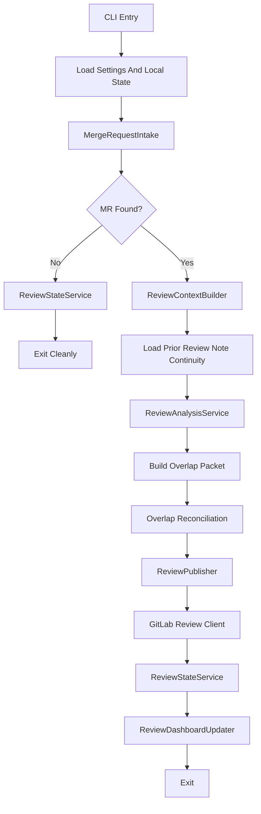

# ZeroOne Ops Pull Request Review Technical Design

## 1. Scope

This document defines the technical design for v1 of the GitLab-first pull
request review bot described in
[functional-design-pr-review.md](../functional/functional-design-pr-review.md).

V1 constraints:

- Python implementation
- GitLab only
- one merge request reviewed per run
- non-destructive workflow
- summary-note publishing only
- local JSON state store
- no inline diff comments in v1
- shared container image with a separate review CLI workflow

## 2. Technical Objectives

- Provide a CLI that can review one merge request from a checked-out repository.
- Integrate with GitLab APIs using tokens from environment variables.
- Build deterministic review context from merge request diffs and local files.
- Use structured LLM output for findings instead of free-form prose.
- Avoid duplicate reviews for the same merge request revision.

## 3. Recommended Stack

- Python 3.13.x
- `uv` for dependency management and command execution
- `httpx` for GitLab API requests
- `pydantic` for config and data models
- `typer` for CLI entrypoints
- `ruff` for linting and formatting
- `mypy` for static type checking
- standard `logging`
- `pathlib` for filesystem work
- `json` for the state store

## 4. Repository Layout

```text
zeroone-ops/
  docs/
    design/
      functional/
        functional-design-pr-review.md
      technical/
        technical-design-pr-review.md
  src/zeroone_ops/
    models/
      review.py
    providers/
      gitlab_review_client.py
    services/
      review/
        change_request_intake.py
        change_request_selector.py
        review_context_builder.py
        review_analysis_service.py
        review_overlap_analysis_service.py
        review_overlap_packet_builder.py
        review_publisher.py
        review_state_service.py
        review_dashboard_updater.py
      dashboard/
        dashboard_service.py
      shared/
        run_state_service.py
```

The exact file names can change, but the review workflow should stay separate
from the Sonar remediation workflow rather than being folded into the same
services.

## 5. Runtime Architecture

### 5.1 Main Execution Path

The review bot currently runs as a synchronous MR-first pipeline:

1. Load config.
2. Initialize GitLab review client and state store.
3. Fetch open merge requests.
4. Use `ChangeRequestSelector` to choose one reviewable MR.
5. Fetch MR metadata, changed files, and diff.
6. Parse remediation-authored MR context when present and keep it available as
   structured review input.
7. Use `ReviewContextBuilder` to load local source context for changed files.
8. Discover a few bounded repository guidance excerpts such as `AGENT.md`,
   engineering standards, and relevant technical design docs when present.
9. Combine MR metadata, optional remediation context, repository guidance,
   diff data, and local code context into the review payload.
10. Use `ReviewAnalysisService` to request structured findings from the LLM.
11. When a prior review note exists on the same MR, build bounded prior-review
    continuity context from GitLab note history.
12. Run overlap reconciliation so repeated findings can be classified as
    unresolved, new, or resolved where the evidence supports it.
13. Use `ReviewPublisher` to render a deterministic review note.
14. Publish the note to GitLab.
15. Persist reviewed SHA and outcome in state.
16. Mirror review status to the dashboard as additive workflow context.

### 5.2 Execution Diagram



### 5.3 Relationship To The Wider System

The review workflow remains MR-first:

- it does not depend on the dashboard to perform review
- it publishes directly to GitLab merge requests
- dashboard mirroring is additive, not the source of truth for review output

The current continuity path is also GitLab-first:

- prior review notes are loaded from GitLab note history
- overlap reconciliation uses the current pass plus bounded prior-pass context
- the resulting note becomes the next continuity checkpoint

## 6. Python Module Responsibilities

### 6.1 `cli.py`

Responsibilities:

- parse CLI arguments,
- invoke the review runner,
- return exit codes.

Suggested commands:

- `zeroone-ops review`
- `zeroone-ops review --dry-run`
- `zeroone-ops review --mr-iid <iid>`

The review workflow should ship in the same container image as the SonarQube
workflow, with separate subcommands rather than a separate review-only image.

### 6.2 `runner.py`

Responsibilities:

- act as the composition root for the review workflow,
- wire together intake, analysis, publishing, and state services,
- build the final CLI-facing summary.

### 6.3 `settings.py`

Responsibilities:

- read environment variables,
- read optional local config JSON,
- build validated runtime settings objects for review mode.

### 6.4 `models/review.py`

Responsibilities:

- define merge request metadata models,
- define changed-file and diff models,
- define structured review-finding models,
- define review note summary models.

### 6.5 `providers/gitlab_review_client.py`

Responsibilities:

- fetch open merge requests,
- fetch merge request details and diff data,
- fetch changed files if separate endpoints are needed,
- publish merge request notes,
- retrieve existing notes later if note replacement is added.

### 6.6 `services/change_request_intake.py`

Responsibilities:

- fetch candidate merge requests,
- filter obviously unsupported items,
- return a typed intake result with counts and no-work summaries.

### 6.7 `services/change_request_selector.py`

Responsibilities:

- apply review eligibility policy,
- skip already-reviewed MR revisions,
- prioritize the next MR to review.

### 6.8 `services/review_context_builder.py`

Responsibilities:

- parse remediation-authored MR description metadata when present,
- load changed files from the local repository,
- discover a bounded set of repository guidance excerpts from known files such
  as `AGENT.md`, `CONTRIBUTING.md`, `README.md`, and relevant technical design
  docs,
- join diff hunks with nearby source context,
- limit changed-file count and per-file context size,
- prepare a stable structured review payload.

The builder should prefer remediation-authored MR context when present, but it
must remain fully functional for normal human-authored merge requests that do
not contain that metadata.

Repository guidance should stay bounded and deterministic:

- only known guidance file locations should be considered in v1,
- only a short excerpt from each file should be included,
- the guidance should act as repository-specific standards rather than as an
  override for the core review rules.

### 6.9 `services/review_analysis_service.py`

Responsibilities:

- choose the active LLM backend,
- request structured review findings,
- reject malformed or oversized findings,
- classify the review result as findings, no findings, or insufficient context.

When remediation-authored context is present, the analysis layer should use it
to compare:

- intended fix versus actual diff behavior,
- recorded remediation constraints versus the produced implementation,
- available validation evidence versus remaining review risk.

This additional context should improve finding quality without making the
review workflow dependent on remediation-specific merge requests.

### 6.10 `services/review_overlap_analysis_service.py`

Responsibilities:

- request overlap-reconciliation output from the LLM
- validate overlap results against the current and prior finding packet
- classify overlap failures cleanly when the result is invalid or unavailable

### 6.11 `services/review_publisher.py`

Responsibilities:

- render a deterministic review note template,
- include summary and numbered findings,
- publish a single note through the GitLab review client.

The publisher also owns the machine-safe continuity block used for later
GitLab-backed prior-review parsing.

Hardening direction for later review-bot work:

- keep the summary note as the authoritative review artifact
- publish inline comments only when finding anchoring is trusted
- enforce compact operator-facing output even if internal staged analysis is
  richer
- keep continuity tied to canonical finding identity rather than presentation
  wording

### 6.12 `services/review_state_service.py`

Responsibilities:

- record reviewed MR revisions,
- persist failures and outcomes,
- prevent duplicate reviews for the same MR SHA,
- build user-facing summaries.

### 6.13 `services/review_dashboard_updater.py`

Responsibilities:

- mirror review outcomes to the dashboard when a matching remediation item
  exists
- create standalone review-status dashboard entries when no remediation item is
  linked
- keep dashboard mirroring secondary to the merge request note itself

### 6.14 `services/shared/state_store.py`

Responsibilities:

- load and save the JSON file,
- store review records keyed by merge request ID and head SHA.

## 7. Configuration Design

### 7.1 Sources

Configuration should come from:

- environment variables for secrets,
- a local JSON config file for non-secret runtime behavior,
- CLI flags for per-run overrides.

### 7.2 Environment Variables

Required:

- `GITLAB_URL`
- `GITLAB_TOKEN`
- `GITLAB_PROJECT_ID` or GitLab CI `CI_PROJECT_ID`
- `OPENAI_API_KEY`
- `OPENAI_MODEL`

Optional:

- `ZEROONE_OPS_CONFIG`
- `ZEROONE_OPS_STATE_PATH`
- `ZEROONE_OPS_LOG_LEVEL`
- `ZEROONE_OPS_BASE_BRANCH`

Inline-comment enablement should remain repo-config-driven rather than
environment-driven.

### 7.3 Runtime Config File

Example review-specific config shape:

```json
{
  "execution_mode": "ci",
  "review": {
    "max_changed_files": 10,
    "max_findings_per_review": 3,
    "max_context_lines_before": 30,
    "max_context_lines_after": 30,
    "publish_no_findings_note": true,
    "inline_comments_enabled": false,
    "supported_paths": ["src/", "app/"],
    "ignored_paths": ["src/generated/"],
    "skip_draft_merge_requests": true
  },
  "gitlab": {
    "target_branch": "main",
    "labels": ["ai-code-review"]
  },
  "state": {
    "path": ".zeroone-ops-state.json"
  }
}
```

Recommended repo-level review noise controls:

- `supported_paths`: limit review to relevant source areas
- `ignored_paths`: exclude generated, vendored, or otherwise noisy paths even
  when they sit under a supported prefix
- `max_changed_files`: cap review breadth per merge request
- `max_findings_per_review`: cap the number of published findings so the bot
  surfaces the highest-signal issues first
- `publish_no_findings_note`: control whether no-findings runs publish a merge
  request note at all
- `inline_comments_enabled`: keep inline-comment publication disabled by
  default until identity continuity and location trust have been validated on
  real review runs

## 8. Data Model Design

### 8.1 Merge Request Model

```python
class MergeRequestInfo(BaseModel):
    iid: int
    title: str
    source_branch: str
    target_branch: str
    web_url: str
    head_sha: str
    author_username: str | None = None
    draft: bool = False
```

### 8.2 Changed File Model

```python
class ChangedFile(BaseModel):
    file_path: str
    diff: str
    new_file: bool = False
    deleted_file: bool = False
    renamed_file: bool = False
```

### 8.3 Review Finding Model

```python
class ReviewFinding(BaseModel):
    severity: Literal["high", "medium", "low"]
    file_path: str
    title: str
    explanation: str
    suggested_follow_up: str
```

Later publish-focused validation should also enforce:

- bounded explanation length
- no internal-analysis phrasing in operator-visible fields
- optional trusted location metadata for inline-comment publication

That location metadata should remain optional so summary-note publishing does
not depend on inline-comment readiness.

### 8.4 Review Result Model

```python
class ReviewResult(BaseModel):
    classification: Literal["no_findings", "findings_present", "manual_review_only"]
    summary: str
    findings: list[ReviewFinding] = []
    advisory_notes: list[str] = []
```

Recommended advisory-note contract:

- reserved for non-actionable repository-guidance-backed style, readability, or
  maintainability concerns
- only when the concern is clearly visible in changed code and meaningful to a
  human reviewer
- bounded and separate from `findings`
- not severity-bearing actionable findings
- not continuity-tracked
- not inline-comment eligible
- not feedback-authoritative

### 8.5 Review State Model

```python
class MergeRequestReviewState(BaseModel):
    mr_iid: int
    head_sha: str
    status: str
    last_run_id: str
    note_url: str | None = None
    updated_at: datetime
```

Later inline-comment support should persist bounded comment metadata in the
authoritative summary note's machine-safe payload rather than treating comment
text as continuity state.

Recommended first embedded contract:

```json
{
  "reviewed_head_sha": "abc123",
  "note_id": 456,
  "findings": [
    {
      "number": 1,
      "identity": "src/service.py::null-check-missing",
      "file_path": "src/service.py",
      "line_start": 42,
      "line_end": 42,
      "region_hint": "guard clause before parse",
      "inline_comment": {
        "comment_id": "789",
        "comment_url": "https://gitlab.example.com/...",
        "status": "published",
        "anchor_file_path": "src/service.py",
        "anchor_line_start": 42,
        "anchor_line_end": 42
      }
    }
  ]
}
```

Recommended modeling rules:

- inline comment metadata is nested under each finding, not stored in a
  separate global registry
- each finding carries zero or one inline comment metadata block in the first
  version
- canonical finding `identity` remains the reuse and deduplication key
- published anchor fields are stored separately from the finding's current
  location fields so later anchor drift is easier to reason about

Important distinction:

- finding identity answers whether this is the same underlying concern
- inline anchor answers whether the earlier inline comment location is still
  reusable

The same finding identity may survive across passes even when the trusted line
range or diff anchor shifts.

This keeps inline comments subordinate to:

- the authoritative summary note
- the reviewed SHA
- the canonical finding identity

Recommended persistence rule:

- the authoritative summary note's machine-safe payload should remain the
  recoverable source of truth in CI-backed runs
- local review state should mirror the same inline-comment metadata so the
  system can move that state to another backend later without changing the
  continuity contract
- local review state must not be the only place continuity-critical
  inline-comment metadata lives
- developer-resolved inline comments may be observed later as advisory context,
  but they must not by themselves clear or resolve a finding without a new
  review pass over the code

## 9. Review Hardening Extension

The next review-bot hardening slices should preserve the current staged review
pipeline while tightening three contracts:

### 9.1 Inline Comment Contract

- summary note remains authoritative
- inline comments are additive
- only trusted diff-anchored findings may publish inline
- inline comments should be shorter and tighter than summary-note findings
- weakly anchored findings remain summary-only
- inline comments do not become separate continuity authorities
- every inline comment belongs to the same reviewed SHA and authoritative
  summary note as the finding that produced it
- follow-up publication should check whether the same canonical finding
  identity already has an inline comment on the relevant prior authoritative
  pass before posting another one

### 9.2 Identity-First Continuity

Repeated-review continuity should prefer stable app-owned finding identity
before any wording-based fallback.

That same identity should later support:

- repeated finding threading
- inline comment reuse
- follow-up note wording

without introducing a second presentation-owned matching scheme.

Recommended first duplicate-avoidance rule:

- if the same canonical finding identity already has a trusted inline comment
  on the latest relevant authoritative pass, do not post a second near-duplicate
  inline comment by default
- prefer summary-note continuity wording unless the earlier anchor is no longer
  valid and a new trusted anchor is available
- publish at most one inline comment per finding in the first version

Recommended first anchor-reuse order:

1. same canonical finding identity
2. same file and same local region, such as `region_hint`, symbol, or clearly
   equivalent code area
3. overlapping line range or line drift of at most 3 lines from the earlier
   anchor

If that sequence breaks at identity, region, or materially different line
placement, the earlier inline anchor should not be reused automatically.

Recommended first inline-comment wording shape:

- one compact concern
- one short why-it-matters sentence when needed
- optional very short follow-up hint

Avoid:

- long explanatory paragraphs
- repeated context already present in the summary note
- internal reasoning or meta-commentary

### 9.3 Output Hygiene Boundary

The first response to overlong published review text should be prompt-level
tightening in the precision stage, not a validator-style rejection path.

The main target is review text that turns into:

- long internal analysis dumps
- implementation chatter not useful to the MR author
- vague unsupported assertions

The intended contract is:

- internal staged reasoning may be richer
- persisted published review output should stay compact and review-safe

Recommended first behavior:

- tighten the precision-stage prompt so findings stay concise and
  operator-facing
- use light later shaping only if simple length cleanup is still needed
- do not treat overlong-but-otherwise-valid review text as a validator failure
  class in the first rollout

### 9.4 Advisory Style Observations

Repository-guidance-backed style or readability concerns that are intentionally
non-actionable should use a separate advisory section rather than overloading
accepted findings or `decision_rationale`.

Recommended first behavior:

- candidate generation may surface those concerns when repository guidance
  explicitly supports them and the issue is clearly visible in changed code
- precision may preserve them only as bounded advisory notes when they do not
  justify an actionable finding
- advisory notes should stay clearly separate from findings in the published
  review output so developers can distinguish style guidance from actionable
  review defects
- advisory notes must not feed repeated-review continuity, inline comment
  publication, or operator feedback authority

### 9.5 Feature-Flagged Test Rollout

Before broad enablement, inline-comment publication should be exercised in a
feature-flagged test deployment.

Recommended first behavior:

- keep `review.inline_comments_enabled` off by default
- enable it only in a bounded test deployment or repository first
- log trusted versus weak anchor decisions
- log whether a finding reused an earlier inline comment or created a new one
- keep inline comments limited to trusted `medium` / `high` findings in the
  first rollout
- keep CI diagnostics compact:
  - one structured inline-comment decision per finding
  - one run-level inline-comment summary

This keeps rollout simple while still giving enough real-run evidence to judge
anchor trust and duplicate-comment behavior.

## 9. Review Note Design

The bot should publish one deterministic summary note.

Suggested template:

```md
## AI Review Summary

Summary: <short summary>

Findings:
1. [high] <title> (`path/to/file.py`)
   <explanation>
   Follow-up: <suggested follow-up>

Notes:
- AI-assisted review pass
- Reviewed commit SHA: `<sha>`
```

If there are no findings, the note can be:

```md
## AI Review Summary

No findings in this pass for commit `<sha>`.

Notes:
- AI-assisted review pass
```

## 10. Deduplication Strategy

The review bot should deduplicate by:

- GitLab merge request IID
- current MR head SHA

If the same MR is rerun with the same SHA:

- skip review entirely, or
- later replace/update the existing note instead of posting a new one

For v1, skipping unchanged revisions is sufficient.

## 11. Failure Handling

Failures should be classified at least by:

- merge request intake
- diff retrieval
- context building
- review analysis
- note publishing

On failure, the bot must:

- record structured failure details in state,
- avoid publishing partial or malformed notes,
- exit with a clear summary.

## 12. Advisory Review Confidence

The review workflow should emit an advisory confidence signal as part of the
review trust-building phase, while keeping it out of runtime control policy.

Recommended first fields:

- `review_confidence: float | None`
- `review_confidence_reason: str | None`

Recommended semantics:

- `review_confidence` reflects how likely the review workflow thinks the
  produced implementation is correct and low risk after inspecting the merge
  request diff and review context

For the first implementation, these values should be treated as advisory
metadata only:

- do not use them as automatic merge or approval gates,
- do not treat them as calibrated probabilities until enough real history
  exists,
- require a short reason string whenever a score is recorded.

Storage and presentation guidance:

- use a normalized `0.0` to `1.0` range,
- surface the value in review-facing artifacts, summaries, or notes before
  making it part of runtime policy.

## 13. Testing Strategy

V1 should include:

- unit tests for MR selection and dedup behavior
- unit tests for review note rendering
- unit tests for changed-file context limits
- integration tests for:
  - fetch MR -> analyze -> publish note
  - unchanged SHA skip
  - findings-present and no-findings cases

## 14. Future Extensions

Post-v1 candidates:

- inline diff comments
- note updates instead of new note creation
- suggested code patches
- GitHub pull request support
- linking review findings into a dashboard or follow-up fix workflow
