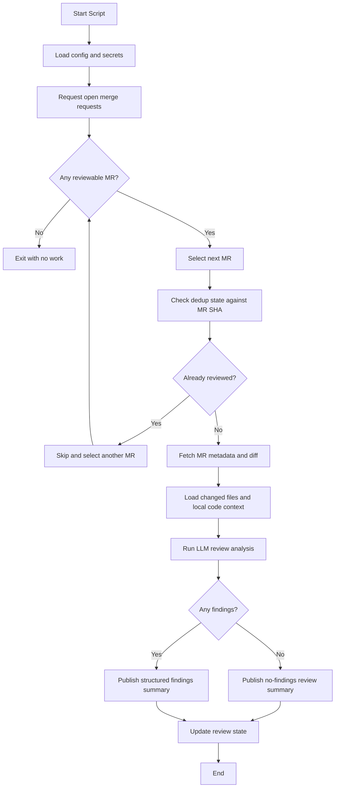
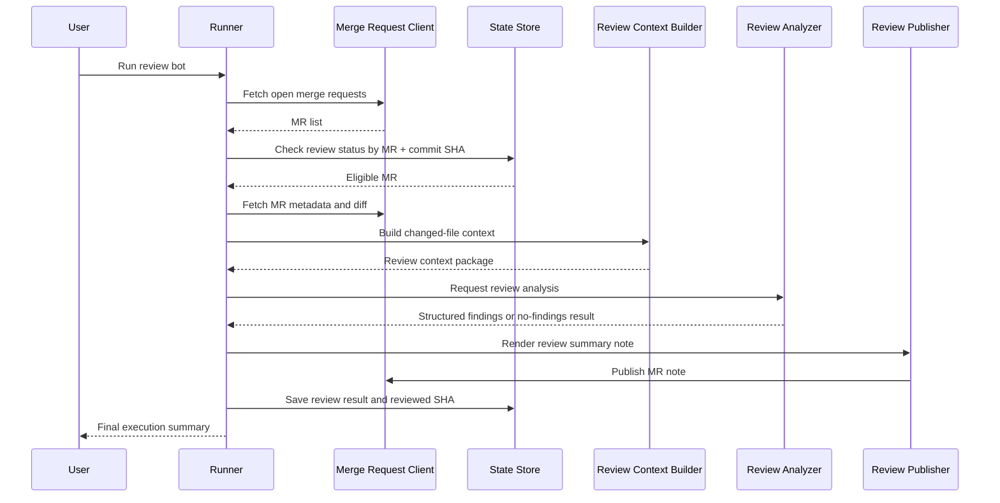

# AI Pull Request Review Bot Functional Design

## 1. Purpose

Build an AI bot that:

1. Requests open merge requests from GitLab when the script runs.
2. Selects one merge request to review.
3. Analyzes the diff and changed files.
4. Produces structured review findings when risks are detected.
5. Publishes a review summary note back to the merge request.

This document defines the functional design for a GitLab-first pull request
review bot before implementation.

## 2. Goals

- Automate first-pass review for merge requests in self-hosted GitLab.
- Surface bug risk, regression risk, missing validation, and unsafe assumptions.
- Keep review output structured and easy for developers to scan.
- Avoid duplicate review spam on the same merge request revision.

## 3. Non-Goals

- Blocking or approving merge requests automatically in v1.
- Replacing human code review.
- Posting inline comments on every diff hunk in v1.
- Generating follow-up code changes automatically as part of the review flow.
- Reviewing every historical merge request or every pipeline run.

## 4. Primary User Story

As a repository maintainer, I run the review bot and it:

- fetches one open merge request,
- analyzes the changed files and diff,
- publishes a structured review summary,
- highlights findings that need human attention,
- avoids posting the same review repeatedly for the same MR revision.

## 5. Assumptions

- The repository is hosted on GitLab for the first version.
- The bot can read merge requests, diffs, and notes through the GitLab API.
- The bot can publish merge request notes back to GitLab.
- An LLM is available to analyze the merge request and produce structured review findings.
- The repository has a normal MR workflow where developers read notes before merge.
- Deployment stays within the shared bot image, with review exposed as a
  separate CLI workflow rather than a dedicated review-only container image.

## 6. External Systems

- Git hosting platform
  - GitLab in v1.
  - Used to fetch merge requests, diffs, metadata, and publish review notes.
- LLM provider
  - Used for review analysis and structured finding generation.
- Local repository workspace
  - Used to read changed files and surrounding source context.

## 7. High-Level Functional Flow

## 8. Proposed Logical Components

### 8.1 Runner

Responsible for:

- starting the workflow,
- loading configuration,
- orchestrating review steps,
- handling success and failure states.

### 8.2 Merge Request Client

Responsible for:

- fetching open merge requests,
- retrieving MR metadata, diffs, and changed files,
- publishing merge request notes.

### 8.3 Merge Request Selector

Responsible for:

- filtering supported merge requests,
- prioritizing review order,
- avoiding duplicate reviews for the same MR revision.

### 8.4 Review Context Builder

Responsible for:

- loading changed files from the local checkout,
- collecting diff hunks and nearby source context,
- preparing structured review input for the LLM.

### 8.5 Review Analyzer

Responsible for:

- classifying whether the MR has findings,
- generating structured review findings,
- producing a short summary and risk framing.

### 8.6 Review Publisher

Responsible for:

- rendering findings into a deterministic note template,
- publishing one merge request summary note,
- updating or replacing the previous bot note later if needed.

### 8.7 State Store

Responsible for:

- tracking which MR revision was already reviewed,
- storing the last reviewed commit SHA,
- preventing duplicate review notes for unchanged MRs,
- recording failures and outcomes.

For v1, this can remain a local JSON state file, following the same inspectable
state model style as the SonarQube bot.

## 9. Component Interaction

## 10. Core Functional Requirements

### 10.1 Configuration

The bot must support:

- Git provider type
- Git provider token
- repository default branch
- merge request selection policy
- review scope policy
- LLM provider configuration
- note template configuration

Recommended input source:

- environment variables for secrets,
- YAML or JSON config for runtime behavior.

### 10.2 Merge Request Retrieval

On each run, the bot must:

- call GitLab to fetch open merge requests for the configured project,
- retrieve MR identifier, title, author, source branch, target branch, head SHA, changed files, and diff,
- filter out closed, draft, or unsupported MRs if configured.

Suggested initial filter criteria:

- merge request is open,
- merge request is not already reviewed for the current head SHA,
- changed files exist in the local repository,
- changed-file count stays within a configured threshold.

### 10.3 Merge Request Selection

The bot should select one merge request per run in v1.

Selection priority:

1. Merge requests not already reviewed for the current head SHA.
2. Merge requests with smaller diffs first.
3. Merge requests targeting the default branch.
4. Merge requests with changed files in supported languages or paths.

### 10.4 Review Analysis

For the selected merge request, the bot must build a review payload containing:

- merge request metadata,
- remediation-authored merge request context when present,
- changed files,
- diff hunks,
- nearby source context,
- repository review constraints,
- instructions to focus on correctness and risk.

When the merge request was created by the remediation workflow, the review bot
should use the remediation-authored context to understand:

- why the change was proposed,
- which issue or dashboard item it targets,
- which constraints shaped the fix,
- which validation signals were already recorded.

That richer context should help the review bot compare intended fix behavior to
the actual implementation instead of reviewing the diff in a vacuum.

The review workflow must still degrade gracefully for normal human-authored
merge requests that do not include remediation metadata.

The LLM review output should classify the MR as:

- no_findings,
- findings_present,
- manual_review_only when context is insufficient.

### 10.5 Review Findings

Each finding should include:

- severity
- file path
- short title
- explanation of the risk
- suggested follow-up

The v1 output should prioritize:

- correctness bugs
- behavior regressions
- missing tests
- unsafe assumptions

When remediation-authored merge request context is available, the bot should
prefer findings that explicitly compare:

- intended change versus actual implementation,
- stated remediation constraints versus the produced diff,
- stated validation evidence versus remaining review risk.

### 10.6 Review Note Publishing

When findings exist, the bot must publish one deterministic merge request note
containing:

- short summary
- numbered findings
- clear statement that the review is AI-assisted

When no findings exist, the bot may publish a short “no findings in this pass”
note or skip publishing based on configuration.

### 10.7 Deduplication

The bot must not post the same review repeatedly for the same merge request SHA.

The v1 dedup key should include:

- GitLab merge request ID
- current head commit SHA

### 10.8 Failure Handling

If the bot cannot fetch the MR, build enough context, or get a valid structured
review response, it must:

- record the failure in state,
- avoid publishing partial or malformed output,
- exit cleanly with a summary.

### 10.9 Advisory Review Confidence

The review workflow may later expose an advisory confidence signal to help
operators understand how likely the review bot thinks the produced
implementation is correct, complete, and low risk.

This signal should remain advisory in the first version:

- it should not approve or merge a merge request automatically,
- it should not replace human code review,
- it should not be treated as a hidden blocking gate.

The score should be accompanied by a short machine-generated reason so
operators can understand why the score was low or high instead of seeing an
unexplained number.

Recommended initial behavior:

- use a simple normalized score range such as `0.0` to `1.0`,
- store the score and reason on review-facing workflow artifacts,
- surface the score for operator awareness before using it as any stronger
  policy input.

## 11. Success Criteria

V1 is successful when:

- the bot can review one open merge request per run,
- it avoids duplicate notes for unchanged revisions,
- it publishes readable structured review summaries in GitLab,
- developers can distinguish “no findings” from “review not possible,”
- the review output is useful enough to reduce manual review time without
  causing spam.

## 12. Future Extensions

Post-v1 candidates include:

- inline diff comments
- review note updates instead of new note creation
- suggested patches
- GitHub pull request support
- review findings feeding a structured dashboard or fix workflow
