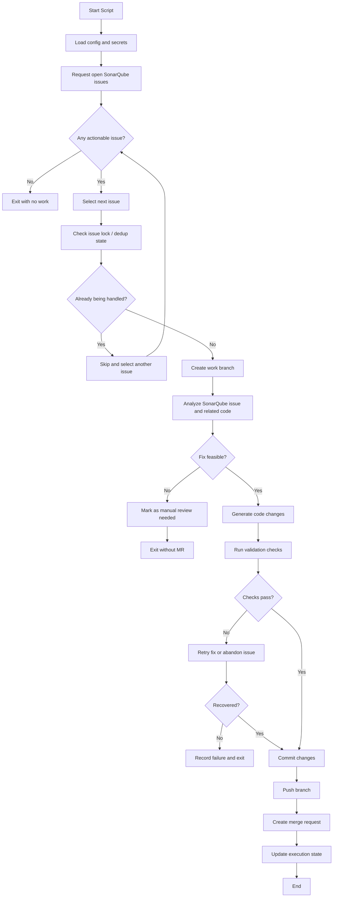
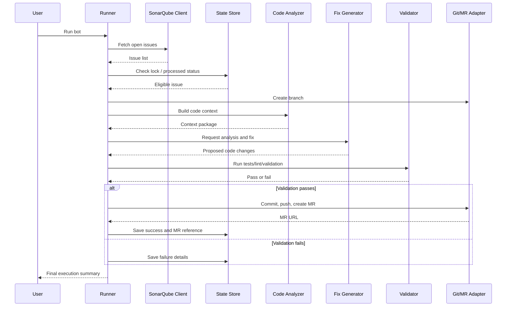
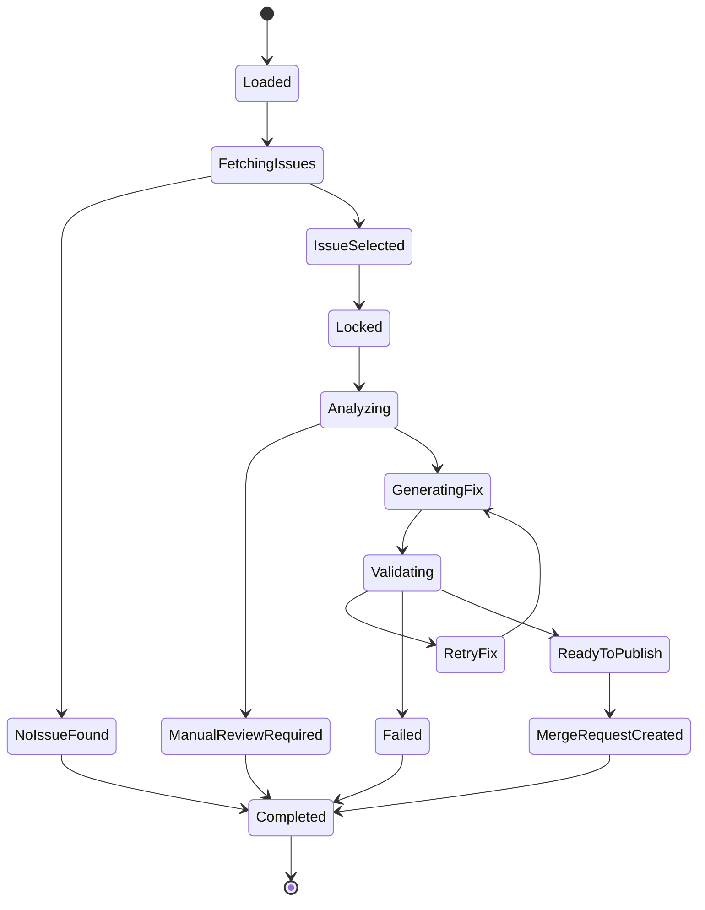

# AI Sonar Bot Functional Design

## 1. Purpose

Build an AI bot that:

1. Requests open issues from SonarQube when the script runs.
2. Selects an issue to work on.
3. Analyzes the issue and the local codebase.
4. Creates a code fix when feasible.
5. Pushes the fix to a branch and opens a merge request for review.

This document defines the functional design before implementation.

## 2. Goals

- Automate the path from SonarQube issue to reviewable code change.
- Keep a human in the loop through merge request review.
- Avoid duplicate work on the same SonarQube issue.
- Produce traceable execution logs and deterministic status updates.

## 3. Non-Goals

- Auto-merging fixes into the default branch.
- Fixing every SonarQube issue type in the first version.
- Guaranteeing a fix for issues that need broad architectural decisions.
- Replacing CI, code review, or SonarQube quality gates.

## 4. Primary User Story

As a repository maintainer, I run the bot and it:

- fetches open SonarQube issues for the target project,
- chooses one actionable issue,
- generates and validates a fix,
- creates a branch and commit,
- opens a merge request with SonarQube context for human review.

## 5. Assumptions

- The repository is hosted on GitLab for the first version.
- SonarQube API access is available through a token.
- The bot runs inside a checked-out repository with permission to create branches and push.
- An LLM is available to analyze issues and propose code changes.
- The local project has at least one test, lint, or validation command that can be run after edits.

## 6. External Systems

- SonarQube
  - Source of issues and issue metadata.
- Git hosting platform
  - GitLab in v1.
  - Used for branch push and merge request creation.
- LLM provider
  - Used for issue analysis, fix generation, and merge request summary creation.
- Local repository workspace
  - Used for code analysis, edits, test execution, and git operations.

## 7. High-Level Functional Flow



## 8. Proposed Logical Components

### 8.1 Runner

Responsible for:

- starting the workflow,
- loading configuration,
- orchestrating each step,
- handling success and failure states.

### 8.2 SonarQube Client

Responsible for:

- authenticating with SonarQube,
- fetching open issues for a configured project,
- retrieving detailed metadata for a selected issue.

### 8.3 Issue Selector

Responsible for:

- filtering supported issue types,
- prioritizing issues,
- ensuring the same issue is not processed twice concurrently.

### 8.4 Code Analyzer

Responsible for:

- mapping SonarQube issue locations to repository files,
- loading relevant code context,
- preparing a structured prompt for the LLM.

### 8.5 Fix Generator

Responsible for:

- proposing code changes,
- applying edits,
- creating commit messages and merge request descriptions.

### 8.6 Validator

Responsible for:

- running project-specific checks,
- collecting command results,
- deciding whether the fix is acceptable for merge request creation.

### 8.7 Git / MR Adapter

Responsible for:

- creating a branch,
- committing and pushing changes,
- opening a merge request in GitLab.

### 8.8 State Store

Responsible for:

- tracking processed issues,
- storing lock state,
- preventing duplicate merge requests,
- recording failures and outcomes.

For v1, this should be a local JSON file with a Renovate-style structure so it stays easy to inspect, diff, and edit.

## 9. Component Interaction



## 10. Core Functional Requirements

### 10.1 Configuration

The bot must support:

- SonarQube base URL
- SonarQube token
- SonarQube project key
- Git provider type
- Git provider token
- repository default branch
- branch naming template
- validation commands
- LLM provider configuration
- issue selection policy

Recommended input source:

- environment variables for secrets,
- YAML or JSON config for runtime behavior.

### 10.2 SonarQube Issue Retrieval

On each run, the bot must:

- call SonarQube to fetch open issues for the configured project,
- retrieve issue key, rule, severity, message, file path, line, status, and tags,
- filter out resolved or unsupported issues.

Suggested initial filter criteria:

- status is open,
- file location exists in the repository,
- issue type is code-fixable,
- severity is within configured threshold.

### 10.3 Issue Selection

The bot should select one issue per run in v1.

Selection priority:

1. Issues not already processed.
2. Issues with direct file and line mapping.
3. Rules from a supported ruleset.
4. Highest configured priority, for example severity or effort.

### 10.4 Issue Analysis

For the selected issue, the bot must build an analysis payload containing:

- SonarQube issue metadata,
- source file and nearby code,
- related tests when identifiable,
- repository conventions,
- validation commands,
- constraints such as "minimal safe change".

The LLM analysis output should classify the issue as:

- auto-fixable,
- likely auto-fixable with retry,
- manual review required.

### 10.5 Code Fix Generation

If the issue is considered auto-fixable, the bot must:

- create a new branch,
- generate a proposed patch,
- apply code changes locally,
- keep the fix scoped to the issue unless dependent edits are required.

The bot should also generate:

- commit message,
- MR title,
- MR body with SonarQube issue details and validation summary.

### 10.6 Validation

After changes are applied, the bot must run configured validation commands.

Examples:

- unit tests,
- linter,
- formatter check,
- type check,
- project build.

Validation outcomes:

- Pass: continue to approval, commit, and MR creation.
- Fail, recoverable: allow one controlled retry with validation feedback.
- Fail, non-recoverable: stop and record failure.

### 10.7 Merge Request Creation

If validation passes, the bot must:

- request human approval,
- commit the generated changes,
- push the branch,
- create a merge request,
- include issue context and test results in the merge request body.

Merge request content should include:

- SonarQube issue key,
- original issue message,
- impacted file(s),
- summary of fix,
- validation commands executed,
- known limitations if any.

### 10.8 State Tracking

The bot must record:

- issue key,
- selected timestamp,
- branch name,
- commit SHA,
- MR URL,
- status such as succeeded, skipped, failed, manual,
- failure reason when applicable.

This avoids duplicate merge request creation for the same issue.

## 11. Proposed State Machine



## 12. Supported and Unsupported Issue Types for V1

Recommended supported issue categories in v1:

- simple code smells,
- low-risk refactors,
- obvious null or error handling gaps,
- naming or dead code fixes,
- narrowly scoped security hotspots that have clear remediation.

Recommended unsupported categories in v1:

- multi-file architectural redesign,
- dependency upgrades,
- issues requiring product decisions,
- ambiguous security fixes,
- large-scale performance tuning.

## 13. Failure Handling

The bot should fail safely.

Failure cases:

- SonarQube unavailable
- no open issues
- issue file missing
- branch creation failure
- fix generation failure
- validation failure
- push failure
- merge request creation failure

Required behavior:

- log the failure,
- update state,
- avoid partial duplicate processing,
- leave the repository in a diagnosable state.

## 14. Security and Permissions

- Use scoped tokens for SonarQube and Git provider.
- Do not log secrets.
- Restrict branch and merge request permissions to the target repository.
- Preserve auditability through execution logs and merge request metadata.
- Require explicit config for commands that can modify or publish code.

## 15. Observability

The bot should emit:

- run ID,
- selected issue key,
- step-by-step status,
- validation command results,
- merge request URL or failure reason.

Recommended outputs:

- console logs for local use,
- structured JSON logs for automation,
- persistent state record for reporting.

## 16. Suggested V1 Execution Policy

- Process exactly one issue per run.
- Support a dry-run mode that performs analysis without code changes.
- Require manual approval before push and merge request creation.
- Retry code generation at most once after validation feedback.

This keeps the first version controlled and easier to debug.

## 17. Recommended Repository Structure

One practical structure for implementation:

```text
ai-sonar-bot/
  docs/
    functional-design.md
  src/
    runner/
    config/
    sonar/
    selection/
    analysis/
    fix/
    validation/
    git_provider/
    state/
  tests/
  examples/
    .env.example
    .gitlab-ci.example.yml
    .ai-sonar-bot.json
  README.md
```

## 18. Locked V1 Design Decisions

These decisions are fixed for the first version:

1. Git provider target
   - GitLab merge requests only.
2. Runtime language
   - Python.
3. State store
   - Local JSON file with a Renovate-style structure.
4. Validation contract
   - Fixed commands in config, with project-specific values.
5. Approval model
   - Human approval required before push and merge request creation.

## 19. Recommended V1 Scope

For the first implementation, keep scope tight:

- Python CLI application
- GitLab merge request support
- SonarQube issue retrieval
- single-issue processing per run
- local JSON state tracking with a Renovate-style structure
- one retry after validation failure
- dry-run mode
- human approval before publish

## 20. Acceptance Criteria

The design is satisfied when a v1 implementation can:

1. Run from the repository root with config and tokens available.
2. Fetch open SonarQube issues for one configured project.
3. Select one eligible issue not already processed.
4. Generate and apply a code fix when the issue is within supported scope.
5. Run configured validation commands.
6. Request human approval, then push a branch and open a merge request when validation passes.
7. Persist execution state and avoid duplicate merge request creation for the same issue.
8. Exit safely with clear logs when no issue is fixable.

## 21. Execution Modes

V1 should support two execution modes:

- Local mode
  - intended for developer-triggered terminal runs
  - may optionally request interactive approval before publish
- CI mode
  - intended for non-interactive execution in a pipeline or Docker container
  - must create the merge request automatically after validation succeeds
  - uses GitLab merge request review as the human approval mechanism

In CI mode, the merge request itself is the approval gate. The bot should not block waiting for terminal input.
