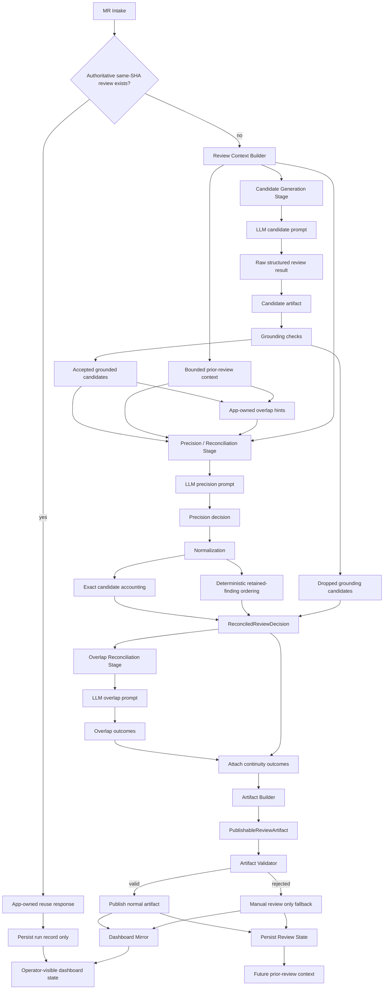

# Review Flow Diagram

This diagram reflects the current implemented staged review flow.

It is intended as a quick reference for:

- current stage boundaries
- LLM-assisted stages vs app-owned stages
- where continuity, validation, and fallback happen

## Notes

- `candidate generation`, `precision / reconciliation`, and `overlap reconciliation`
  are the current LLM-assisted stages.
- `grounding`, `normalization`, `artifact building`, `validation`, `state persistence`,
  and `dashboard mirroring` are app-owned.
- Same-SHA reuse is an app-owned operational early exit, not a new review pass.
- The precision stage owns final review meaning.
- The validator owns publish safety, not review truth.
- Repair is intentionally not implemented yet; current validator fallback is
  `manual_review_only`.
