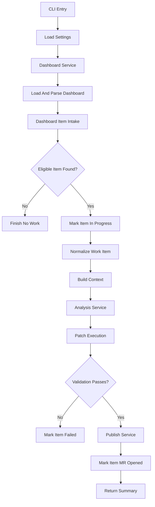

# AI Code Ops Dashboard Remediation Technical Design

## 1. Scope

This document defines the technical design for dashboard-backed remediation
described in
[functional-design-dashboard-remediation.md](functional-design-dashboard-remediation.md).

The goal is to let the remediation workflow consume one structured dashboard
item instead of reading directly from SonarQube.

Initial constraints:

- GitLab only
- one dashboard item processed per run
- one shared container image and CLI
- dashboard issue remains the remote control plane
- remediation stays limited to the current safe single-file structured-edit
  model
- direct Sonar intake may remain available only as a temporary fallback before
  the dashboard-backed path is fully trusted

## 2. Technical Objectives

- Add a dashboard-backed intake path for remediation-ready items.
- Keep discovery and remediation separated by a strict dashboard item contract.
- Reuse the existing structured-edit, bot-rendered diff, validation, publish,
  and rollback path wherever possible.
- Add dashboard lifecycle updates for `in_progress`, `mr_opened`, `failed`,
  `rejected`, and `done`.
- Preserve deterministic dedup and traceability through stable dashboard item
  IDs.

## 3. Recommended Stack

- Python 3.13.x
- `uv` for dependency management and command execution
- `httpx` for GitLab API requests
- `pydantic` for dashboard and remediation models
- standard `logging`
- `json` for local state during the current phase
- `pathlib` for workspace access

No new runtime dependencies should be required for the first implementation.

## 4. Repository Layout

Suggested additions:

```text
ai-sonar-bot/
  docs/
    functional-design-dashboard-remediation.md
    technical-design-dashboard-remediation.md
  src/ai_sonar_bot/
    models/
      dashboard.py
      remediation.py
    services/
      dashboard_item_intake.py
      dashboard_item_selector.py
      dashboard_item_normalizer.py
      dashboard_remediation_updater.py
      remediation_context_builder.py
```

The exact filenames can vary, but dashboard-backed remediation should stay
isolated from:

- source-specific discovery producers
- merge-request review workflow services
- low-level GitLab issue transport

## 5. Runtime Architecture

### 5.1 Main Execution Path

Dashboard-backed remediation should run as a synchronous pipeline:

1. Load config and state.
2. Initialize GitLab dashboard client and dashboard service.
3. Load and parse the dashboard issue.
4. Select one remediation-ready item.
5. Mark the item `in_progress`.
6. Normalize the dashboard item into a provider-neutral remediation work item.
7. Build local repository context for that work item.
8. Run analysis, structured-edit generation, edit rendering, patch execution,
   validation, and publish through a remediation-native execution contract.
9. Update the dashboard item to:
   - `mr_opened` on success,
   - `rejected` when policy or local approval rejects it,
   - `failed` on execution failure.
10. Return a run summary.

The runtime path should also define how it behaves when a previously selected
item is still marked `in_progress` from an interrupted earlier run.

The first version should keep this runtime path limited to state transitions it
can observe directly during the active remediation run. Post-run reconciliation
for merge requests that are later merged or closed should remain outside this
workflow.

### 5.2 Execution Diagram



## 6. Python Module Responsibilities

### 6.1 `cli.py`

Responsibilities:

- expose a dashboard-backed remediation command
- keep existing review commands intact
- treat the old direct Sonar remediation command as a temporary fallback rather
  than a long-term parallel remediation path

Suggested commands:

- `ai-sonar-bot dashboard remediate`
- `ai-sonar-bot dashboard remediate --dry-run`

The first implementation should use `dashboard remediate` as the explicit
workflow entrypoint. Dashboard-backed remediation should stay a separate
workflow, not a hidden flag on the old Sonar path. Live remediation should stay
CI-only in the first implementation; local operator use is limited to
`dashboard remediate --dry-run` so the dashboard lifecycle does not need a
separate local-success state yet.

### 6.2 `runner.py`

Responsibilities:

- act as the composition root for dashboard-backed remediation
- wire together dashboard intake, lifecycle updates, and the existing
  remediation pipeline
- build the final run summary

The runner may still reuse the current single-file remediation engine during
migration, but the long-term direction should be:

- normalize source-specific inputs into a remediation-native execution model,
- avoid rebuilding fake `SonarIssue` values just to enter the execution path,
- keep SonarQube as one producer profile rather than the base execution type.

### 6.3 `models/remediation.py`

Responsibilities:

- define provider-neutral remediation work-item models
- decouple remediation execution from the raw dashboard item shape

Suggested models:

- `RemediationWorkItem`
- `RemediationSelectionResult`
- `RemediationLifecycleUpdate`

### 6.4 `services/dashboard_item_intake.py`

Responsibilities:

- load the parsed dashboard document
- select one supported remediation-ready item
- return a typed no-work result when nothing is eligible

This service should not know how to fix code. It only selects one candidate.

### 6.5 `services/dashboard_item_selector.py`

Responsibilities:

- filter supported item types and statuses
- skip items already represented by active merge requests
- skip items outside current remediation policy
- return stable skip reasons for logs and summaries

### 6.6 `services/dashboard_item_normalizer.py`

Responsibilities:

- convert a `DashboardItem` into a provider-neutral `RemediationWorkItem`
- validate required fields before execution
- reject items that do not satisfy the remediation contract

This keeps the execution path from depending directly on dashboard-specific
field names.

### 6.7 `services/remediation_context_builder.py`

Responsibilities:

- build the existing code-context model from the selected work item
- reuse current issue-context concepts where possible
- support the initial single-file remediation scope only

The first implementation can likely reuse much of the current Sonar
`ContextBuilder` logic once the dashboard item is normalized to the required
shape.

### 6.8 `services/dashboard_remediation_updater.py`

Responsibilities:

- transition dashboard item statuses
- attach branch name, merge request URL, and commit SHA when available
- move items into the correct dashboard section through normal rendering rules

This service should own lifecycle updates rather than scattering them across
runner and publish logic.

### 6.9 Existing Reused Services

The dashboard-backed remediation flow should continue reusing:

- `AnalysisService`
- `PatchExecutionService`
- `PublishService`
- `WorkspaceSnapshotService`
- `Validator`

The new path should change intake and lifecycle management, not the proven
single-file remediation engine.

However, the transition should not stop at intake. To support future producers
cleanly, the execution core should gradually move from Sonar-native types
toward remediation-native inputs.

Recommended direction:

- adapt the legacy direct Sonar path into `RemediationWorkItem`,
- update analysis, prompting, and execution services to consume the
  remediation-native model,
- treat Sonar-specific prompt shaping as one producer strategy rather than the
  global workflow contract.

## 7. Data Model

### 7.1 `DashboardItem`

Already exists and remains the storage model for the dashboard issue.

Dashboard-backed remediation should require these fields for a selected item:

- `id`
- `source`
- `type`
- `status`
- `title`
- `summary`
- `priority`
- `source_reference`
- `file`

Additional fields used when present:

- `line`
- `rule`
- `severity`
- `validation_commands`
- `expected_change`
- `constraints`
- `acceptance_criteria`

### 7.2 `RemediationWorkItem`

Suggested provider-neutral execution model:

- `dashboard_item_id`
- `source_type`
- `source_ref`
- `title`
- `status`
- `message`
- `file_path`
- `line`
- `rule_id`
- `severity`
- `source_payload`

Optional execution metadata can continue to carry:

- `validation_commands`
- `expected_change`
- `constraints`
- `acceptance_criteria`

This model allows remediation execution to stay independent from whether the
item came from Sonar, pipeline discovery, or another producer.

The implementation should avoid leaving this model as a thin wrapper around a
later fabricated `SonarIssue`. If that happens, the execution path remains
source-shaped even though intake looks generic.

## 8. Selection And Dedup Rules

### 8.1 Eligible Statuses

The selector should consider only:

- `open`

The first version should not automatically pick:

- `in_progress`
- `mr_opened`
- `done`
- `rejected`
- `ignored`
- `failed`

### 8.2 Eligible Types

The selector should initially allow only the dashboard item types already proven
safe for the current remediation engine, which likely means Sonar-derived
single-file code-smell items.

### 8.3 Dedup Rules

Before selecting an item, the workflow should check:

- whether an active merge request already represents the item
- whether local state already tracks the item as active
- whether the dashboard item is already marked `mr_opened` or `in_progress`

Stable dashboard item IDs should be the primary dedup key.

For v1, local state and run summaries should persist the dashboard item ID
directly rather than trying to derive a second dedup identity from source data.

During migration, selection should also respect path ownership rules so direct
Sonar remediation and dashboard-backed remediation do not both act on the same
underlying issue at the same time.

## 9. Lifecycle Updates

### 9.1 Before Execution

When an item is selected:

- update status from `open` to `in_progress`

### 9.2 On Successful Publish

When branch push and merge request creation succeed:

- update status to `mr_opened`
- set `branch_name`
- set `merge_request_url`
- set `commit_sha`

### 9.3 On Failure

When execution fails before publish:

- update status to `failed`
- optionally set `log_excerpt` or failure summary later

### 9.4 On Rejection

When policy or local approval rejects remediation:

- update status to `rejected`

Status transitions should be explicit and deterministic. A later maintenance
service can prune or archive older resolved items.

### 9.4.1 Keep First-Version State Ownership Narrow

The first remediation workflow should own only these transitions:

- `open -> in_progress`
- `in_progress -> mr_opened`
- `in_progress -> failed`
- `in_progress -> rejected`

Transitions caused by later external events, such as merge request merge or
closure after the remediation run has finished, should be handled by a separate
scheduled reconciliation workflow rather than adding another always-on state
controller bot.

### 9.5 Stale In-Progress Handling

The implementation should define how stale `in_progress` items are detected and
recovered.

The first version does not need a distributed lease system. It should use one
clear time-based recovery rule:

- if an item is still `in_progress` and its recorded run metadata is older than
  24 hours, treat it as stale,
- move it back to `open`,
- record in the dashboard update and run summary that the item was reopened by
  stale-run recovery.

Here, `in_progress` means the remediation workflow selected the item and is
actively processing it. Review happens after the workflow succeeds and the item
moves to `mr_opened`.

The 24-hour window is therefore a conservative stale-run recovery
buffer for interrupted jobs and operator investigation, not a review window.

## 10. Migration Strategy

The rollout should be dashboard-first before live launch:

1. keep the old direct Sonar remediation path only as a temporary fallback
2. validate dashboard-backed remediation live on the same narrow issue class
3. compare summaries, failures, and merge request quality
4. fix rollout issues in the dashboard-backed path directly
5. deprecate and later remove direct Sonar remediation intake

This avoids building permanent coexistence machinery for a path that may be
retired before the platform is live.

For the first version, ownership should stay simple:

- the dashboard-backed remediation workflow owns active execution state,
- Sonar dashboard sync owns Sonar-derived discovery freshness,
- a later reconciliation workflow owns passive convergence for merged, closed,
  or stale remote states,
- the old direct Sonar remediation path should not be treated as a second
  long-term authoritative controller.

Sonar dashboard sync should keep its ownership equally narrow:

- it remains the discovery producer for Sonar-derived dashboard items,
- it may complete stale untouched `open` Sonar items that no longer exist
  upstream,
- it should not rewrite or remove Sonar-derived items once they have entered
  remediation-owned states such as `in_progress`, `mr_opened`, `failed`,
  `rejected`, or `done`.

## 11. Testing Strategy

### 11.1 Unit Tests

Add tests for:

- dashboard item selection
- status filtering
- dedup rules
- dashboard item normalization
- lifecycle updates

### 11.2 Integration Tests

Add runner-level coverage for:

- no eligible dashboard item
- selected dashboard item moves to `in_progress`
- successful remediation moves item to `mr_opened`
- failed remediation moves item to `failed`
- rejected remediation moves item to `rejected`
- stale `in_progress` handling follows the documented recovery rule
- migration-mode dedup prevents duplicate work across direct Sonar and
  dashboard-backed remediation

### 11.3 Regression Tests

As real dashboard-backed remediation failures appear, convert them into
regression tests just like the existing Sonar and review workflows.

## 12. Risks And Constraints

- dashboard items may be malformed or manually edited
- stale dashboard state may cause confusing transitions if lifecycle updates are
  not atomic enough
- direct Sonar and dashboard-backed remediation can diverge during migration
- the current single-file remediation engine limits the first supported item
  classes intentionally

The implementation should prefer explicit rejection and good summaries over
best-effort guessing.

## 13. Dashboard Write Coordination

The dashboard issue is a shared remote control plane, so the implementation
should define how read-modify-write conflicts are handled when multiple jobs or
producers touch it close together.

The first version can stay simple, but it should make retry behavior explicit
for:

- loading stale dashboard content,
- applying lifecycle updates after another writer has already changed the issue,
- deciding when to fail safely instead of repeatedly overwriting unexpected
  remote state.

For v1, the update policy should be:

- reload the dashboard once when a lifecycle write appears to conflict with a
  newer remote state,
- recompute the intended lifecycle update against the fresh dashboard state,
- retry exactly once,
- fail safe with a clear summary if the second attempt still cannot be applied
  cleanly.

This write-coordination behavior should not be coupled to merge-request-merged
or merge-request-closed reconciliation in the first remediation workflow. That
later convergence logic should remain a separate scheduled maintenance path.

## 14. Traceability Contract

The implementation should keep these identifiers available across logs,
summaries, and dashboard lifecycle updates:

- dashboard item ID,
- run ID,
- branch name when created,
- commit SHA when created,
- merge request URL when available.

This should be treated as part of the execution contract, not only as a logging
nice-to-have, because operator workflows will depend on correlating those
surfaces reliably.

## 15. Contract Extensibility

As additional producers are added later, the dashboard remediation contract
should distinguish between:

- universal remediation fields required for every selectable work item,
- source-specific metadata that can remain optional or namespaced.

This keeps the provider-neutral remediation model from being overfit to the
first Sonar-backed item shape.

In practice, that means future-producer support should be added through:

- one shared remediation-native execution contract,
- producer-specific normalization and capability registration,
- optional source-specific prompting or policy overlays,
- explicit runtime use of agreed generic fields instead of carrying them only
  as unused metadata.
