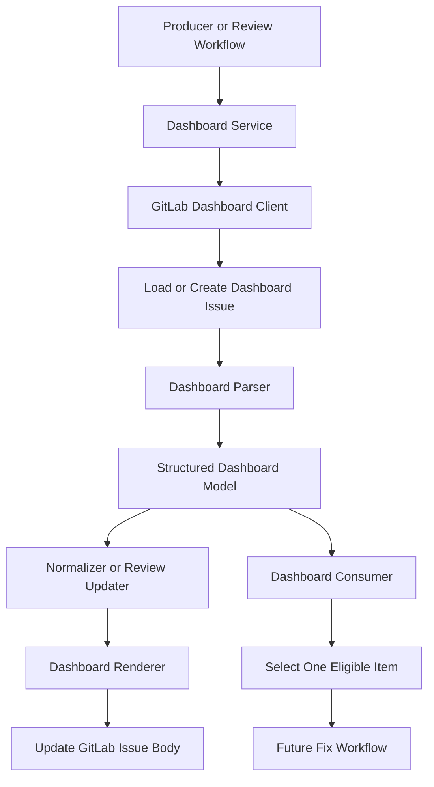

# AI Code Ops Dashboard Technical Design

## 1. Scope

This document defines the technical design for the GitLab-first dashboard
described in
[functional-design-dashboard.md](functional-design-dashboard.md).

The dashboard is a future control-plane feature, not part of the current
SonarQube v1 runtime path.

V1 dashboard constraints:

- GitLab only
- one persistent dashboard issue per repository
- markdown-backed structured storage
- deterministic machine-owned sections
- no arbitrary command execution from dashboard edits
- discovery and remediation remain separate workflows
- merge-request review results are mirrored to the dashboard, but detailed
  review findings remain on the merge request itself

## 2. Technical Objectives

- Create or find one persistent GitLab dashboard issue per repository.
- Store structured work items in a stable markdown format that is both
  human-readable and machine-parseable.
- Support multiple future producers:
  - Sonar discovery
  - pipeline failure discovery
  - scheduled internal review
  - merge request review status
- Support future consumers that read one structured work item at a time for
  remediation.
- Keep review-note publishing on merge requests separate from dashboard status
  updates.

## 3. Recommended Stack

- Python 3.13.x
- `uv` for dependency management and command execution
- `httpx` for GitLab API requests
- `pydantic` for dashboard and work-item models
- standard `logging`
- `json` only for local state where needed
- `pathlib` for any local debug fixtures or snapshots

The dashboard itself should use GitLab issues as the durable remote store.

## 4. Repository Layout

Suggested additions:

```text
zeroone-ops/
  docs/
    functional-design-dashboard.md
    technical-design-dashboard.md
  src/zeroone_ops/
    models/
      dashboard.py
    providers/
      gitlab_dashboard_client.py
    services/
      dashboard_service.py
      dashboard_renderer.py
      dashboard_parser.py
      dashboard_normalizer.py
      dashboard_consumer.py
      review_dashboard_updater.py
```

The exact file names can change, but dashboard concerns should stay isolated
from Sonar remediation and merge-request review services.

## 5. Runtime Architecture

### 5.1 Main Execution Paths

The dashboard supports two different future workflows.

Discovery/update path:

1. Load config.
2. Initialize GitLab dashboard client.
3. Fetch or create the dashboard issue.
4. Parse the current dashboard body into structured sections and items.
5. Normalize new source findings into dashboard items.
6. Merge normalized items into the parsed dashboard model.
7. Render deterministic markdown.
8. Update the GitLab issue body.

Consumer path:

1. Load config.
2. Initialize GitLab dashboard client.
3. Fetch the dashboard issue.
4. Parse the current body.
5. Select one eligible dashboard item.
6. Hand it to a remediation workflow as a provider-neutral work item.

Review status update path:

1. Review workflow completes on an MR revision.
2. Publish the primary review note on the merge request.
3. Fetch the dashboard issue.
4. Parse current dashboard state.
5. Upsert the MR review status item.
6. Render deterministic markdown.
7. Update the dashboard issue.

### 5.2 Execution Diagram



## 6. Python Module Responsibilities

### 6.1 `models/dashboard.py`

Responsibilities:

- define dashboard section names,
- define dashboard item models,
- define review status item models,
- define parse/render intermediate models.

Suggested models:

- `DashboardItem`
- `DashboardSection`
- `DashboardDocument`
- `DashboardReviewStatusItem`

### 6.2 `providers/gitlab_dashboard_client.py`

Responsibilities:

- find dashboard issues by title and labels,
- create the dashboard issue if missing,
- fetch current issue body and metadata,
- update issue body,
- optionally add or maintain labels later.

This provider should stay focused on GitLab issue transport only.

### 6.3 `services/dashboard_parser.py`

Responsibilities:

- parse the machine-owned markdown sections,
- extract structured dashboard items,
- reject malformed or unsupported item blocks,
- preserve human-readable context outside managed sections only if explicitly
  supported.

The parser should be strict for machine-owned sections. Silent best-effort
parsing would make remediation unsafe.

### 6.4 `services/dashboard_renderer.py`

Responsibilities:

- render deterministic markdown from the structured dashboard model,
- preserve stable section ordering,
- preserve stable item ordering rules within sections,
- keep the output human-readable.

The renderer should be the only place that formats dashboard markdown.

### 6.5 `services/dashboard_normalizer.py`

Responsibilities:

- convert source-specific findings into `DashboardItem`,
- assign stable IDs,
- normalize source references,
- enforce the structured item contract before persistence.

This service should be producer-agnostic and reusable by:

- Sonar discovery
- pipeline-failure discovery
- scheduled internal review

### 6.6 `services/dashboard_service.py`

Responsibilities:

- orchestrate load, parse, merge, render, and update,
- expose high-level methods like:
  - `upsert_items(...)`
  - `load_document(...)`
  - `publish_document(...)`
- hide GitLab issue discovery details from callers.

### 6.7 `services/dashboard_consumer.py`

Responsibilities:

- read a parsed dashboard document,
- select one eligible dashboard item,
- enforce status and type constraints,
- return a provider-neutral work item to a future fix workflow.

### 6.8 `services/review_dashboard_updater.py`

Responsibilities:

- map review workflow results into dashboard review-status items,
- upsert by merge request identity plus reviewed SHA,
- keep dashboard review entries as status records only,
- avoid duplicating full review findings from the merge request note.

## 7. Data Model

### 7.1 `DashboardItem`

Required fields:

- `id`
- `source`
- `type`
- `status`
- `title`
- `summary`
- `priority`
- `source_reference`

Optional fields:

- `file`
- `line`
- `rule`
- `severity`
- `validation_commands`
- `expected_change`
- `constraints`
- `acceptance_criteria`
- `pipeline_id`
- `job_id`
- `job_name`
- `commit_sha`
- `merge_request_iid`
- `merge_request_url`
- `reviewed_head_sha`
- `review_status`
- `log_excerpt`

### 7.2 `DashboardDocument`

Suggested shape:

- `issue_id`
- `issue_iid`
- `title`
- `sections: list[DashboardSection]`
- `items_by_id: dict[str, DashboardItem]`
- `raw_body`

### 7.3 Status Rules

Supported statuses:

- `open`
- `in_progress`
- `mr_opened`
- `done`
- `rejected`
- `ignored`
- `failed`

Review status items may also carry:

- `no_findings`
- `findings_present`
- `manual_review_only`

These should be represented as review-specific metadata, not as a separate top
level lifecycle enum for all item types.

## 8. Markdown Storage Format

The dashboard issue body should contain deterministic sections, for example:

- `## Open Candidates`
- `## In Progress`
- `## Merge Requests Opened`
- `## Merge Request Reviews`
- `## Rejected Or Ignored`
- `## Recent Failures`

Each item should render as a stable markdown block.

Recommended format:

```md
### Item: sonar:python:S1125:src/service.py:42

```yaml
id: sonar:python:S1125:src/service.py:42
source: sonarqube
type: code_smell_fix
status: open
title: Simplify boolean comparison
summary: Replace explicit boolean equality with direct truthiness.
file: src/service.py
line: 42
priority: low
rule: python:S1125
severity: LOW
validation_commands:
  - uv run pytest
source_reference: 12345678-issue-key
```
```

The exact fenced format can change, but the design needs:

- one stable item boundary,
- one machine-readable payload per item,
- deterministic ordering.

## 9. Deterministic Ordering Rules

Section ordering should be fixed.

Within sections, order items by:

1. status bucket
2. priority
3. source
4. stable item ID

Review status items should be ordered by:

1. merge request IID
2. reviewed head SHA

Deterministic ordering is required so GitLab issue updates remain reviewable and
do not churn unnecessarily.

## 10. ID and Deduplication Rules

### 10.1 Work Item IDs

Each producer should generate stable IDs from source-specific identity.

Examples:

- Sonar item:
  - `sonar:<issue_key>`
- pipeline failure item:
  - `pipeline:<pipeline_id>:<job_id>`
- internal review item:
  - `review:<finding_id>`

### 10.2 Review Status IDs

Review status records should be deduplicated by:

- merge request IID
- reviewed head SHA

Suggested ID:

- `mr-review:<mr_iid>:<head_sha>`

### 10.3 Upsert Rules

If an item with the same ID already exists:

- update mutable fields like status, summary, links, and timestamps if those are
  later added,
- do not create a duplicate item block.

## 11. Producer Integration

### 11.1 Sonar Discovery

Future Sonar discovery should:

- fetch supported Sonar issues,
- normalize them into dashboard items,
- avoid applying code changes directly in the same workflow.

### 11.2 Pipeline Failure Discovery

Future pipeline discovery should:

- parse one actionable failed job,
- normalize it into a dashboard item,
- only write items when failure parsing is high confidence.

### 11.3 Scheduled Internal Review

Future internal review should:

- scan the codebase on a schedule,
- write structured findings into the dashboard,
- avoid auto-remediation inside the same workflow.

### 11.4 Merge Request Review Workflow

The merge-request review workflow should:

- publish the main review note on the merge request,
- upsert one review status item into the dashboard,
- keep the dashboard entry limited to status, reviewed SHA, and traceability
  metadata.

The dashboard must not become the only place where review findings are
published.

## 12. Consumer Integration

The future fix workflow should consume dashboard items only when:

- the item parses cleanly,
- the item is in an eligible status,
- the item type is supported,
- no stronger in-progress lock already exists elsewhere.

The consumer should convert the dashboard item into the shared internal work
item model rather than coupling remediation directly to dashboard markdown.

## 13. Failure Handling

The dashboard path should fail safely.

Rules:

- if parsing fails, do not write a partial update,
- if the dashboard issue cannot be found or created, return a typed failure,
- if a producer generates an invalid item, reject that item before rendering,
- if GitLab update fails, surface the exact issue ID and attempted operation in
  logs and state.

Review workflows should not fail review-note publication just because the
dashboard mirror update fails later. The dashboard update is secondary to the
merge-request note for review flows.

## 14. State Strategy

The dashboard is a remote visibility and coordination layer, not the only source
of truth for runtime state.

Recommended split:

- merge requests and branches remain the hard dedupe signals for remediation,
- merge request IID plus head SHA remains the hard dedupe signal for review,
- the dashboard mirrors and summarizes those states for operators.

This keeps dashboard drift from becoming a blocker to safe execution.

## 15. Testing Strategy

Unit tests should cover:

- item normalization
- markdown parsing
- markdown rendering
- dedup and upsert behavior
- review status update mapping
- consumer eligibility rules

Provider tests should cover:

- dashboard issue lookup
- dashboard issue creation
- dashboard issue update

Integration tests should cover:

- producer writes one or more items into an empty dashboard
- producer updates an existing dashboard without duplicate items
- consumer reads and selects one eligible dashboard item
- review workflow writes MR note and then updates dashboard review status

## 16. Rollout Strategy

Recommended implementation order:

1. define dashboard models
2. implement GitLab dashboard client
3. implement parser and renderer
4. implement dashboard service
5. implement one producer path
6. implement one consumer path
7. add review-status mirroring

The first producer should likely be the dashboard service itself with fixture
tests, followed by either Sonar discovery normalization or pipeline-failure
discovery, depending on product priority.

## 17. Future Extensions

- GitHub issue-backed dashboard with the same internal model
- command or checkbox-driven operator actions
- multiple dashboards by workflow type or repository area
- richer timestamps and audit metadata
- labels, reviewers, and assignee synchronization
