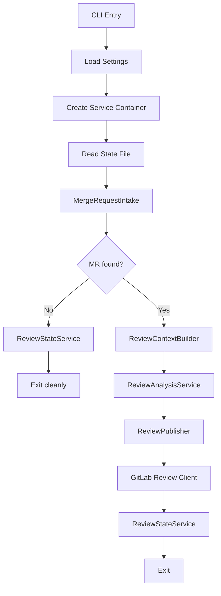

# AI Pull Request Review Bot Technical Design

## 1. Scope

This document defines the technical design for v1 of the GitLab-first pull
request review bot described in
[functional-design-pr-review.md](functional-design-pr-review.md).

V1 constraints:

- Python implementation
- GitLab only
- one merge request reviewed per run
- non-destructive workflow
- summary-note publishing only
- local JSON state store
- no inline diff comments in v1
- shared container image with a separate review CLI workflow

## 2. Technical Objectives

- Provide a CLI that can review one merge request from a checked-out repository.
- Integrate with GitLab APIs using tokens from environment variables.
- Build deterministic review context from merge request diffs and local files.
- Use structured LLM output for findings instead of free-form prose.
- Avoid duplicate reviews for the same merge request revision.

## 3. Recommended Stack

- Python 3.13.x
- `uv` for dependency management and command execution
- `httpx` for GitLab API requests
- `pydantic` for config and data models
- `typer` for CLI entrypoints
- `ruff` for linting and formatting
- `mypy` for static type checking
- standard `logging`
- `pathlib` for filesystem work
- `json` for the state store

## 4. Repository Layout

Suggested additions alongside the existing SonarQube bot layout:

```text
ai-sonar-bot/
  docs/
    functional-design-pr-review.md
    technical-design-pr-review.md
  src/ai_sonar_bot/
    models/
      review.py
    providers/
      gitlab_review_client.py
    services/
      mr_intake.py
      mr_selector.py
      review_context_builder.py
      review_analysis_service.py
      review_publisher.py
      review_state_service.py
```

The exact file names can change, but the review workflow should stay separate
from the Sonar remediation workflow rather than being folded into the same
services.

## 5. Runtime Architecture

### 5.1 Main Execution Path

The review bot runs as a synchronous pipeline in v1:

1. Load config.
2. Initialize GitLab review client and state store.
3. Fetch open merge requests.
4. Use `MergeRequestSelector` to choose one reviewable MR.
5. Fetch MR metadata, changed files, and diff.
6. Parse remediation-authored MR context when present and keep it available as
   structured review input.
7. Use `ReviewContextBuilder` to load local source context for changed files.
8. Combine MR metadata, optional remediation context, diff data, and local
   code context into the review payload.
9. Use `ReviewAnalysisService` to request structured findings from the LLM.
10. Use `ReviewPublisher` to render a deterministic review note.
11. Publish the note to GitLab.
12. Persist reviewed SHA and outcome in state.

### 5.2 Execution Diagram



## 6. Python Module Responsibilities

### 6.1 `cli.py`

Responsibilities:

- parse CLI arguments,
- invoke the review runner,
- return exit codes.

Suggested commands:

- `ai-sonar-bot review`
- `ai-sonar-bot review --dry-run`
- `ai-sonar-bot review --mr-iid <iid>`

The review workflow should ship in the same container image as the SonarQube
workflow, with separate subcommands rather than a separate review-only image.

### 6.2 `runner.py`

Responsibilities:

- act as the composition root for the review workflow,
- wire together intake, analysis, publishing, and state services,
- build the final CLI-facing summary.

### 6.3 `settings.py`

Responsibilities:

- read environment variables,
- read optional local config JSON,
- build validated runtime settings objects for review mode.

### 6.4 `models/review.py`

Responsibilities:

- define merge request metadata models,
- define changed-file and diff models,
- define structured review-finding models,
- define review note summary models.

### 6.5 `providers/gitlab_review_client.py`

Responsibilities:

- fetch open merge requests,
- fetch merge request details and diff data,
- fetch changed files if separate endpoints are needed,
- publish merge request notes,
- retrieve existing notes later if note replacement is added.

### 6.6 `services/mr_intake.py`

Responsibilities:

- fetch candidate merge requests,
- filter obviously unsupported items,
- return a typed intake result with counts and no-work summaries.

### 6.7 `services/mr_selector.py`

Responsibilities:

- apply review eligibility policy,
- skip already-reviewed MR revisions,
- prioritize the next MR to review.

### 6.8 `services/review_context_builder.py`

Responsibilities:

- parse remediation-authored MR description metadata when present,
- load changed files from the local repository,
- join diff hunks with nearby source context,
- limit changed-file count and per-file context size,
- prepare a stable structured review payload.

The builder should prefer remediation-authored MR context when present, but it
must remain fully functional for normal human-authored merge requests that do
not contain that metadata.

### 6.9 `services/review_analysis_service.py`

Responsibilities:

- choose the active LLM backend,
- request structured review findings,
- reject malformed or oversized findings,
- classify the review result as findings, no findings, or insufficient context.

When remediation-authored context is present, the analysis layer should use it
to compare:

- intended fix versus actual diff behavior,
- recorded remediation constraints versus the produced implementation,
- available validation evidence versus remaining review risk.

This additional context should improve finding quality without making the
review workflow dependent on remediation-specific merge requests.

### 6.10 `services/review_publisher.py`

Responsibilities:

- render a deterministic review note template,
- include summary and numbered findings,
- publish a single note through the GitLab review client.

### 6.11 `services/review_state_service.py`

Responsibilities:

- record reviewed MR revisions,
- persist failures and outcomes,
- prevent duplicate reviews for the same MR SHA,
- build user-facing summaries.

### 6.12 `services/state_store.py`

Responsibilities:

- load and save the JSON file,
- store review records keyed by merge request ID and head SHA.

## 7. Configuration Design

### 7.1 Sources

Configuration should come from:

- environment variables for secrets,
- a local JSON config file for non-secret runtime behavior,
- CLI flags for per-run overrides.

### 7.2 Environment Variables

Required:

- `GITLAB_URL`
- `GITLAB_TOKEN`
- `GITLAB_PROJECT_ID` or GitLab CI `CI_PROJECT_ID`
- `OPENAI_API_KEY`
- `OPENAI_MODEL`

Optional:

- `AI_SONAR_BOT_CONFIG`
- `AI_SONAR_BOT_STATE_PATH`
- `AI_SONAR_BOT_LOG_LEVEL`
- `AI_SONAR_BOT_BASE_BRANCH`

### 7.3 Runtime Config File

Example review-specific config shape:

```json
{
  "execution_mode": "ci",
  "review": {
    "max_changed_files": 10,
    "max_context_lines_before": 30,
    "max_context_lines_after": 30,
    "publish_no_findings_note": true,
    "supported_paths": ["src/", "app/"],
    "skip_draft_merge_requests": true
  },
  "gitlab": {
    "target_branch": "main",
    "labels": ["ai-code-review"]
  },
  "state": {
    "path": ".ai-sonar-bot-state.json"
  }
}
```

## 8. Data Model Design

### 8.1 Merge Request Model

```python
class MergeRequestInfo(BaseModel):
    iid: int
    title: str
    source_branch: str
    target_branch: str
    web_url: str
    head_sha: str
    author_username: str | None = None
    draft: bool = False
```

### 8.2 Changed File Model

```python
class ChangedFile(BaseModel):
    file_path: str
    diff: str
    new_file: bool = False
    deleted_file: bool = False
    renamed_file: bool = False
```

### 8.3 Review Finding Model

```python
class ReviewFinding(BaseModel):
    severity: Literal["high", "medium", "low"]
    file_path: str
    title: str
    explanation: str
    suggested_follow_up: str
```

### 8.4 Review Result Model

```python
class ReviewResult(BaseModel):
    classification: Literal["no_findings", "findings_present", "manual_review_only"]
    summary: str
    findings: list[ReviewFinding] = []
```

### 8.5 Review State Model

```python
class MergeRequestReviewState(BaseModel):
    mr_iid: int
    head_sha: str
    status: str
    last_run_id: str
    note_url: str | None = None
    updated_at: datetime
```

## 9. Review Note Design

The bot should publish one deterministic summary note.

Suggested template:

```md
## AI Review Summary

Summary: <short summary>

Findings:
1. [high] <title> (`path/to/file.py`)
   <explanation>
   Follow-up: <suggested follow-up>

Notes:
- AI-assisted review pass
- Reviewed commit SHA: `<sha>`
```

If there are no findings, the note can be:

```md
## AI Review Summary

No findings in this pass for commit `<sha>`.

Notes:
- AI-assisted review pass
```

## 10. Deduplication Strategy

The review bot should deduplicate by:

- GitLab merge request IID
- current MR head SHA

If the same MR is rerun with the same SHA:

- skip review entirely, or
- later replace/update the existing note instead of posting a new one

For v1, skipping unchanged revisions is sufficient.

## 11. Failure Handling

Failures should be classified at least by:

- merge request intake
- diff retrieval
- context building
- review analysis
- note publishing

On failure, the bot must:

- record structured failure details in state,
- avoid publishing partial or malformed notes,
- exit with a clear summary.

## 12. Advisory Review Confidence

The review workflow should emit an advisory confidence signal as part of the
review trust-building phase, while keeping it out of runtime control policy.

Recommended first fields:

- `review_confidence: float | None`
- `review_confidence_reason: str | None`

Recommended semantics:

- `review_confidence` reflects how likely the review workflow thinks the
  produced implementation is correct and low risk after inspecting the merge
  request diff and review context

For the first implementation, these values should be treated as advisory
metadata only:

- do not use them as automatic merge or approval gates,
- do not treat them as calibrated probabilities until enough real history
  exists,
- require a short reason string whenever a score is recorded.

Storage and presentation guidance:

- use a normalized `0.0` to `1.0` range,
- surface the value in review-facing artifacts, summaries, or notes before
  making it part of runtime policy.

## 13. Testing Strategy

V1 should include:

- unit tests for MR selection and dedup behavior
- unit tests for review note rendering
- unit tests for changed-file context limits
- integration tests for:
  - fetch MR -> analyze -> publish note
  - unchanged SHA skip
  - findings-present and no-findings cases

## 14. Future Extensions

Post-v1 candidates:

- inline diff comments
- note updates instead of new note creation
- suggested code patches
- GitHub pull request support
- linking review findings into a dashboard or follow-up fix workflow
