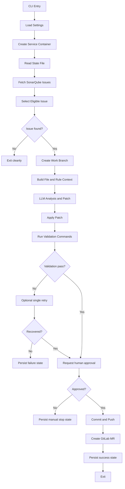
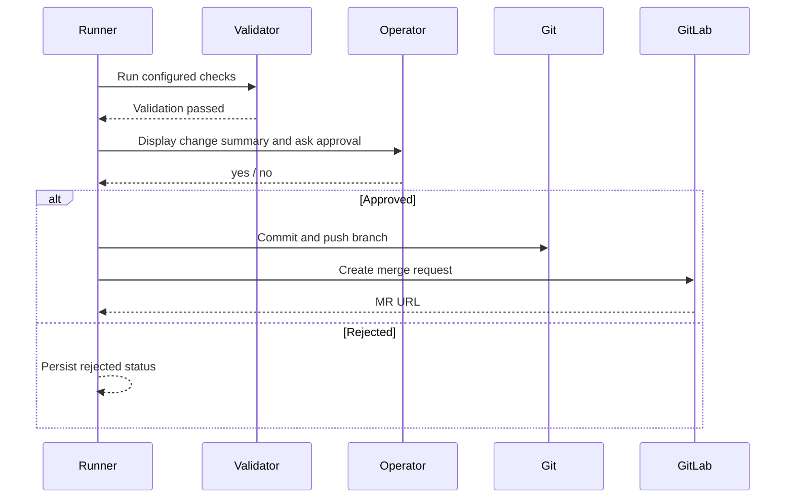

# AI Sonar Bot Technical Design

## 1. Scope

This document defines the technical design for v1 of the AI Sonar Bot described in [functional-design.md](/Users/justinmelger/Desktop/github/ai-sonar-bot/docs/functional-design.md).

V1 constraints:

- Python implementation
- GitLab only
- SonarQube as the issue source
- one issue processed per run
- local JSON state store
- human approval required before push and merge request creation

## 2. Technical Objectives

- Provide a CLI that can run from a checked-out repository.
- Integrate with SonarQube and GitLab APIs using tokens from environment variables.
- Maintain a durable local state file to avoid duplicate work.
- Use a deterministic execution pipeline with explicit step boundaries.
- Isolate provider integrations so future expansion stays manageable.

## 3. Recommended Stack

- Python 3.12+
- `uv` for dependency management, virtualenv management, and command execution
- `httpx` for API requests
- `pydantic` for config and data models
- `typer` or `argparse` for CLI
- `ruff` for linting and formatting
- `mypy` for static type checking
- `structlog` or standard `logging` for logs
- `pathlib` for filesystem work
- `subprocess` for validation and git commands
- `json` for the state store

Recommended packaging:

- `pyproject.toml`
- `uv.lock`
- source layout under `src/`

## 4. Repository Layout

```text
ai-sonar-bot/
  docs/
    functional-design.md
    technical-design.md
  src/ai_sonar_bot/
    __init__.py
    cli.py
    settings.py
    logging.py
    runner.py
    models/
      __init__.py
      config.py
      sonar.py
      gitlab.py
      state.py
      analysis.py
    providers/
      __init__.py
      sonar_client.py
      gitlab_client.py
      llm_client.py
    services/
      __init__.py
      issue_selector.py
      context_builder.py
      fix_generator.py
      validator.py
      approval.py
      branch_manager.py
      mr_service.py
      state_store.py
    prompts/
      fix_issue.txt
      summarize_mr.txt
    utils/
      __init__.py
      git.py
      command.py
      files.py
      clock.py
  tests/
    unit/
    integration/
  .env.example
  pyproject.toml
  uv.lock
  README.md
  .ai-sonar-bot.json
```

## 5. Runtime Architecture

### 5.1 Main Execution Path

The bot runs as a synchronous pipeline in v1:

1. Load config.
2. Initialize clients and state store.
3. Fetch open SonarQube issues.
4. Select one supported issue.
5. Create a local work branch.
6. Build code context.
7. Request analysis and patch proposal from the LLM.
8. Apply changes.
9. Run validation commands.
10. Request human approval.
11. Commit and push branch.
12. Create GitLab merge request.
13. Persist final state.

### 5.2 Execution Diagram



## 6. Python Module Responsibilities

### 6.1 `cli.py`

Responsibilities:

- parse CLI arguments,
- load settings file path overrides,
- invoke the runner,
- return exit codes.

Suggested commands:

- `ai-sonar-bot run`
- `ai-sonar-bot run --dry-run`
- `ai-sonar-bot run --issue-key <key>`
- `ai-sonar-bot approve --run-id <id>` for a future non-interactive workflow

For v1, only `run` is required.

### 6.2 `runner.py`

Responsibilities:

- orchestrate the end-to-end flow,
- handle step-level exceptions,
- decide terminal run status,
- write state updates.

This is the only module that should coordinate multiple services directly.

### 6.3 `settings.py`

Responsibilities:

- read environment variables,
- read optional local config JSON,
- build validated runtime settings objects.

### 6.4 `providers/sonar_client.py`

Responsibilities:

- call SonarQube REST APIs,
- normalize issue payloads,
- expose typed methods for search and detail retrieval.

### 6.5 `providers/gitlab_client.py`

Responsibilities:

- resolve project ID if needed,
- create merge requests,
- optionally add labels, assignees, or reviewers later.

### 6.6 `providers/llm_client.py`

Responsibilities:

- send structured prompts,
- enforce response format,
- return parsed analysis and patch data.

### 6.7 `services/issue_selector.py`

Responsibilities:

- filter unsupported SonarQube issues,
- avoid already-processed items,
- rank issues,
- return the single selected issue.

### 6.8 `services/context_builder.py`

Responsibilities:

- load the target file,
- capture neighboring lines,
- identify related test files when possible,
- include validation command metadata in the LLM context.

### 6.9 `services/fix_generator.py`

Responsibilities:

- build prompts,
- request issue analysis,
- request a patch,
- validate patch boundaries before apply.

### 6.10 `services/validator.py`

Responsibilities:

- run configured shell commands,
- stream or capture output,
- summarize failures for retry prompts.

### 6.11 `services/approval.py`

Responsibilities:

- present a summary to the operator,
- request explicit approval in the terminal,
- return approved or rejected.

### 6.12 `services/branch_manager.py`

Responsibilities:

- ensure clean enough git state for execution,
- create local branches,
- commit changes,
- push to origin.

### 6.13 `services/mr_service.py`

Responsibilities:

- assemble merge request title and description,
- call GitLab client to create the MR,
- attach issue metadata in a consistent template.

### 6.14 `services/state_store.py`

Responsibilities:

- load and save the JSON file,
- manage issue lock state,
- record run history and issue outcomes.

## 7. Configuration Design

## 7.1 Sources

Configuration should come from:

- environment variables for secrets,
- `.ai-sonar-bot.json` for non-secret runtime settings,
- CLI flags for run-time overrides.

Precedence order:

1. CLI flags
2. Environment variables
3. `.ai-sonar-bot.json`
4. defaults

## 7.2 Environment Variables

Required:

- `SONARQUBE_URL`
- `SONARQUBE_TOKEN`
- `SONARQUBE_PROJECT_KEY`
- `GITLAB_URL`
- `GITLAB_TOKEN`
- `GITLAB_PROJECT_ID` or `GITLAB_PROJECT_PATH`
- `LLM_API_KEY`

Optional:

- `AI_SONAR_BOT_CONFIG`
- `AI_SONAR_BOT_STATE_PATH`
- `AI_SONAR_BOT_LOG_LEVEL`
- `AI_SONAR_BOT_BASE_BRANCH`

## 7.3 Runtime Config File

Example `.ai-sonar-bot.json`:

```json
{
  "base_branch": "main",
  "branch_prefix": "ai-sonar",
  "dry_run": false,
  "max_retry_count": 1,
  "supported_severities": ["BLOCKER", "CRITICAL", "MAJOR"],
  "supported_issue_types": ["CODE_SMELL", "BUG", "VULNERABILITY"],
  "supported_rules": [],
  "validation_commands": [
    "uv run pytest",
    "uv run mypy src",
    "uv run ruff check .",
    "uv run ruff format --check ."
  ],
  "analysis": {
    "context_lines_before": 40,
    "context_lines_after": 40,
    "max_file_bytes": 200000
  },
  "approval": {
    "required": true
  },
  "gitlab": {
    "target_branch": "main",
    "labels": ["ai-sonar-bot", "sonarqube"]
  },
  "state": {
    "path": ".ai-sonar-bot-state.json"
  }
}
```

## 7.4 Pydantic Settings Model

Suggested top-level model:

```python
class AppConfig(BaseModel):
    base_branch: str
    branch_prefix: str = "ai-sonar"
    dry_run: bool = False
    max_retry_count: int = 1
    supported_severities: list[str]
    supported_issue_types: list[str]
    supported_rules: list[str] = []
    validation_commands: list[str]
    analysis: AnalysisConfig
    approval: ApprovalConfig
    gitlab: GitLabConfig
    state: StateConfig
```

## 8. Data Model Design

## 8.1 SonarQube Issue Model

```python
class SonarIssue(BaseModel):
    key: str
    rule: str
    severity: str
    type: str
    status: str
    message: str
    component: str
    project: str
    file_path: str
    line: int | None = None
    effort: str | None = None
    tags: list[str] = []
    creation_date: datetime | None = None
```

`file_path` should be normalized to a repository-relative path.

## 8.2 Analysis Result Model

```python
class IssueAnalysis(BaseModel):
    issue_key: str
    classification: Literal["auto_fixable", "retryable", "manual"]
    summary: str
    risk_notes: list[str]
    target_files: list[str]
    proposed_strategy: str
```

## 8.3 Patch Result Model

```python
class PatchProposal(BaseModel):
    issue_key: str
    files_touched: list[str]
    unified_diff: str
    commit_message: str
    mr_title: str
    mr_description: str
```

For v1, the LLM should return a unified diff. The bot applies it locally and rejects patches that touch files outside the repository.

## 8.4 Validation Result Model

```python
class ValidationCommandResult(BaseModel):
    command: str
    exit_code: int
    stdout: str
    stderr: str
    duration_ms: int

class ValidationResult(BaseModel):
    passed: bool
    results: list[ValidationCommandResult]
    summary: str
```

## 8.5 Run State Model

```python
class RunStatus(str, Enum):
    STARTED = "started"
    NO_ISSUE = "no_issue"
    SELECTED = "selected"
    ANALYZING = "analyzing"
    FIX_GENERATED = "fix_generated"
    VALIDATION_FAILED = "validation_failed"
    AWAITING_APPROVAL = "awaiting_approval"
    REJECTED = "rejected"
    MR_CREATED = "mr_created"
    MANUAL = "manual"
    FAILED = "failed"

class RunRecord(BaseModel):
    run_id: str
    issue_key: str | None = None
    branch_name: str | None = None
    commit_sha: str | None = None
    mr_url: str | None = None
    status: RunStatus
    started_at: datetime
    updated_at: datetime
    error_message: str | None = None
```

## 9. State Store Design

## 9.1 File Location

Default path:

- `.ai-sonar-bot-state.json`

The file lives in the repository root so it is easy to inspect locally. It should not be committed by default.

## 9.2 File Structure

The structure should be simple and Renovate-like: top-level metadata plus itemized tracked objects.

Example:

```json
{
  "version": 1,
  "updated_at": "2026-03-27T10:00:00Z",
  "repository": {
    "base_branch": "main",
    "gitlab_project_id": "12345",
    "sonarqube_project_key": "sample-project"
  },
  "active_issue_key": null,
  "runs": [
    {
      "run_id": "20260327T100000Z-7f2db3a1",
      "issue_key": "AX12345",
      "status": "mr_created",
      "branch_name": "ai-sonar/AX12345-null-check",
      "commit_sha": "abc123",
      "mr_url": "https://gitlab.example.com/group/project/-/merge_requests/14",
      "started_at": "2026-03-27T10:00:00Z",
      "updated_at": "2026-03-27T10:04:12Z",
      "error_message": null
    }
  ],
  "issues": {
    "AX12345": {
      "status": "mr_created",
      "last_run_id": "20260327T100000Z-7f2db3a1",
      "branch_name": "ai-sonar/AX12345-null-check",
      "mr_url": "https://gitlab.example.com/group/project/-/merge_requests/14",
      "attempt_count": 1,
      "last_error": null,
      "updated_at": "2026-03-27T10:04:12Z"
    }
  }
}
```

## 9.3 State Semantics

- `active_issue_key` prevents concurrent work in a single shared state file.
- `runs` provides an append-only execution log.
- `issues` stores the latest lifecycle state per SonarQube issue.

Issue lifecycle values:

- `selected`
- `manual`
- `validation_failed`
- `rejected`
- `mr_created`
- `failed`

## 9.4 Write Strategy

To avoid state corruption:

1. Read current JSON.
2. Modify in memory.
3. Write to a temporary file in the same directory.
4. Atomically replace the original file.

## 10. SonarQube Integration Design

## 10.1 API Endpoints

Primary endpoint:

- `GET /api/issues/search`

Suggested query parameters:

- `projects=<SONARQUBE_PROJECT_KEY>`
- `statuses=OPEN,REOPENED,CONFIRMED`
- `ps=100`

Optional narrowing:

- `types=CODE_SMELL,BUG,VULNERABILITY`
- `severities=BLOCKER,CRITICAL,MAJOR`

Future endpoint:

- `GET /api/issues/show`

Used only if the search payload is insufficient.

## 10.2 SonarQube Client Interface

```python
class SonarClient(Protocol):
    def search_open_issues(self) -> list[SonarIssue]: ...
    def get_issue(self, issue_key: str) -> SonarIssue: ...
```

## 10.3 Issue Normalization Rules

- Strip project prefixes from SonarQube component paths when needed.
- Normalize separators to POSIX-style relative paths.
- Reject issues whose files do not exist in the local repository.
- Preserve original raw fields for logging if useful.

## 11. GitLab Integration Design

## 11.1 API Endpoints

Primary endpoint:

- `POST /api/v4/projects/:id/merge_requests`

Potential secondary endpoints later:

- add labels or reviewers,
- comment on existing MRs,
- detect duplicate open MRs.

## 11.2 GitLab Client Interface

```python
class GitLabClient(Protocol):
    def create_merge_request(
        self,
        project_id: str,
        source_branch: str,
        target_branch: str,
        title: str,
        description: str,
        labels: list[str] | None = None,
    ) -> MergeRequestInfo: ...
```

## 11.3 Duplicate MR Prevention

Duplicate prevention should rely primarily on local state in v1.

Optional safety check:

- query GitLab for an open MR from the same source branch before creating a new one.

## 12. LLM Integration Design

## 12.1 Prompt Inputs

The LLM request should include:

- SonarQube issue metadata,
- repository-relative target file path,
- focused code snippet around the target line,
- optional whole file content when under size threshold,
- related test file snippets when found,
- validation commands,
- instructions to minimize change scope,
- required response schema.

## 12.2 Response Format

Use structured JSON wrapped around a unified diff. Example:

```json
{
  "analysis": {
    "classification": "auto_fixable",
    "summary": "Add a null check before dereferencing the response object.",
    "risk_notes": ["Behavior changes if callers rely on exception flow."],
    "target_files": ["src/service.py"],
    "proposed_strategy": "Return early when the response is None."
  },
  "patch": {
    "files_touched": ["src/service.py"],
    "unified_diff": "diff --git a/src/service.py b/src/service.py\n..."
  },
  "metadata": {
    "commit_message": "fix: handle nullable response in service",
    "mr_title": "fix: handle nullable response in service",
    "mr_description": "## Summary\n...\n## SonarQube Issue\n..."
  }
}
```

## 12.3 Guardrails

- Reject responses missing required fields.
- Reject patches that touch paths outside the repository.
- Reject patches larger than a configured file count or byte size.
- Reject empty patches for issues classified as auto-fixable.
- Include validation failure output in the retry prompt.

## 13. Patch Application Design

## 13.1 Strategy

Preferred v1 strategy:

- request unified diff output from the LLM,
- write the diff to a temporary file,
- apply it with `git apply --index --reject` or `git apply`,
- inspect the result,
- unstage if needed before validation.

Alternative fallback:

- file-by-file replacement from structured output if unified diff proves unreliable.

## 13.2 Safety Checks

Before applying a patch:

- verify branch is not the base branch,
- verify target files are inside repo root,
- verify no forbidden paths are touched, such as `.git/`,
- verify file count is within the configured maximum.

## 14. Git Workflow Design

## 14.1 Branch Naming

Format:

- `ai-sonar/<issue-key>-<slug>`

Example:

- `ai-sonar/AX12345-null-check`

Slug source:

- sanitized fragment from issue message or rule.

## 14.2 Local Git Preconditions

The branch manager should:

- verify the current repo is a git repository,
- verify the base branch exists locally,
- verify there are no conflicting staged changes,
- fail fast if the working tree is too dirty for safe automation.

Reasonable v1 rule:

- allow untracked files,
- reject modified tracked files unless running in a dedicated clean clone.

## 14.3 Commit Message

Format:

- `fix(sonar): <short description> [<issue-key>]`

Example:

- `fix(sonar): add null guard to service response [AX12345]`

## 15. Validation Design

## 15.1 Command Execution

Validation commands should run:

- sequentially,
- from repository root,
- with captured stdout and stderr,
- with a per-command timeout.

Suggested timeout:

- 10 minutes per command in v1

## 15.2 Result Handling

If any command fails:

1. capture all outputs,
2. summarize the failure,
3. if retry count is below max, send feedback to the LLM,
4. otherwise mark the issue as `validation_failed`.

## 16. Human Approval Design

## 16.1 Terminal Flow

After validation passes, the CLI should show:

- issue key and message,
- files changed,
- validation command summary,
- git diff summary,
- proposed commit message,
- proposed MR title.

Prompt:

- `Create merge request? [y/N]:`

If the user answers:

- `y` or `yes`: continue
- anything else: stop and persist state as `rejected`

## 16.2 Approval Diagram



## 17. Logging and Error Handling

## 17.1 Logging Fields

Every log event should include:

- `run_id`
- `issue_key` when available
- `step`
- `status`
- `duration_ms` when relevant

## 17.2 Exception Strategy

Use typed exceptions for:

- configuration errors,
- SonarQube API failures,
- GitLab API failures,
- git command failures,
- patch application failures,
- validation failures,
- approval rejection,
- state store read/write failures.

The runner catches these and maps them to terminal statuses.

## 18. Testing Strategy

## 18.1 Unit Tests

Cover:

- issue selection rules,
- config parsing,
- state store load/save,
- SonarQube payload normalization,
- GitLab request payload building,
- approval parsing,
- validation result summarization.

## 18.2 Integration Tests

Cover:

- reading config and executing a dry run,
- applying a known patch fixture,
- state file transitions across a successful mocked run,
- failure transitions on validation error.

## 18.3 Mocking Strategy

- mock SonarQube responses,
- mock GitLab MR creation,
- mock LLM responses with fixed JSON fixtures,
- run validation commands against test-safe commands.

## 19. Implementation Sequence

Recommended order:

1. Scaffold package, CLI, and settings.
2. Implement models and JSON state store.
3. Implement SonarQube client and issue selection.
4. Implement git branch manager and validation runner.
5. Implement LLM integration and patch application.
6. Implement terminal approval flow.
7. Implement GitLab MR creation.
8. Add dry-run behavior and tests.

## 20. Open Technical Risks

- LLM-generated patches may not apply cleanly.
- SonarQube file paths may not map directly to local paths.
- Some issues may need broader repository context than the default prompt size.
- Validation commands may be slow or side-effectful in some repositories.
- A local JSON state file is simple but not safe for multi-runner concurrency.

## 21. V1 Exit Criteria

The technical design is complete when implementation can be started with no unresolved questions about:

- module boundaries,
- runtime config inputs,
- JSON state structure,
- SonarQube and GitLab API usage,
- approval flow,
- patch application strategy,
- validation and error handling behavior.

## 22. Packaging and Developer Tooling Decisions

These decisions are fixed for v1:

- use `uv` for project initialization, dependency installation, locking, and command execution,
- use `pyproject.toml` as the single project configuration file,
- commit `uv.lock` to keep dependency resolution reproducible,
- use `ruff check` for linting,
- use `ruff format` for formatting,
- use `mypy` for static type checking,
- run quality checks through `uv run`.

Recommended developer commands:

- `uv sync`
- `uv run pytest`
- `uv run mypy src`
- `uv run ruff check .`
- `uv run ruff format .`
